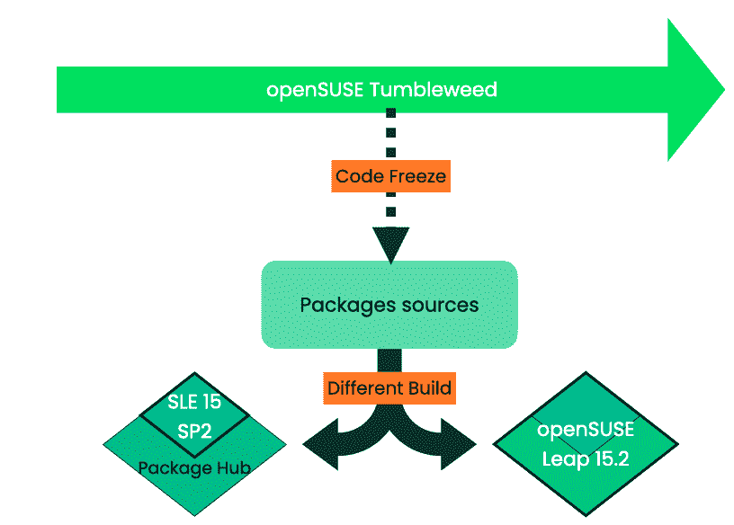
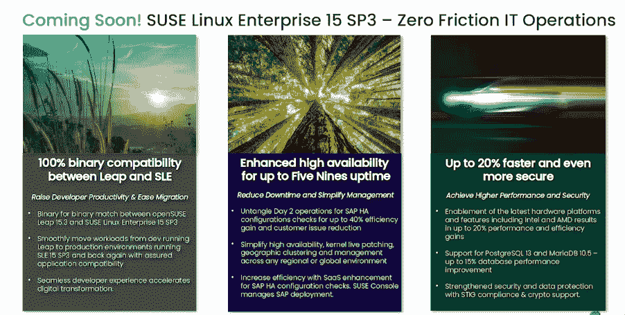

# SUSE 使 openSUSE Leap 和 SUSE Linux Enterprise 二进制兼容

> 原文：<https://thenewstack.io/suse-makes-opensuse-leap-and-suse-linux-enterprise-binary-compatible/>

开源企业软件提供商 [SUSE](https://www.suse.com/) 将在 7 月份发布其 SLE Service Pack 3 (SP3)时，使其两个 Linux 发行版 [openSUSE Leap](https://get.opensuse.org/leap/) 社区版和 [SUSE Linux Enterprise (SLE)](https://www.suse.com/fr-fr/products/server/) 完全二进制兼容。

这个想法是，除了别的以外，既改善对 openSUSE 的支持，因为它受益于与 SLE 相同的服务包，又有助于促进从 openSUSE Leap 到 SLE 的企业迁移。实际上，DevOps 团队可以在 openSUSE Leap 上免费测试应用和代码，并且更容易、更安全地迁移到 SLE。

openSUSE Leap and SUSE Linux Enterprise (SLE) previously shared the same source but were not binary compatible.

兼容性还将引入[SUSE Linux Enterprise Base Container Images(SLE BCI)](https://registry.suse.com/)，它提供“真正开放、灵活和安全的容器映像和应用程序开发工具，供开发人员和集成商立即使用，而没有替代产品强加的锁定”，[SUSE 云原生基础设施副总裁 Keith Basil](https://www.linkedin.com/in/keithbasil) 告诉新堆栈。

SUSE 的举动也被视为帮助吸引红帽[CentOS](https://www.openshift.com/try?utm_content=inline-mention)用户的努力，CentOS 是红帽企业版 Linux (RHEL) 的免费版本。然而，Red Hat 正在“T16”将重心从 CentOS Linux 转移到 RHEL 重建 CentOS 流，CentOS 表示“在当前 RHEL 发布之前”将跟踪该流换句话说，如果用户选择 CentOS Stream，他们只能选择滚动发布。

Basil 说，由于 SLES 15 SP3 将提供“openSUSE Leap 和 SLE 之间的完全二进制兼容性，用户可能会被鼓励放弃 CentOS Stream，以受益于更稳定的版本更新。“由于 CentOS 不再提供与任何商业 Linux 发行版的二进制兼容性，SUSE 将推出解决这一问题的程序和服务，以便这些用户可以迁移到 Leap。”

由于 SLES 15 SP3 将在 openSUSE Leap 和 SUSE Linux Enterprise 之间提供二进制兼容性，并且 CentOS 不再提供与 Red Hat 商业 Linux 发行版的二进制兼容性，“SUSE 将推出解决这一问题的程序和服务，以便这些用户可以迁移到 openSUSE Leap，”Basil 说。

SUSE 的高级产品经理[米切尔·斯维奇](https://www.linkedin.com/in/michalsvec/?originalSubdomain=cz)在 SUSE 最近举行的 [SUSECON 2021](https://www.susecon.com/) 会议上说，openSUSE Leap 和 SLE 之间的核心将共享“完全相同的一套包”。“由于 Leap 和 SLE 之间的迁移非常容易，非常非常快，这使得开发人员能够在开源和免费的环境中使用 openSUSE Leap，”斯维茨说。“一旦他们需要企业保障，他们可以选择 SLE 订阅服务并轻松迁移。”

服务包连接是关键，因为它将确保 openSUSE 用户可以从更安全和稳定的更新中受益，而不是必须依赖滚动更新。滚动更新没有经过彻底的测试和审查，因此不像一年发布两次的经过更严格审查的服务包版本那样受益于相同的质量保证(QA)。然而，对于那些经常寻求 openSUSE 更新的人来说，他们可以在最终版本发布之前安装测试服务包，或者选择使用 [openSUSE Tumbleweed](https://en.opensuse.org/Portal:Tumbleweed) 的滚动发布周期。

<svg xmlns:xlink="http://www.w3.org/1999/xlink" viewBox="0 0 68 31" version="1.1"><title>Group</title> <desc>Created with Sketch.</desc></svg>