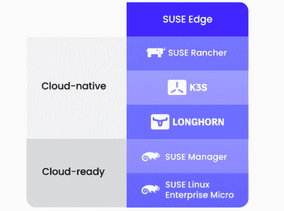

# SUSE 寻求为 Edge 提供“全生命周期”Kubernetes 管理

> 原文：<https://thenewstack.io/suse-seeks-to-offer-full-lifecycle-kubernetes-management-for-the-edge/>

在本月早些时候的 SUSECON 2021 会议上，SUSE 介绍了其所谓的“Edge 全生命周期管理”平台，并解释了该产品将如何解决当今的许多边缘计算问题，因为它试图结合 SUSE Linux 和 Rancher Kubernetes 编排工具和平台的最佳之处。

这项技术现在被称为 SUSE Edge，代表着该公司去年收购 Rancher 后，Linux 和 Kubernetes 为边缘计算提供的单一产品的结合。

在一次主题演讲中，[任命的 SUSE 工程和创新总裁、Rancher 的前首席执行官和创始人 Sheng Liang](https://www.linkedin.com/in/shengliang) 说，SUSE 现在为 Kubernetes 提供了“完整的堆栈，让它们携手形成现代 IT 堆栈的基础——Linux 管理单个计算机，Kubernetes 在多台计算机上协调应用程序容器，”Liang 说。

在实践层面上，SUSE 使企业能够在其内部和多云环境中部署 Linux，而 Rancher 提供了 Kubernetes 管理框架，特别是边缘部署，从物联网设备到远程部署的在线信息亭。

SUSE 云原生基础设施副总裁 [Keith Basil](https://www.linkedin.com/in/keithbasil) 表示，Edge 的全生命周期管理“意味着我们不仅可以利用 Kubernetes 部署容器化的工作负载，还可以管理集群配置和集群中使用的操作系统的生命周期。

一个 Kubernetes 集群将由一个操作系统、Kubernetes 和运行于其上的工作负载组成。我们所说的“全生命周期”是指在每一层管理生命周期的新能力:应用程序、集群和操作系统。"

SUSE 的主要目的是帮助解决组织在 Kubernetes for edge 应用程序上扩展应用程序时面临的许多问题。

“根据我们看到的概况和使用案例，边缘有两个具有挑战性的领域。一个是库伯内特带来的天然复杂性，”巴兹尔说。“第二个是管理的边缘位置的绝对数量。当您将这两个挑战(复杂性和大量)结合在一起时，您基本上需要一个框架来提供应对这些挑战的杠杆。”

SUSE Edge 包括:

SUSE 捐赠给[云原生计算基金会(CNCF)](https://cncf.io/?utm_content=inline-mention) 的 [K3s](https://k3s.io/) ，特别适合[树莓 PI](https://www.raspberrypi.org/products/raspberry-pi-4-model-b/) 单板电脑等设备和智能安防摄像头等物联网设备。作为一个二进制文件，它旨在支持低功耗应用和 CPU，包括 ARM64 和 ARMv7 处理器。SUSE 表示，K3s 可以容纳多达 100 万个 x86 或 ARM64 CPUs 的边缘集群。SUSE 还在今年早些时候增加了对 ARM64 架构的存储支持，从而为运行 K3s 的 ARM64 设备提供了存储能力。根据梁的说法，K3s“已经成为边缘计算事实上的行业标准——就像 Linux Kubernetes 无处不在一样。”

根据 SUSE 的说法，K3s 用户可以以最大的一致性和效率管理多达 100 万个基于 x86 或 ARM64 的硬件构建的边缘集群。

SUSE 对 Edge 的全生命周期管理可以追溯到 Rancher 创始人在 SUSE 被收购之前对边缘计算的最初雄心。“这真的是看到 Kubernetes 无处不在的愿景的延伸。事实上，我们期望并渴望加速 Kubernetes 的商品化，”巴兹尔说。“这就是为什么我们认为 Rancher 产品系列出色，因为它围绕 Kubernetes 并与 Kubernetes 一起创造价值。我们处处创新的愿景大大加强了这一地位。如果你从创新的角度来看 Kubernetes，你会看到我们在这个领域做了一些非常酷的事情。”

<svg xmlns:xlink="http://www.w3.org/1999/xlink" viewBox="0 0 68 31" version="1.1"><title>Group</title> <desc>Created with Sketch.</desc></svg>