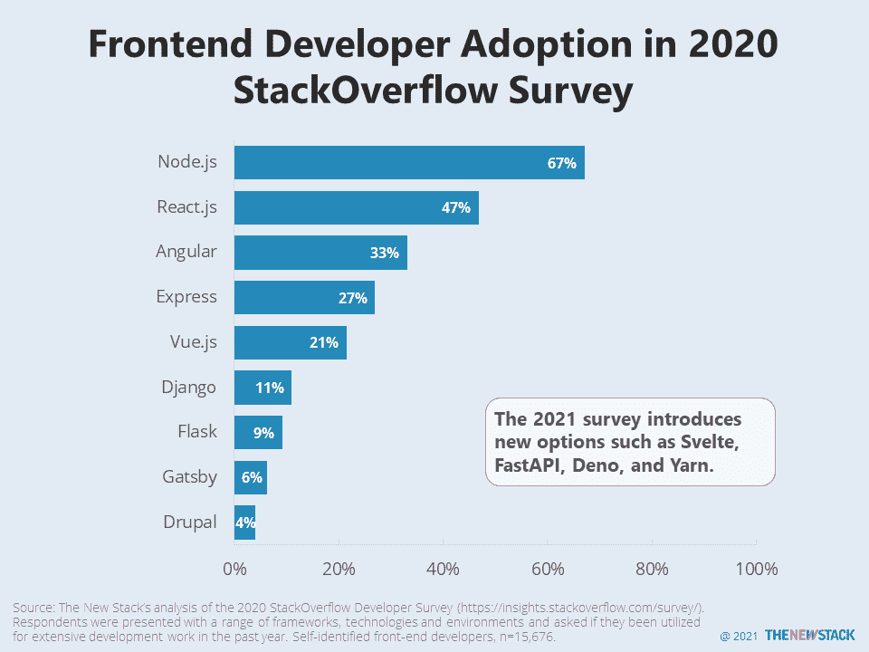

# Svelte 和 Deno 走上 StackOverflow 验证之路

> 原文：<https://thenewstack.io/svelte-and-deno-on-the-path-to-stackoverflow-validation/>

有时候，调查中最具可操作性的信息不是来自答案，而是所提问题的选择。StackOverflow 的年度[开发者调查](https://insights.stackoverflow.com/survey/)就是如此，[本周发布了最新版本](https://stackoverflow.blog/2021/05/25/the-2021-developer-survey-is-now-open/)。第一次，web 框架 [Svelte](https://svelte.dev/) 和 [FastAPI](https://fastapi.tiangolo.com/) 被包含在内。其他值得注意的新增内容包括 [Deno](https://deno.land/) 和 [Yarn](https://yarnpkg.com/) 。所有这些选项已经在前端开发人员社区中渗透了一段时间。现在是复习这些技术知识的好时机。几个月后公布结果时，你可能会看到头条新闻，宣称他们中的一些人是“最受喜爱的”或“最想得到的”。

Svelte 是一种[类似于聚合物](https://thenewstack.io/polymers-web-component-library-litelement-and-how-it-compares-to-react/)的网络组件，可以比较为 React。FastAPI 是一个与 Django 和 Flask 相当的 Python 框架。Deno 是 JavaScript 和 TypeScript 的运行时。它是为了解决 Node.js 的弱点而创建的。其中一个弱点是 NPM 包装管理器，这就是为什么我们想知道，自从我们上一次[写了](https://thenewstack.io/this-week-in-numbers-the-node-js-users-tech-stack-2/)之后，纱线包装管理器的采用增加了吗？

最后，对 StackOverflow 的人来说，一个大问题是:为什么你们决定在今年的调查中将 Node.js 归类为一种语言？当被问及他们是否广泛使用 JavaScript、TypeScript 和 Node.js 时，一个开发人员会说三者都用吗？根据 StackOverflow 的调查，Node.js 在 2020 年被 67%的前端开发者广泛使用。

通过 Pixabay 的特征图像。

<svg xmlns:xlink="http://www.w3.org/1999/xlink" viewBox="0 0 68 31" version="1.1"><title>Group</title> <desc>Created with Sketch.</desc></svg>