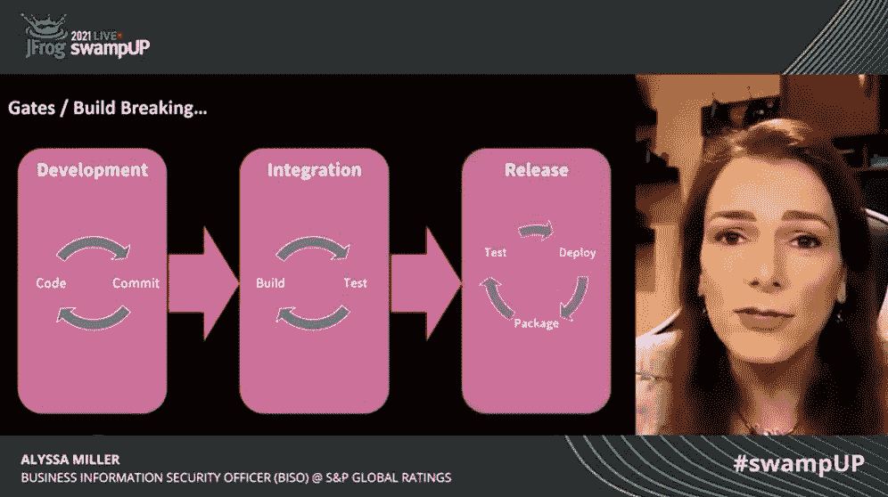
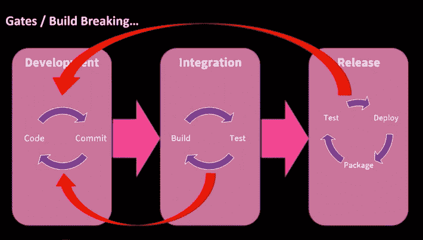
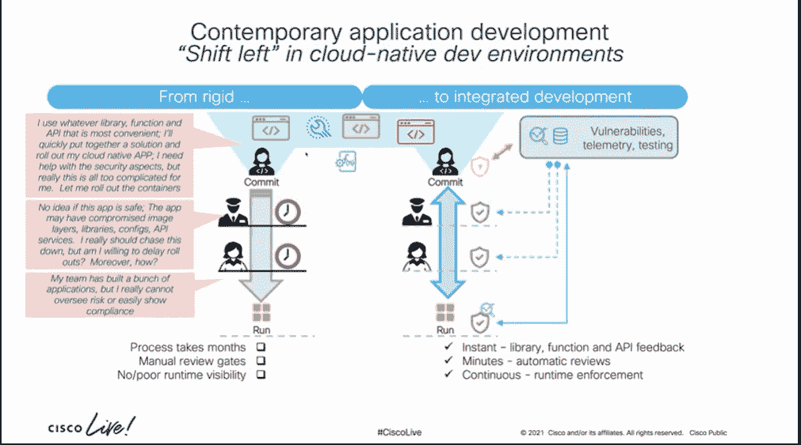
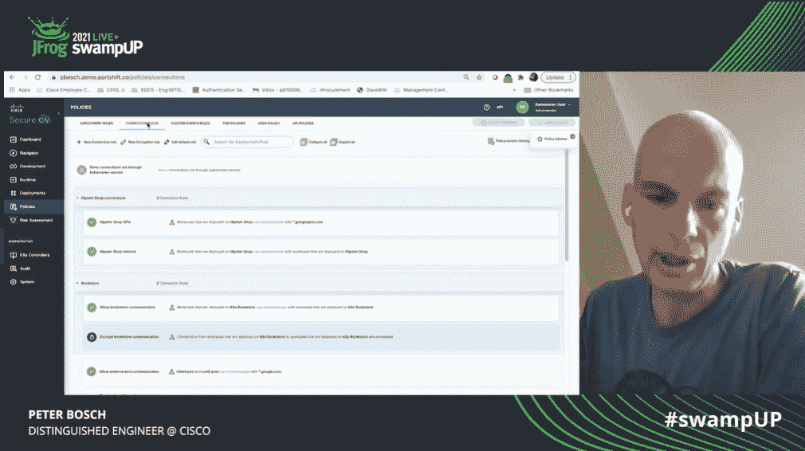

# 淹没:出于安全考虑，DevOps 需要护栏，而不是大门

> 原文：<https://thenewstack.io/swampup-devops-needs-guardrails-not-gates-for-security/>

将安全性融入开发运维流程(通过“左移”)对于许多快速发展的企业来说仍然是一个挑战，尽管一些聪明的思想家在最近的虚拟会议上有一些关于如何实现这一点的想法。

谁拥有 DevOps 过程中的安全性的问题至少可以追溯到 2012 年，当时 DevOps 的先驱 Gene Kim 和 Josh Corman [在 RSA 安全会议上提出了这个术语](https://www.csoonline.com/article/2135089/-rsac---bsidessf-videos--gene-kim-and-josh-corman.html)。对于已经承担全栈开发任务的雇主来说，转移保护应用程序的负担(“左移”)似乎是一个很大的要求，尤其是当他们越来越依赖外部开发的开源软件库时。在(虚拟)走廊上，安全团队正忙于保护网络、数据、云存在和端点的安全。应用程序安全性在他们的优先级列表中排在很低的位置。

但是，DevOps，以及推而广之的 DevSecOps，不仅仅是关于工具，还关于人员、流程和治理，我们将安全性添加到 DevOps 流程中的方式一直是有缺陷的，[阿莉莎·米勒](https://twitter.com/AlyssaM_InfoSec)、 [S & P 全球评级](https://www.spglobal.com/ratings/en/)商业信息安全官和最近出版的“[网络防御者职业指南](https://www.manning.com/books/cyber-defenders-career-guide)”的作者在虚拟会议上的陈述中指出。

她说，传统上，安全团队采取的方法是在持续集成和部署(CI/CD)管道中的每个步骤之间设置关卡。静态分析应该在代码提交时完成，应用程序进入部署前的最后一步是进行动态测试。如果发现了潜在的安全弱点，那么应用程序就无法继续运行。

“这是使 DevSecOps 崩溃的原因。这就是破坏 CI/CD 的原因，”米勒警告说。这导致了很长的反馈周期，因为代码被退回，开发人员被要求立即修复问题。“盖茨打破了这种模式，因为盖茨在每个阶段都威胁要阻止我们。他们威胁要让我们倒退。”

“我们必须停止将安全性视为我们两个阶段之间的门户。相反，我们必须考虑如何将安全融入这些阶段，”她说。

她说，这并不是说我们不应该使用安全工具，而是它们应该集成到管道本身中。这些测试发现的错误应该简单地添加到现有的 DevOps backlog 中，并在下一个 sprint 中处理，如果足够严重，它们甚至可以占据最高优先级。

在这种方法中，“我们没有停止管道的当前流动。米勒说:“我们正在安排下一次演练，以解决我们在这次演练中发现的漏洞。”。开发周期变得越快，暴露这些漏洞的风险就越小。

这个难题的一大部分是在[威胁建模](https://owasp.org/www-community/Threat_Modeling)中必须完成的前期工作——了解给定应用程序的可能攻击点。在最好的 DevOps 方式中，威胁建模应该作为一个协作过程来完成，业务经理、开发人员、运营和安全人员都要一起工作，而不是对整个系统进行建模，而只是对特定的用户情况进行建模，这将揭示弱点。

“想象一下，你不是试图对整个系统进行威胁建模，而是考虑每个用户的情况。随着用户故事的编写，你只需引入基本的威胁信息，并使其成为用户故事的一部分，”米勒说。那么威胁信息可以直接流入构建过程。“识别对特定用户故事至关重要的关键资产，然后识别威胁。”

## 安全云原生

思科杰出的工程师[彼得·博施](https://www.linkedin.com/in/peter-bosch-00707a7/)在他自己的演讲中建议，在 DevOps 流程中，门的一个替代品可能是护栏。

随着云计算的出现，应用程序开发发生了变化。开发人员不能再依赖 infosec 仅仅通过确保底层基础设施的安全来保护应用程序的安全。和 Miller 一样，Bosch 强调说，总的来说，今天的 CI/CD 管道还没有纳入安全实践。相反，许多安全团队对开发人员构建的应用程序中隐藏的潜在漏洞知之甚少。

Bosch 说:“没有 CI/CD 加持续安全这样的东西，也没有直接进入 IDE 的集成安全工具集。”

理想情况下，这种想法是将安全性直接集成到 CI/CD 流程中。Bosch 建议，这可以通过安全团队在开发过程中添加护栏来实现。例如，安全团队可以提供一组可信资产，如图像、无服务器服务、API、配置设置和支持工具集。这将使安全团队有机会审查和监控所有这些特定资产的安全漏洞。如果后来在其中一个支持库中发现了漏洞，那么安全团队可以通过一张吉拉票通知开发人员更新他们的软件。

博世展示了一个名为 Secure Cloud Native([Secure CN](https://console.portshift.io/login))的思科软件包，该软件包可以让开发人员从容器、映像、映像层或 API 的角度更广泛地了解他们的云原生应用程序是如何工作的。应用程序的外部活动由运行在 Istio 服务网格上的 Envoy 代理提供的指标监控。界面可以显示应用程序是如何从不同的组件和漏洞或应用程序本身可能存在的其他问题组合在一起的。

<svg xmlns:xlink="http://www.w3.org/1999/xlink" viewBox="0 0 68 31" version="1.1"><title>Group</title> <desc>Created with Sketch.</desc></svg>