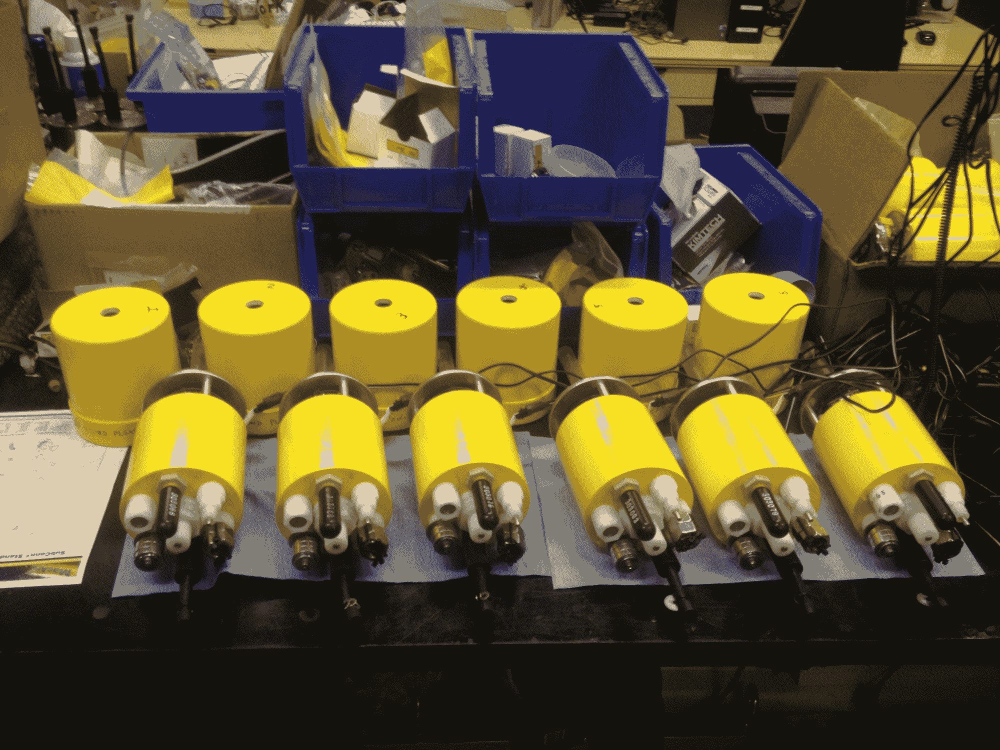
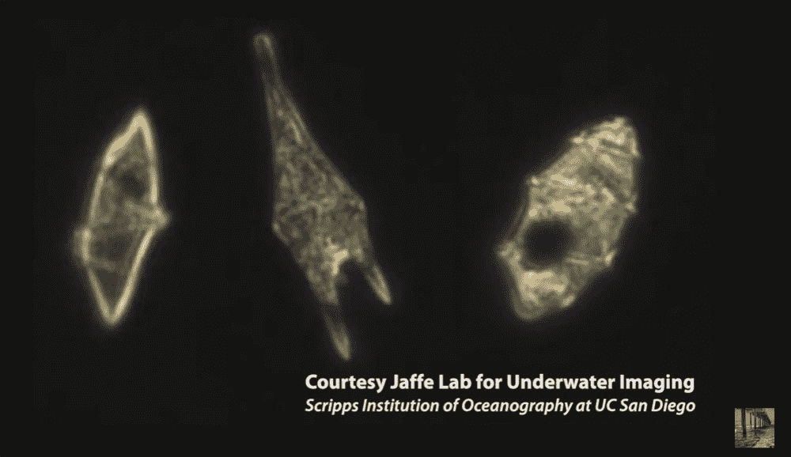

# 成群的“机器人浮游生物”帮助科学家追踪海洋野生动物、石油泄漏

> 原文：<https://thenewstack.io/swarms-robotic-plankton-help-scientists-track-marine-wildlife-oil-spills/>

研究海洋野生动物不是一件容易的事情，因为研究人员受到他们所拥有的工具的限制，这些工具可以帮助他们近距离观察那些不断移动的海洋生物。对于研究浮游生物的科学家来说尤其如此，浮游生物是任何数量的不能逆着洋流游动的漂流生物，如细菌、古生菌、藻类和原生动物。

尽管浮游生物体积很小，但却是鲸鱼和鱼类等大型水生动物的主要食物来源。令人惊讶的是，浮游生物还产生了地球一半的氧气。尽管它们在生态上很重要，但还不完全清楚这些生物是如何聚集在一起并被洋流推来推去的，以及这如何影响它们的进食和交配行为。

但是这种不确定性正在消失，这要归功于一大群水下机器人，它们被编程来模仿浮游生物的运动。由加州大学圣地亚哥分校[斯克里普斯海洋研究所](https://ucsd.edu/)的科学家创造，他们现在使用这些微型自主水下探测器(M-AUE)来更好地了解浮游生物如何在水下三维移动。该团队的发现有朝一日还可能帮助人类减轻石油泄漏和有害藻类大量繁殖等威胁，这些威胁会导致大量鱼类死亡，并使饮用水对人类有毒。

[https://www.youtube.com/embed/Yn94g1QEuEc?feature=oembed](https://www.youtube.com/embed/Yn94g1QEuEc?feature=oembed)

视频

直到最近，研究人员还依赖数学模型来检验关于这些生物如何在复杂的洋流交汇中被推动和聚集的假设。Scripps 的海洋学家 Jules Jaffe 和 Peter Franks 领导了发明这些漂浮、自主机器人的工作，正如最近发表在[*Nature communication s*](http://press.nature.com/login?redirect_url=http%3A%2F%2Fpress.nature.com%2Fwp-content%2Fuploads%2Ffiles%2F2017%2F01%2Fncomms14189.pdf)的一篇论文中所详述的。

这些机器人是数十年工作的顶峰:弗兰克斯是一名科学家，他在 20 年前发表了一篇论文，提出浮游生物在所谓的内波——海洋表面下缓慢移动的大浪——的推动下聚集成厚厚的斑块。弗兰克斯当时无法验证他的理论，因为当时没有可用的技术来跟踪每一种微生物。

二十年过去了，科技已经赶上了几年前的科学愿景。科学家的“机器人浮游生物”能够随着洋流漂流，但已经被编程为像真正的浮游生物一样上下浮动，通过使用活塞自动调整浮力以匹配海洋的内波。模仿浮游生物的机器人之所以能够做到这一点，是因为它们的外形由两个嵌套的圆柱体组成，由一种密度大但重量轻的泡沫制成，可以承受沉重的机载电池的重量。这些机器人还配备了温度和压力传感器，以及适合水下使用的微处理器和麦克风。机器人浮游生物可以下潜到 10 到 50 米的深度而不会下沉。

“工程上的重大突破是使 M-AUEs 变得小巧、便宜，并且能够在水下被持续跟踪，”Jaffe 说。

这篇论文描述了该团队五个小时的实验，其中看到了一群 16 米长的水母在加利福尼亚海岸外释放，测量直径为 300 米(984 英尺)。这个群体被设定在水下 10 米(33 英尺)的深度。因为 GPS 数据无法在海洋表面下收集，所以使用一种特殊开发的使用声音信号的工具来跟踪单个机器人，每 12 秒收集一次数据。

多亏了这一群没有橘子大的小机器人，科学家们能够证实弗兰克斯关于浮游生物运动的几十年前的数学理论。随着鱼群周围的水下温度降低，特别是当海水达到最高点时，鱼群就会散开。在波谷温度升高的过程中，蜂群会重新形成，形成密集的斑块。

这些发现不仅对未来监测世界浮游生物数量或检查石油泄漏具有重要意义。“这种群体感应方法开辟了一个全新的海洋探索领域，”Jaffe 说。这是第一次将这样的群体用于研究目的，该团队预计将建造数百个，并在其上添加相机，以帮助科学家拍摄受威胁的珊瑚栖息地的快照，或跟踪海豚、鲸鱼和其他野生动物在海洋保护区之间的活动。虽然我们人类可能无法完全理解一个相互联系的生命网络是如何支撑我们所有人的，但最终，它仍然存在，我们可以收集的任何信息无疑将有助于我们更好地理解如何保护它。

图片:加州大学圣地亚哥分校。

<svg xmlns:xlink="http://www.w3.org/1999/xlink" viewBox="0 0 68 31" version="1.1"><title>Group</title> <desc>Created with Sketch.</desc></svg>