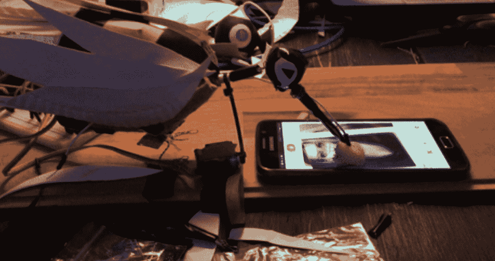

# 瑞典的“非常愚蠢的黑客马拉松”产生了一些相当恶意的黑客

> 原文：<https://thenewstack.io/sweden-hosted-stupid-hackathon/>

愚蠢的黑客马拉松现象已经蔓延到欧洲。上周末，“愚蠢的黑客马拉松瑞典 2017”的成果揭晓，25 个项目中的每一个似乎都比上一个更无意义。

去年，我将“愚蠢的黑客马拉松”的新兴趋势描述为一种新的趋势，即[轻松无趣的编码活动](https://thenewstack.io/stupid-shit-hackathons-growing-popularity/)，这种活动提供了“对所有其他黑客马拉松的含蓄批评，包括他们的欢呼雀跃的言辞和企业赞助商。”从其网站来看，这个活动的官方名称是“[愚蠢的狗屎，没人需要&可怕的想法黑客马拉松](http://www.stupidhackathon.com/)”但它似乎通常被简称为“愚蠢的黑客马拉松”。

一个类似的[“恐怖黑客”活动](http://terriblehack.website/)最近在滑铁卢大学举办，下周末还有另一个愚蠢的黑客马拉松[在纽约市](http://www.stupidhackathon.com/)。但随着越来越多的开发人员接受这个想法，这种兴奋似乎正在慢慢蔓延。

这个想法是由黑客新闻上发布的一封给瑞典活动组织者[stupidhackathon.com](https://news.ycombinator.com/item?id=13641892)的电子邮件引发的。“他们非常贴心，告诉我们要努力，”他写道，并补充说，低期望值有一种非常解放的感觉。组织一次愚蠢的黑客马拉松的好处在于它真的很容易。如果事情不顺利，你可以耸耸肩，说“嘿，那太愚蠢了。”

“比如我们的直播。我忘了插上麦克风，所以没有声音。很蠢！”他写道。

我最喜欢的愚蠢项目之一叫做“啄木鸟的火种”它用机械臂再造了一只几乎灭绝的啄木鸟，显然是通过不断擦拭 Tinder 来解决其数量减少的问题:

事实上，动物似乎是一个主题。另一个项目通过提供一个确认“我不是猫”的复选框，对验证码技术进行了独特的改进。而另一个项目——名为[“Sting for Dogs】](https://earthpeople.club/~mjelle/stingfordogs/)——只是简单地以高频率播放录音艺术家 Sting 的音乐，这样只有狗才能听到。

但许多所谓的“愚蠢”项目实际上显示出一些严重的技术印章。

其中最吸引人的一个叫做“恐慌屋”，被描述为“两个人的一个有点虐待狂的虚拟现实应用程序，一个人在一个房间里，另一个人用一个物理盒子控制。”

[https://www.youtube.com/embed/L1NYDN7sd0k?feature=oembed](https://www.youtube.com/embed/L1NYDN7sd0k?feature=oembed)

视频

另一个愚蠢但恶意的黑客叫做“[一切都很平静](https://github.com/alimony/everything-is-calm)”这是一个 Chrome 扩展，它会逐渐无形地降低 YouTube 视频的音量，“直到最后 20 秒，当它回到最大值时，希望在用户连续增加外部设备的音量以补偿它“太低”之后。”

但是其中最流行的似乎是“愚蠢的 Shell”——一个变种的 Unix shell，在这个 Shell 中列出你的文件时，*也会删除其中的一个文件。(“要不你再 *ls* 看看是哪个？”它嘲笑——知道这样做会删除*另一个*文件…*

[https://www.youtube.com/embed/AAq8Mfdgl7I?feature=oembed](https://www.youtube.com/embed/AAq8Mfdgl7I?feature=oembed)

视频

而使用**猫**命令读取文件内容，反而只是显示一只猫的 ASCII 图。

黑客新闻的一位评论者开玩笑说，他们实际上想采用它的一个功能。

"认真考虑\_(ツ)_/作为我的新的提示."

另一位用户开玩笑说，愚蠢的 Shell“有一个光明的未来”，尽管它的创建者显然留下了下一条评论，指出了一个停止播放的小故障。"我也很笨，在演示过程中不小心删除了源代码."

“我们给这家伙弄点风投资金吧！!"有人开玩笑说。

<svg xmlns:xlink="http://www.w3.org/1999/xlink" viewBox="0 0 68 31" version="1.1"><title>Group</title> <desc>Created with Sketch.</desc></svg>