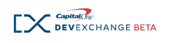
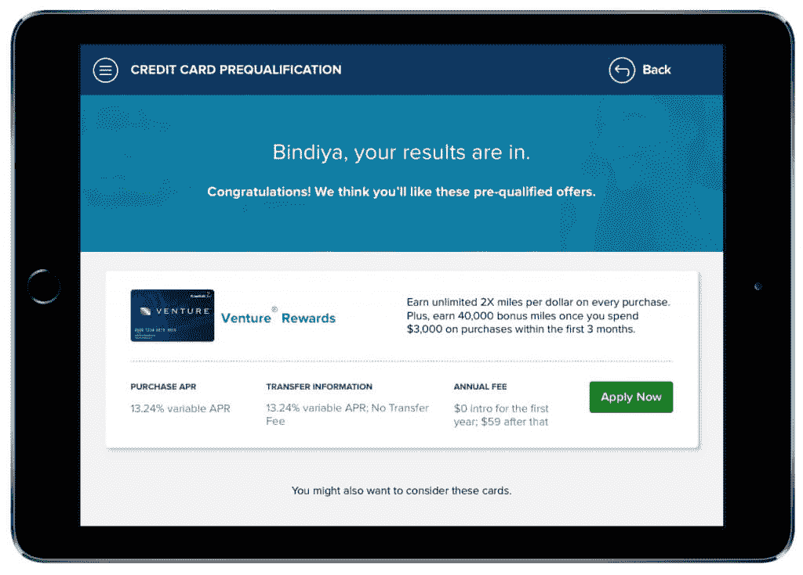
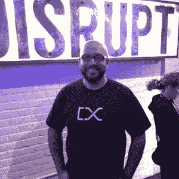
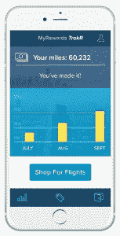

# SXSW: Capital One 开放 API 供第三方电子商务使用

> 原文：<https://thenewstack.io/sxsw-capital-one-opens-apis-third-party-e-commerce-use/>

美国银行业巨头 Capital One 借鉴谷歌的 YouTube 和其他开发人员熟悉的消费者服务，开放了一些内部应用程序编程接口(API)，因此其他应用程序和电子商务服务也可以使用它们。

“人们不把银行视为科技软件公司。现在，我们正在重塑银行业，看看开发商将在哪些领域创造更高水平的消费者体验，”Capital One 常务副总裁 Naveed Anwar 表示。“我们正在重塑客户与我们互动的方式。”

这些 API 记录在一个新推出的开发者门户网站中， [Capital One DevExchange](https://developer.capitalone.com/) ，它提供了参考实现、测试沙箱和启动代码。该公司在本周和下周在德克萨斯州奥斯汀举行的 SXSW 互动会议上首次推出了 Capital One DevExchange。

最初，该公司提供三个 API，包括一个通过 Capital One 自己的客户身份验证系统提供双因素身份验证的 API。

这些 API 现在处于测试阶段，随着公司从社区和合作伙伴那里获得反馈，将于今年年底投入生产。随着时间的推移，将会引入更多的 API，所有这些 API 都已经在 Capital One digital 产品中使用。

安瓦尔解释说，Capital One 选择公开的 API 不仅是因为它们作为独立服务的潜在效用，也是为了共同提供一个平台，开发者可以利用这个平台来增强自己的服务和应用。安瓦尔说:“我们会给你一些基础知识，让你在开发应用程序和与银行合作时不再有摩擦。”。“我们采取的方法是，开发者只需要集成一次，就可以建立在这种经验上。”

在最初发布的三个 API 中，最引人注目的是 [SwiftID](https://developer.capitalone.com/products/swiftid/homepage/) ，它基于 Capital One 的数字客户账户提供双因素认证服务。通过 SwiftID，Capital One 客户可以使用他们的 Capital One 身份管理其他第三方服务，其方式与脸书 ID 用于访问其他网络服务的方式相似，但更安全。

SXSW 的 Naveed Anwar

“谈到金融交易，人们都在寻找安全的身份。只有少数几家公司能给你一种安全使用身份的方法，”安瓦尔说。

一个对机动车辆部门记录或税收信息的访问都可以通过这样的服务来批准。该服务也可以用作身份验证机制。

“比方说，你把车送到一个机械师那里，然后你被困在一个会议中，当机械师打电话来要求授权修理汽车时，你无法接听电话。安瓦尔说:“只需在应用程序上轻轻一划，你就可以获得批准。”

第二个 API 叫做 [Rewards](https://developer.capitalone.com/products/rewards/homepage/) ，可以提供 Capital One 客户奖励信息，比如里程、积分和客户获得的现金奖励。

使用第三个 API， [Credit Offers](https://developer.capitalone.com/products/credit-offers/homepage/) ，用户可以提交一些基本信息，公司会向 Capital One financial services 返回一组经过资格预审的定制优惠，比如信用卡。

一旦开发人员将他们的应用程序连接到 Capital One 的 API，他们就可以访问一个仪表板，为他们提供性能和健康指标。其中一些功能来自内部开发的名为 [Hygieia](https://github.com/capitalone/Hygieia) 的仪表盘，该公司[于去年](https://thenewstack.io/capital-one-out-to-display-its-geekdom-with-open-source-devops-dashboard/)对其进行了开源。

示例代码最初将在 Node.js 中提供，并计划引入 Curl 和 Python。随着时间的推移，从用户需求中选择的其他语言的代码也将被提供。“我们正在寻求用户群体的反馈，”安瓦尔说。

在后端，Capital One 正在使用 [Swagger](https://swagger.io/) 来构建和管理其 API——该公司甚至计划通过自己的一些修改来为 Swagger 代码库做出贡献。该公司同时使用 Node.js 和 Ruby on Rails 来扩展服务以供外部使用。所有的 API 都是从 Amazon Web Services 运行的。

#### 2016 年 3 月 10 日-12 日 // 德克萨斯州奥斯汀@安东尼的

#### 2016 年 3 月 10 日-12 日 // 德克萨斯州奥斯汀@安东尼的

欢迎来到 Antone SXSW 的 Capital One House，在这里，新堆栈将采访技术专家和开发人员，讨论 API、平台以及在新堆栈经济中构建应用的新方式。

[Capital One](https://twitter.com/capitalone?lang=en) 于 1994 年从 Signet 剥离，并于次年完全独立，是美国主要银行机构中最新的一家。该公司现在拥有 6500 万个客户账户和 45000 名员工。

*TNS 主编亚历克斯·威廉姆斯为本文做出了贡献。*

Capital One 是新堆栈的赞助商。

<svg xmlns:xlink="http://www.w3.org/1999/xlink" viewBox="0 0 68 31" version="1.1"><title>Group</title> <desc>Created with Sketch.</desc></svg>