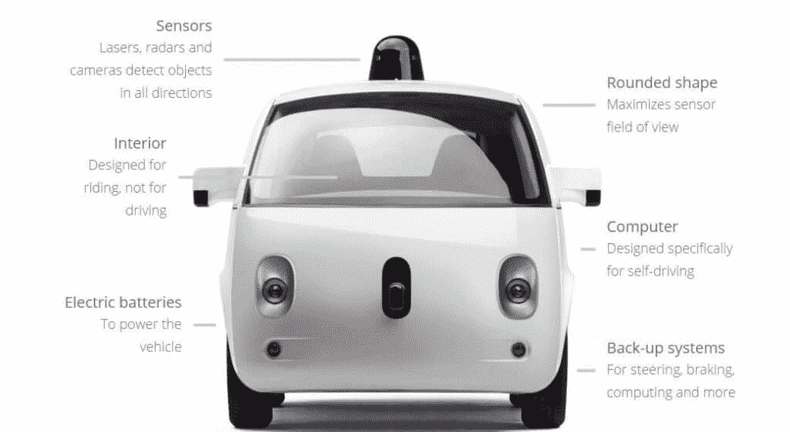

# 事故报告:谷歌无人驾驶汽车

> 原文：<https://thenewstack.io/sxsw-googles-self-driving-car-current-limits-ai/>

在为其无人驾驶汽车开发算法时，谷歌吸收了几乎所有的交通规则，但至少有一条除外:不要与市政公交司机发生冲突。

在目前正在奥斯丁举行的 [SXSW Interactive](http://www.sxsw.com/) 会议上的一次介绍会中，谷歌在[的自动驾驶汽车项目](https://www.google.com/selfdrivingcar/)的主管克里斯·厄姆森(Chris Urmson)介绍了人工智能驱动的程序，包括在道路上行驶了 140 多万英里后，谷歌自动驾驶汽车至少部分出现故障的第一起事故。

“我们的汽车对公交车司机将要做的事情做了一个假设。公共汽车司机对我们的汽车将要做什么做了一个假设。它们不是同一个假设，”厄姆森说。

由车载计算机的推理能力引领的无人驾驶汽车的新兴科学肯定会成为一个巨大的产业——通用汽车[刚刚以未披露的金额收购了](http://techcrunch.com/2016/03/11/gm-buys-self-driving-tech-startup-cruise-as-part-of-a-plan-to-make-driverless-cars/)无人驾驶汽车技术 Cruise。但是，沉浸在人工智能中的谷歌的工作已经超越了自动驾驶汽车。它探索了计算机在模仿甚至改进人类推理方面的极限。

谷歌在 2009 年开始了它的自动驾驶汽车项目。该公司开始制造可以在公共道路上行驶至少 100，000 英里的原型，“比以前任何人都要多十倍，”厄姆森说。

该公司购买了一个丰田普锐斯车队，给他们配备了摄像头和传感器，并派他们和工程师一起去观察发生了什么。

直到二月，这些汽车从未造成事故，即使它们行驶了超过一百万英里。就像优秀的司机一样，车辆被设定为对所有可能性保持警惕，甚至是两三步之外的可能性。这辆车小心翼翼得几乎要出故障了，当被另一辆车超车时会慢下来。如果它看到自己处于另一辆车的盲区，就会减速。

厄姆森说，该公司使用激光、雷达和摄像头的组合，在车辆中建立了“前所未有的传感水平”。这辆车可以感知前方 200 米的情况，并拥有 360 度的周边视野。接收到所有这些数据后，机载计算机每秒钟做出大约 10 次关于如何前进的决定。

2 月 14 日，在加州山景城，一辆谷歌无人驾驶汽车，一辆雷克萨斯，以大约 15 英里/小时的速度侧滑了一辆公交车。据《每日邮报》报道，虽然事故中汽车的左前侧被撞瘪，轮胎被压扁，固定在汽车上的雷达被巴士撕掉，但无人受伤。运营这辆巴士的[圣塔克拉拉谷交通局](http://www.vta.org/)调查了这起事件，发现巴士司机没有责任。

在 SXSW，Urmson 提供了一份事故报告。

在一个繁忙的十字路口试图右转时，自动驾驶汽车移动到了超宽车道的右侧。这是许多司机采取的一种常见做法，绕过等待穿过十字路口的汽车，这也是自动驾驶汽车最近才被编程做的一件事。“这是以自然方式在社区中驾驶的重要组成部分，”他说。

然而，车辆碰到了肩膀上的一些沙袋，迫使它停下来。信号灯转向，右侧车道的汽车开始向前移动，而自动驾驶汽车则坐在沙袋后面。

“在这一点上，我们的汽车带着传感器回头看，看到了这辆公交车，”厄姆森说。它看的是公交车的大小。它会查看车道的宽度，并决定公共汽车不适合。“至少，它认为它不适合，”厄姆森说。"在那一刻，人们以为公共汽车司机会减速。"

巴士司机，盯着缺口，有其他想法，所以继续前进。厄姆森承认，如果无人驾驶汽车原地不动，公共汽车本来可以通过。但是汽车向前移动，撞上了公共汽车。

“对我们来说，这是艰难的一天，”厄姆森承认。“我们不喜欢我们的车撞到东西。”他说，随后，谷歌将这一经验融入其算法，通过 3500 次测试运行类似的场景，以确保类似的事情不会再次发生。

尽管如此，人类仍然是不可预测的生物，斯波克对此再清楚不过了。厄姆森还讲述了一个故事，一辆自动驾驶汽车在路上行驶，上面有一个警告标志，表明鸭子可能正在穿越，确实遇到了一些鸭子，但也有一名坐在电动轮椅上的女子拿着扫帚追赶它们。

“现在我们有一个团队，他们的工作是想出奇怪的东西，但他们没有想出这个，”厄姆森说。

<svg xmlns:xlink="http://www.w3.org/1999/xlink" viewBox="0 0 68 31" version="1.1"><title>Group</title> <desc>Created with Sketch.</desc></svg>