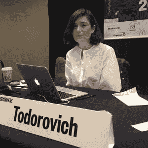
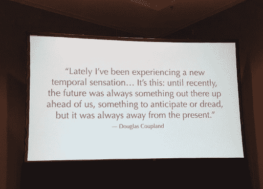

# SXSW 2017:时间应该是你下一个项目的基本设计元素

> 原文：<https://thenewstack.io/sxsw-time-essential-element-design/>

设计师应该将时间视为一个重要的设计元素，就像线条、形状、形式、纹理、颜色和空间等其他核心设计元素一样， [Frog Design](https://www.frogdesign.com/) 的首席总监[克里斯汀·托多罗维奇](https://www.linkedin.com/in/christinetodorovich/)本周在奥斯汀的 SXSW 互动会议上说。

我们生活在一个时代，持续的变化是现在的标准。她认为，结果是，我们体验时间的方式开始经历根本性的转变。

虽然设计师和开发人员可能认为自己是事物的制造者，但他们也是体验的塑造者。交互体验总是在某种时间框架内进行。如何利用这些时间对于最佳体验至关重要。

换句话说，开发者应该让时间成为他们所做的任何事情的核心部分。

虽然没有涉及任何一个特定的设计领域，但她的思想可以应用于用户界面设计，甚至系统和硬件设计。她引用了谷歌的一个设计原则:“运动提供了意义。”

你会看到谷歌的法令越来越多地在社交媒体上发布。Twitter 和脸书的用户反馈现在塞满了动画 gif 和短视频。

时间被用在各种创造性的和有益的方式上。健身追踪器捕捉心跳，即慢跑者跑步的持续时间。作为一个社交媒体平台，Snapchat 凭借其对时间的创新使用，即通过提供仅在一段时间内共享视频的服务(“短暂消息”)，积累了庞大的用户基础。

在很大程度上，向移动计算的转变带来了这种对移动的新强调。我们不再只是点击，现在我们刷卡。我们按下一个按钮的时间长短就可以引发不同的动作。用户体验(UX)前端应用程序开发人员正在研究动画原理，寻找优雅的方式来传达动作。从他们的经验中，华特·迪士尼卡通动画师在 20 世纪 30 年代制定了 12 条动画规则，他们今天正在研究动态应用程序的开发:

托多洛维奇不是在即席发言。她指出，认知理论研究表明，我们经历的变化越多，时间似乎就过得越慢(或者这可能不仅仅是认知上的:爱因斯坦的狭义相对论认为，一个人越接近光速，时间就过得越慢)。

我们正在进入一个被托多洛维奇称为“超实时”的时代。“超现实”这个词被用来描述一种很难区分真实和虚拟的状态，所以“超现实时间”是多个时间框架的层叠。

这听起来像科幻小说，但这正是 Instagram 通过其 [Hyperlapse](https://itunes.apple.com/us/app/hyperlapse-from-instagram/id740146917?mt=8) 应用程序提供的内容，该应用程序实际上允许用户操纵视频的播放速度。另一个应用程序 Explore 9/11 允许参观纽约 9/11 纪念馆和博物馆的游客将他们通过智能手机摄像头看到的 9/11 图像叠加在一起。总的来说，时间将是增强现实的一个巨大组成部分，她说。

“使用技术来模拟时间旅行绝对是我们现在流行的想象的一部分，”她说。

> 《托奇系列# 2》# akinorigo # time # movement # sxsw # motion
> 
> Joab Jackson(@ joabjack)于 2017 年 3 月 15 日下午 4:56 PDT
> 
> 分享的一篇帖子

首都一号赞助了这篇文章。

专题图片:德克萨斯州奥斯汀的公共艺术。

<svg xmlns:xlink="http://www.w3.org/1999/xlink" viewBox="0 0 68 31" version="1.1"><title>Group</title> <desc>Created with Sketch.</desc></svg>