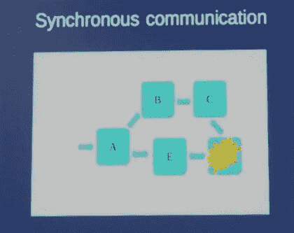

# Synchronous REST 如何将微服务转变成整体

> 原文：<https://thenewstack.io/synchronous-rest-turns-microservices-back-monoliths/>

Lightbend 技术负责人 [James Roper](https://twitter.com/jroper?ref_src=twsrc%5Egoogle%7Ctwcamp%5Eserp%7Ctwgr%5Eauthor) 称，如果你将一个单一的遗留应用[分解成一组微服务](https://thenewstack.io/from-monolith-to-microservices/)，并且这些微服务通过 REST(表述性状态转移)进行通信，那么你实际上仍然拥有一个单一的应用。

周三，在曼哈顿维亚康姆总部举行的每月一次的纽约 Java 特殊利益集团会议上，Roper 给出了这个重要的智慧。

在演讲中，Roper 是异步通信的大力提倡者。毫不奇怪， [Lightbend](http://www.lightbend.com) (以前的 Typesafe)提供了一个基于 Scala 的微服务平台，[称为 Lagom](https://thenewstack.io/lightbends-lagom-offers-microservice-framework-java-developers/) ，基于异步通信。

请记住，“异步通信”不同于常用的术语“异步 I/O”。异步 I/O 是指不停止操作来等待流程线程完成，而异步通信是微服务的一个产物，是指设计一个系统，使一个服务不需要等待另一个服务来完成其任务。

“使用异步通信，如果用户向一个服务发出请求，而该服务需要向另一个服务发出请求，则该通信不会阻止[第一个服务]服务向用户返回响应，”Roper 说。

今天，大多数[微服务](https://thenewstack.io/microservices-changed-matter/)架构使用 [REST](https://thenewstack.io/make-a-restful-json-api-go/) (代表性状态转移)协议来促进不同服务之间的通信(代替对象调用)。尽管 REST 被证明比其他通信(特别是基于 XML 的 SOAP)更容易实现，但它有一个固有的缺点，即它本质上是同步的，而不是异步的。

“客户机发送请求，服务器发送响应，”Roper 描述 REST 如何工作时说。

一个失败的服务可以使整个操作停止。

可以建立由一系列同步通信的微服务组成的面向用户的服务，使得一个微服务依赖于另一个微服务，而另一个微服务又依赖于第三个微服务，依此类推。只要所有的服务都在工作，这种方法就能很好地工作。但是如果一个微服务失败，它可能引发一系列的失败，最终导致最终用户拒绝服务，Roper 解释说。

同样，如果一个微服务很慢，那么整个响应时间也会变慢。

使用 REST 这样的同步通信，“从技术角度来看，我们刚刚构建了一个整体。所有这些都是独立的服务，这并不重要，这个系统仍然像一个整体，”罗珀说。

(在对话中，Roper 假设观众理解微服务架构相对于整体架构的优势，[因为所有常见的原因](https://thenewstack.io/containers-microservices-work-together-enable-agility/)，例如微服务更容易修复和重新配置)。

在异步通信中，一个服务可能仍然依赖于另一个服务，但是不会延迟发回其响应，因为它正在等待来自另一个服务的输入。因此，如果一个服务失败，它不会影响其他服务，罗珀解释说。“它不会影响系统中的任何其他东西，”Roper 说。这种设计还消除了瓶颈和单点故障。

Roper 使用一个基于 Java 的类似 Twitter 的服务演示，向观众展示了如何以多种方式在代码中实现异步调用。一种方法是让每个微服务在信息更新时发布它提供的信息，而不是等待另一个微服务请求该信息。以这种方式，例如，如果聊天服务需要用户的“朋友”列表，它可以使用由“朋友”分发微服务提供的最新列表，而不是从微服务请求该信息，该微服务可以运行也可以不运行。

Roper 承认，异步通信在一致性或确保最终用户获得最新信息方面存在挑战。许多社交网络，比如脸书，使用[最终一致性](https://cloud.google.com/datastore/docs/articles/balancing-strong-and-eventual-consistency-with-google-cloud-datastore/)，这不能保证每个用户的新闻订阅都有最新的信息。

此外，实现 REST 调用的简单性是无可匹敌的。一位与会者似乎对实现异步通信所需的大量代码感到震惊。

"你这样做是为了代替一个简单的休息电话？"这位与会者问道。Roper 注意到一些软件，比如 Apache Kafka，可以自动处理异步服务的底层细节。

“只需简单的休息呼叫，您的服务就会停止。有了这个，就不是了，”他说。

<svg xmlns:xlink="http://www.w3.org/1999/xlink" viewBox="0 0 68 31" version="1.1"><title>Group</title> <desc>Created with Sketch.</desc></svg>