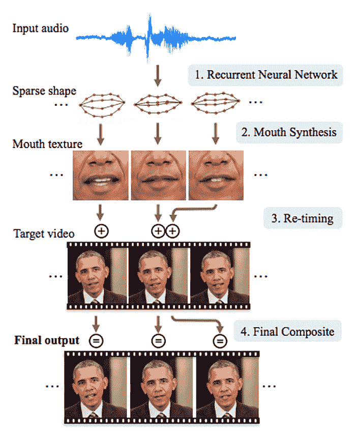

# 如何用人工神经网络合成假奥巴马视频

> 原文：<https://thenewstack.io/synthesize-fake-obama-video-artificial-neural-networks/>

如今，似乎没有一天没有人宣布“假新闻”——这个现在已经臭名昭著的短语在上次美国大选期间变得突出，现在正在令人作呕地流传。

但是任何聪明的人都知道，你不能总是相信你在网上(或网下)读到或看到的东西。由于照片编辑技术允许人们创造看起来真实但实际上从未发生的场景，互联网上充斥着伪造的 PS 图像。

现在，在人工智能的帮助下，我们也可能面临虚假新闻视频爆炸的前景。至少这是我们从来自华盛顿大学的研究人员的新发现中可能假设的，华盛顿大学的研究人员使用人工神经网络创建了这个相当令人信服但虚假的美国前总统巴拉克·奥巴马的视频，这个人工神经网络是在以前总统为主角的数小时视频片段上训练的，上面覆盖了他去年谈论[奥兰多大规模枪击事件](https://thenewstack.io/off-shelf-hacker-times-fear-uncertainty-doubt-lean-tools/)的真实音频剪辑。观察并看看你是否能确定什么是真实的，什么不是，以及它是如何做到的:

[https://www.youtube.com/embed/9Yq67CjDqvw?feature=oembed](https://www.youtube.com/embed/9Yq67CjDqvw?feature=oembed)

视频

根据研究人员的论文，他们使用了所谓的递归神经网络(RNN)，这是一种人工神经网络，它排列人工神经元的节点，以类似人类大脑的方式运行。这些网络被输入大量数据，以便“学习”如何执行任务或解决问题。

我们已经看到递归神经网络被应用于语音识别、文本到语音合成等领域——任何需要某种内部存储器来处理不同输入序列的领域。

在这种情况下，研究人员在一个单独的视频中提取了奥巴马讲话的音频，并将其复制到另一个完全不同位置的视频上。使用公共领域中大约 14 小时的镜头，并来源于奥巴马的每周公告，递归神经网络能够“学习”如何重建对应于各种声音的面部和嘴部运动的组合。

为了做到这一点，神经网络合成了一个“稀疏的嘴形”，在此基础上，嘴部纹理可以被应用并混合到一个改变的目标视频中，给说话的头部一个自然运动的外观。结果是一个怪异的似是而非的假唱。

然而令人惊讶的是，这并不是研究人员第一次尝试做这种事情。正如上面视频中提到的，同样的概念也有过其他版本，但这一次，华盛顿大学的团队在这个过程中添加了一个时间延迟，以使结果看起来更加真实。

此外，神经网络专注于合成面部与说话最相关的部分——即嘴及其周围区域、嘴唇和牙齿，特别关注说话时皮肤上的细微皱纹和阴影。甚至下颌线也翘起来，与目标视频中的下巴相匹配。

“给定每个时刻的嘴形，我们合成高质量的嘴部纹理，并将其与适当的 3D 姿势匹配进行合成，以改变他在目标视频中似乎在说什么，以匹配输入音频轨道，”该团队写道。"我们的方法产生了逼真的效果."

但制造假新闻不是这里的主要目的。研究小组预测这项技术可以用于其他更实际的应用。

“现实的音频到视频转换具有实际应用，如改善会议的视频会议，以及未来的应用，如能够通过仅从音频创建视觉效果，在虚拟现实中与历史人物进行对话，”研究的共同作者 Ira[Kemelmacher-Shlizerman](https://homes.cs.washington.edu/~kemelmi/)在 *[科学日报](https://www.sciencedaily.com/releases/2017/07/170711141408.htm)* 上说。“这种突破将有助于推动接下来的步骤。”

即使这项技术被用于操纵大众以达到政治目的，同样的技术也可以被用来确定一个视频是真的还是假的——通过检测混合的牙齿和嘴部运动。

论文合著者 [Supasorn Suwajanakorn](http://homes.cs.washington.edu/~supasorn/) 告诉 [*IEEE Spectrum*](http://spectrum.ieee.org/tech-talk/robotics/artificial-intelligence/ai-creates-fake-obama) “这可能不会被人眼注意到，但可以很容易地开发一个程序，将嘴区域的模糊性与视频的其余部分进行比较，并将非常可靠地工作”。

或许，这是一种冰冷的安慰，但至少这是一个合理的警告，提醒我们未来可能会发生什么。

图片:华盛顿大学

<svg xmlns:xlink="http://www.w3.org/1999/xlink" viewBox="0 0 68 31" version="1.1"><title>Group</title> <desc>Created with Sketch.</desc></svg>