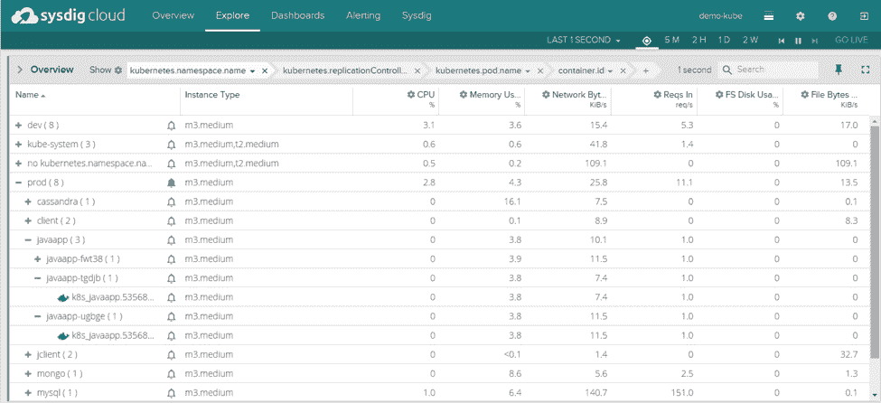
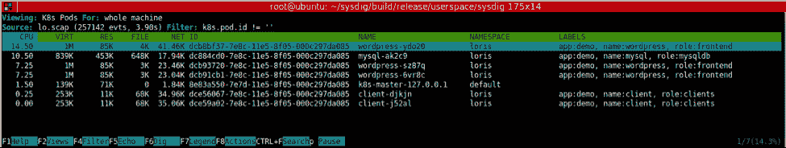

# Sysdig 将 Kubernetes 添加到其容器监控云中

> 原文：<https://thenewstack.io/sysdig-adds-kubernetes-container-monitoring-cloud/>

随着基于容器的平台的使用越来越多，开发人员需要了解在这些容器中运行的应用程序。传统上，他们有许多在虚拟和物理环境中都运行良好的传统监控工具，尽管传统的应用可见性方法在面对容器时往往会变得不稳定。由于容器的固有结构是将进程与系统范围内发生的事情隔离开来，这使得监控容器内部运行的应用程序变得更加困难。

## 进入 Kubernetes

为了帮助解决这个问题，Sysdig 在其 Sysdig 云中添加了对 Kubernetes 的原生支持，以允许开发人员更好地了解他们大规模运行的名称空间容器。该公司在本周于旧金山举行的 Kubecon 会议上宣布了这项新功能。

作为一个全方位服务的基础设施监控平台， [Sysdig Cloud](https://sysdig.com/) 提供对容器工作负载的监控、警报和故障排除。此外，Kubernetes 现在允许服务不仅提供单个容器的信息，如果需要，还可以提供整个集群的信息。

Docker 是一个强大的容器解决方案，但也非常基础。Docker 在开发需要快速伸缩的应用程序时带来了挑战。就其本身而言，Docker 本身不提供任何以任何特定方式移动容器或向容器分配资源的功能。对于运行微服务的开发人员来说，启动容器的过程意味着必须启动单独的服务器，然后将应用服务放置到服务器上，同时启动所需的任何其他容器，如负载平衡器或数据库。所有这些最终都需要手动连接到服务器，其他容器也需要同样艰苦的过程才能启动和运行。

结果，开发人员可能会以跨服务器的容器分散网络而告终，这带来了明显的挑战。有了 Kubernetes，无论容器位于服务器的什么位置，都可以连接它们，因为主控制器处理所有的 minion 容器环境编排。

Kubernetes 是为管理构建在 pod、节点、集群、服务和名称空间结构上的容器而构建的软件。在一个特定的名称空间中，开发人员可以建立物理机或虚拟机的集群，在这些集群上调度节点。然后，开发人员从节点部署 pod——跨越一系列节点的连接容器组。使用 Kubernetes，用户可以拥有许多 pod 和集群，在系统出现故障时，通过复制控制可以简化扩展。

Sysdig 首席运营官兼产品副总裁 Chris Crane 表示:“通过 Kubernetes，开发人员可以抽象出底层服务器，然后从 Kubernetes 的角度来看待他们的系统，从而对他们的基础设施有一个合理的了解。

从单个 pod 中提取信息，然后可以获得可用的元数据，并将其应用于 Sysdig Cloud 的 ContainerVision 中看到的信息，以逐个应用程序为基础查看性能。基于 web 的应用程序的开发人员可以查看那些与服务器相关联的容器和单元的性能，而不管它们在系统环境中的位置如何。这允许团队抽象出容器中不适合他们需求的层，让他们更好地了解他们关注的微服务。

图为:Sysdig 云中的容器分组特性

Sysdig Cloud 基于开源的 Sysdig 软件，由 Sysdig Cloud 的创始人、现任首席执行官洛里斯·德吉奥安尼创建。Sysdig 提供了容器级别的系统级探索。它可以从正在运行的 Linux 实例中捕获系统状态和活动，然后保存、过滤和分析这些信息。它可以用 Lua 编写脚本，包括一个命令行界面和一个交互式图形界面，称为 csysdig。“把 sysdig 想象成 strace+tcpdump+htop+iftop+lsof+牛逼酱”，[网站](http://www.sysdig.org/)为软件声明。

[Sysdig 云](https://sysdig.com/product/)背后的技术为运行 Sysdig 提供了坚实的基础。本地代理是用 C 和 C++编写的，这在监控 Linux 环境时非常吻合。Sysdig Cloud 通过在操作系统内核中安装一个模块来工作，允许开发人员更深入地了解他们的容器。

云服务现在支持开源和商业环境。Sysdig Cloud 的后端以用 Java 应用程序编写的定制 Cassandra 数据库为特色。该数据库以一秒钟的粒度收集每个进程和每个端口的唯一系统指标，而不仅仅是在主机级别收集指标。前端由 ember.js 编写的 JavaScript 应用程序提供支持。

## 解决正确的问题

对于那些关心系统性能的人来说，在服务器上放置单元和集群是监视系统的一个重要部分。有了对 Kubernetes 开发层次结构的新支持，使用 Sysdig Cloud 的开发人员现在能够在[个人级别](https://sysdig.com/digging-into-kubernetes-with-sysdig/)深入到他们的基础设施中。用户可以使用向下钻取功能突出显示 csysdig 中正在运行的元素，按 enter 键，并获得正在运行的容器、pod 和服务的列表，然后探索各个容器中正在运行的任务。

图为:使用 csysdig 查看机器上运行的 pod 列表。

有了从外部看到容器内部的能力，开发人员就不必使用传统的 VM 代理等。或者用额外的仪器污染他们现有的容器。Sysdig Cloud 提供了一个拖放式解决方案，用户可以将 Sysdig Cloud 容器放入他们的环境中。这种方法检测存在的所有其他容器，包括在这些容器中运行的进程。

然后，Sysdig Cloud 通过允许用户在单个级别上监控服务，按照单个部分隔离指标以获得更好的性能和分析，从而进一步进行监控。这使得整个开发流程的可见性更好，Sysdig Cloud 不仅能够支持云平台，还能够支持传统虚拟机以及那些从传统虚拟机混合过渡到基于云的托管解决方案的公司。

尽管容器最初只是作为在隔离环境中进行快速应用测试的轻量级虚拟机，但它们已经迅速改变了软件开发的前景。Sysdig 认识到，这种转变对希望在生产中大规模运行容器的企业来说是一种障碍，尤其是微服务，它为当今在容器中工作的人所面临的问题提供了一种独特的解决方案。

*Docker 是新栈的赞助商。*

特征图片:[光纤](https://www.flickr.com/photos/alesk/345519308)，由[亚历山大·德尔博斯](https://www.flickr.com/photos/alesk/)持 [CC by 2.0](https://creativecommons.org/licenses/by/2.0/) 授权。

<svg xmlns:xlink="http://www.w3.org/1999/xlink" viewBox="0 0 68 31" version="1.1"><title>Group</title> <desc>Created with Sketch.</desc></svg>