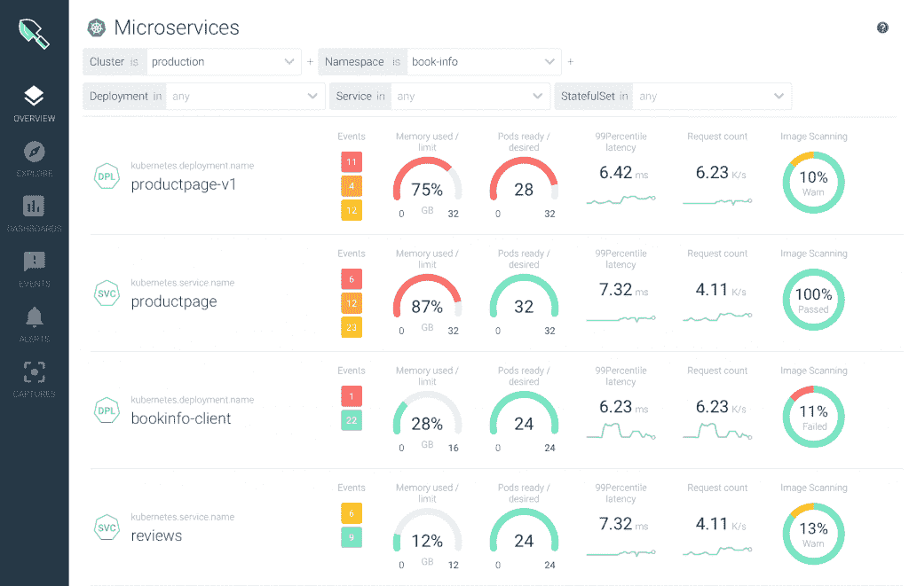

# Sysdig 更新为云本机应用程序提供了安全性和可见性

> 原文：<https://thenewstack.io/sysdig-update-provides-security-and-visibility-to-cloud-native-applications/>

随着可见性和安全性平台(VSP) 2.0 的测试版发布，Sysdig 继续扩展其客户对其收集的有关云原生应用的精细信息进行分割的方式。在一份声明中，该公司表示，新平台为企业提供了“第一个也是唯一一个统一的云原生环境的风险、健康和性能视图”，提供了“性能指标、合规性仪表板、安全事件等”

Sysdig 首席技术官兼创始人[洛里斯·德吉奥安尼](https://www.linkedin.com/in/degio)在一次采访中解释说，该公司的产品已经发展到可以处理企业在生产中运行云原生应用程序的需求，他认为这不应再由孤立的点解决方案来处理。

“云原生环境中的数据量是传统环境中的 10 倍。需要更多的背景知识。有指挥者和其他实体一起演奏。计算单位是短暂的，而 CI/CD 的过程完全改变了一切，”Degioanni 说。“Sysdig 没有提供单点解决方案，而是将所有东西打包在一个平台上，提供最佳的数据和集成。此次发布旨在提供一个解决方案，让您能够在生产中运行 Kubernetes 和基于云的原生应用，并能够解决企业在生产中运行 Kubernetes 时需要解决的所有问题。”

根据 Degioanni 的说法，Sysdig 的真正优势来自于其与[增强的 Berkeley 数据包过滤器](https://thenewstack.io/linux-technology-for-the-new-year-ebpf/) (eBPF)的合作，该公司声明称，该过滤器允许单个代理“收集来自主机、容器、编排器、网络、进程和跨云文件的丰富和深入的性能和安全数据。”然后，VSP 2.0 为用户提供了一个单一位置来查看与他们的需求相关的数据，即“企业环境的单一综合视图，该视图提供了数千个集群中数千种微服务的风险、运行状况和性能数据。”

“传统上，要获得如此丰富的信息，您必须修改操作系统的内核。这会给你在可见性方面的超能力，但也会让安全团队紧张。多亏了 eBPF 和那里所做的工作，就像在系统内核中获得了一个小 VM，”Degioanni 解释道。"此虚拟机只能运行预先验证的程序。您可以非常灵活地在内核中以一种不危险的方式运行这些程序，并且确信它不会在您的部署中造成安全问题。”

Degioanni 说，有了新版本的 VSP，该平台可以在单个主机上监控和保护的容器数量增加了大约 5 倍，该平台可以处理的指标数量增加了近 10 倍。除了更大的规模，VSP 2.0 还提供了“现成的仪表盘，用于容量规划、控制平面运行状况和合规性趋势、新的默认警报规则、Kubernetes 基准测试结果、现成的 Kubernetes 审计策略以及与 kube 准入控制器的集成。”

VSP 2.0 还提供了对新运行时的支持，包括 CRI-O 和 containerd，以及使用 Kubernetes 元数据进一步查明根本原因和评估风险状况的能力。VSP 2.0 的预览版将于 2019 年 5 月向现有客户提供。

由[斯科特·韦伯](https://unsplash.com/photos/3LsocYqXWpM?utm_source=unsplash&utm_medium=referral&utm_content=creditCopyText)在 [Unsplash](https://unsplash.com/search/photos/cloud?utm_source=unsplash&utm_medium=referral&utm_content=creditCopyText) 拍摄的特写图片。

<svg xmlns:xlink="http://www.w3.org/1999/xlink" viewBox="0 0 68 31" version="1.1"><title>Group</title> <desc>Created with Sketch.</desc></svg>