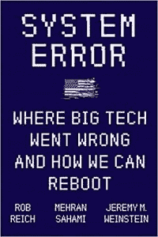
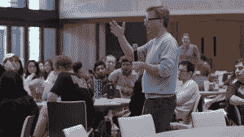

# “系统错误”警告“优化”的黑暗面

> 原文：<https://thenewstack.io/system-error-book-warns-of-optimization-dangers-for-tech-companies/>

甚至在[“脸书论文”发布之前，](https://www.protocol.com/facebook-papers)三位斯坦福大学教授就为大型科技公司提出了他们自己的改革建议。

9 月，哲学家[罗布·赖克](https://www.linkedin.com/in/rob-reich-8555738/)、计算机科学家[麦兰·萨哈米](https://www.linkedin.com/in/mehransahami/)和政治科学家[杰瑞米·温斯坦](https://politicalscience.stanford.edu/people/jeremy-weinstein)发布了一本名为[的新书《系统错误:大科技哪里出错了，我们如何重启》](https://politicalscience.stanford.edu/publications/system-error-where-big-tech-went-wrong-and-how-we-can-reboot)

《纽约客》(The New Yorker)最近的一个标题将其描述为[“斯坦福接受科技冲击”，](https://www.newyorker.com/magazine/2021/10/25/stanford-takes-on-the-techlash)认为 2016 年的一个认识动摇了世界对大科技的信心，即“随着数字革命的积极方面，如更高效的墨西哥卷饼递送，可能会出现消极方面，如西方民主的瓦解。”

这本书认为，正是程序员本身——以及他们对优化的关注——不可避免地与社会更大的“利润和规模最大化的愿望”(以及随之而来的技术垄断)结合在一起，最终造成了一系列意想不到的问题。

然后，作者提供了他们解决问题的方法。

## 问题解决者

那么这些雄心勃勃的问题解决者是谁呢？

萨哈米在谷歌还是一家初创公司时就在谷歌工作(由联合创始人谢尔盖·布林(Sergey Brin)招募到该公司)。萨哈米从事的应用程序“现在被数十亿人使用”(包括电子邮件的垃圾邮件过滤器)，然后在 2007 年回到斯坦福大学担任计算机科学教授，他“希望技术专家明白，他们在编写代码时做出的决定会产生影响数百万人的真实社会后果。”

但这本书也需要温斯坦的观点——他在斯坦福大学担任现职之前，曾在白宫(奥巴马政府期间)担任政府职务，并与美国驻联合国大使共事。

“正如政策制定者在许多方面对技术一无所知一样，”该书声称，“技术专家对公共政策的重要性以及社会科学可以帮助我们理解、预测甚至减轻技术对社会的影响的方式是天真的，甚至可能是故意视而不见。”

第三种观点也很关键——这是赖克的观点，他领导着该大学的社会伦理中心和以人为中心的人工智能研究所——该书指出，他“带来了苏格拉底式的取向，提出了探索性和令人不安的问题，旨在动摇技术专家的观点。”

斯坦福政治学教授罗布·赖克在《系统错误》中向技术专家提出了“令人不安的试探性问题”。

这本书的序言认为，赖克最终想要挑战工程师如何看待自己的角色。“作为一个问题解决者，不去问更深层次的问题是不够的:这个问题值得解决吗？考虑到我们重视的事物，我们有什么特别的方法来解决它吗？”

这本书将他们自己称为“技术专家、政策制定者和哲学家”，描述了三位教授如何一起设计了一门关于技术变革的热门课程，涵盖了政治和伦理。

《纽约客》追踪了斯坦福大学 2019 年宣布的课程(有 300 名学生参加)。《斯坦福新闻》的标题称，这门课程“敦促学生负责任地行动和思考问题”，而不是“快速行动和打破常规”

[https://www.youtube.com/embed/AOqIiofqp3E?feature=oembed](https://www.youtube.com/embed/AOqIiofqp3E?feature=oembed)

视频

这本书从作者的课堂经验中发展而来，以他们早先在斯坦福观察到的“关注模式”为开篇。“*创新*和*颠覆*是校园里的流行语，我们的学生宣扬一种近乎乌托邦的观点，认为旧的做事方式已经被打破，技术是万能的解决方案。

“也许最令人不安的是，对数字经济和从斯坦福到硅谷的赚钱渠道的热情并没有因为对谁的问题得到解决(以及谁的问题被忽视)、谁从创新中受益(以及谁在损失)以及谁在塑造我们的技术未来方面有发言权(以及谁仍然被忽视)的批判性思考而减弱。”

他们写道，这不仅仅是斯坦福的问题，引用乐观的科技标题背叛了“我们努力在学生中对抗的一种天真的乐观主义。”

“‘让世界变得更美好’已经成为主要科技公司的一句妙语，而不是真正的使命宣言，突显出我们许多人在确定什么是真正的公共利益时面临的困难。”

## 效率是否已经泛滥成灾？

他们的书的主要论点是，塑造我们的未来始于将我们的注意力引向技术专家的“独特思维”(和不断增长的力量)——具体来说，就是优化的思维。(第一部分开篇引用了阿尔多斯·赫胥黎的反乌托邦小说*美丽新世界中的一句话:“在一个科技发达的时代，效率低下是对圣灵的亵渎。”)*

 *第一章向我们介绍了“效率至上的程序员群体”，这本书以一种近乎大胆的尝试来描述当今的程序员。它深入研究了计算机科学本身的起源——决策理论家[乔治·丹齐格](https://en.wikipedia.org/wiki/George_Dantzig)(也是斯坦福大学教授)的工作——以及它在[“旅行推销员问题”等问题上的优化优先级](https://en.wikipedia.org/wiki/Travelling_salesman_problem)

1976 年，斯坦福大学教授乔治·丹齐格和总统杰拉尔德·福特在国家科学奖章仪式上。

但这本书的作者指出，只有通过某种方式优化你可以测量或量化的东西才是可能的。他们甚至试图提供一些真实世界的例子来说明“技术专家的专业思维是如何轻易地成为更普遍的生活取向的。”(例如，那个古怪的美食家创立了一家价值数百万美元的公司，销售一种名为 Soylent 的代餐粉。)

这本书的下一部分题为“效率的不足”

简介还讲述了约书亚·白劳德的故事，这位斯坦福大学的学生在创建了一款帮助挑战停车罚单的应用程序 DoNotPay(由安德森·霍洛维茨提供种子资金)后成为了一家科技公司的首席执行官。

作者引用了一个简介，发现该应用程序最终帮助成功挑战了超过 16 万张停车罚单——防止 400 万美元进入市政府金库。白劳德的下一个梦想是什么？“我希望用技术取代律师，”他告诉一名记者，“从反对停车罚单这样非常简单的事情开始，然后走向按下按钮起诉某人或按下按钮离婚这样的事情。”

在这本书的这一部分——最近在 *Fast Company* 摘录的[——作者强调白劳德“不是一个坏人。他只是生活在一个正常的世界里，不去多想新技术公司会如何产生有害影响。”](https://www.fastcompany.com/90670525/stanford-founders-misplaced-priorities-system-error-excerpt)

他们把他简单地描述为“斯坦福和整个硅谷诞生的创业思维的一个最近的例子”，被同行和教授(以及投资者)推向雄心勃勃，而没有考虑社会的更大利益。

这本书的作者把白劳德的引用引向了它的逻辑结论——以及它提出的问题。

“我们真的想生活在一个人们按下按钮就可以起诉的社会里吗？如果由算法和自动化系统来决定谁应该拥有孩子的监护权以及共同财产应该如何分割，离婚会不会更痛苦？”

## 谁的目标重要？

在“系统错误”的后面，作者要求读者考虑谁的目标得到了满足——这是白劳德本人最近在 Twitter 上表达的观点。

这本书充满了例子和轶事。赖克曾经参加过一次由一位技术巨头举办的小型晚宴，他想讨论建立一个新国家以最大限度地促进技术/科学进步的利弊。当赖克被问及这是否是一种民主时，他对这一回答感到惊讶。

“民主？不，”泰坦说。“为了优化科学，我们需要一位仁慈的技术专家来负责。民主太慢，拖了科学的后腿。”

这本书认为这是一个核心问题:优化者，即使是善意的，“未能衡量所有有意义的东西。”(然后，后来，他们最终只是把自己的价值观强加给我们其他人。)

“一个更好的策略是，用混乱、低效、但授权的过程来取代编码员和强大的科技公司狭隘的技术官僚治理，决定通过我们所谓的民主来推广什么价值观。”

作者的“引言”以辩称他们的书“展示了让优化者掌权的危险，并授权我们所有人做出艰难的决定，这些决定将决定技术如何改变我们的社会。"

## 超越人性

《系统错误》是一本生动的读物。有一些精辟的副标题，比如，“可测量的并不总是有意义的”，“数据收集的狂野西部”，以及“有什么东西应该超越自动化吗？”有整整一章是关于言论自由的，包括一个名为“言论过剩及其后果”的小节

有时，作者的言辞令人振奋。(“如果我们接受技术完全超出我们的控制，我们就把未来拱手让给了工程师、企业领导人和风险资本家。”)但作为一个解决方案，他们建议依赖一个历史悠久的系统:“民主政治的交换”，该系统“倾向于通过深思熟虑缓慢地决定事情，并随时可能修改任何过去的决定。”

他们指出，从美国参议院关于社交媒体的听证会到欧盟的《通用数据保护条例》(GDPR)，一切都表明“政府和科技行业之间的新关系是一种真正的可能性”

最后一章提供了作者自己提出的解决方案，呼吁“我们如何对待市场的政策变化，以便对企业权力和垄断行为进行检查”，包括数据可移植性(在竞争的社交媒体服务之间)以及对数据隐私的更强承诺(由政府机构实施)。

他们还指出，即使只是反垄断执法的威胁也可能改变公司的行为，并主张重组公司治理。他们指出，监管本身应该变得更具响应性和“适应性”，最终表明，如果我们的立法者未能提供良好的技术成果，他们应该面对选民的愤怒。

由于互联网是全球性的，这本书的最后一页提到了与专制的中国合作寻找“数字领域的共同规则”的挑战。

作者的猫声称他的副本“系统错误。”

《系统错误》以一句引人注目的话结束:民主本身是一种技术，“一种解决社会问题的设计，其主要优点是捍卫个人权利、赋予公民发言权以及适应不断变化的社会条件……

“事实证明，它能够应对过去的各种挑战。对我们技术未来的监管将是下一个决定性的挑战。”

* * *

# WebReduce

<svg xmlns:xlink="http://www.w3.org/1999/xlink" viewBox="0 0 68 31" version="1.1"><title>Group</title> <desc>Created with Sketch.</desc></svg>*