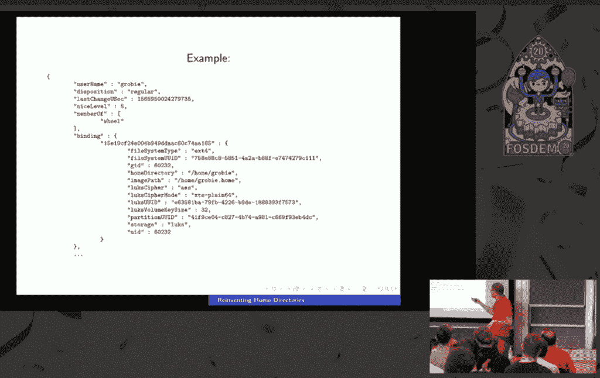

# Systemd 的 Lennart Poettering 希望将 Linux 主目录带入 21 世纪

> 原文：<https://thenewstack.io/systemds-lennart-poettering-wants-to-bring-linux-home-directories-into-the-21st-century/>

一些极客传统在 2020 年继续，包括 FOSDEM——自由和开源软件开发者欧洲会议。特别的 20 周年纪念版仍然按计划于 2 月初在布鲁塞尔举行，给了社区开发者一个相互交流的机会。

上周，这些视频终于出现在网上——包括经常引起争议的 [systemd](https://thenewstack.io/systemd-vs-linux-kernel/) 创造者[Lennart poeting](http://0pointer.de/lennart/),[让我们把 UNIX 主目录的概念带入 21 世纪](https://youtu.be/ZYOHvzv2T64)

在“Distributions devroom”专题中，这位德国软件工程师(也是 Red Hat 的员工)针对我们当前的系统提出了自己的观点，其中每个新用户帐户都需要在`etc/passwd`中有一个相应的条目，并告诉我们 systemd 将如何开始使其变得更好。

几个月前，科技博客 Hackaday [调侃道:“主目录在本质上是如此不起眼，人们通常不会考虑改变它们的任何东西。“然后还有伦纳特吟诗…”](https://hackaday.com/2019/10/16/pack-your-bags-systemd-is-taking-you-to-a-new-home/)

通过 systemd-homed，Poettering“旨在将所有围绕用户管理的独立配置实体统一到一个集中的系统中，足够灵活地处理未来可能需要的一切，”Hackaday 总结道。

[https://www.youtube.com/embed/ZYOHvzv2T64?feature=oembed](https://www.youtube.com/embed/ZYOHvzv2T64?feature=oembed)

视频

至少自 2019 年以来，Poettering 一直在谈论 systemd-homed 项目，在其 GitHub 的知识库上将其描述为“systemd 的一个新组件，它改变了我们在 Linux 上制作主目录的方式，添加了有意义的强大加密，支持自动枚举和热插拔主目录等等。”

在他的演讲中，诗人分享了一个更加雄心勃勃的愿景。“我个人认为，我们应该转向一般不可写`etc/`的系统，”除非发生实际的重新配置。他认为创建或更新用户不应该是一种配置改变。

或者，正如他的幻灯片所说，当前的 Unix 架构“混合了状态和配置”

但是我们目前的系统还有一个基本的缺点。每个用户的唯一用户标识号(或 UID)必须在所有系统之间共享(用于控制访问)。“我们为传播做了所有这些基础设施，但我认为我们不应该…我认为如果 UID 实际上是本地系统的产物，那会好得多。”

## 从第一天开始就是 YubiKeys？

此外，主目录中也没有内置加密。“这很奇怪，”Poettering 说。想象一下，使用全磁盘加密启动笔记本电脑，提供您的解密密码，然后被要求提供另一个较小的密码来访问您的网络帐户。Poettering 称之为密码，“它实际上并不保护你的数据，只是控制访问。”

“我们应该弄清楚如何加密这些东西，如何锁定这些东西，锁定到您想要锁定的实际凭证上。”

这怎么可能呢？虽然系统应该用自己的资产管理系统锁定，但“你的数据应该锁定到你控制的东西”——比如你自己的私人密码或 YubiKey 这样的硬件认证设备。

Poettering 与我们今天的世界形成了对比，在我们今天的世界中，“你用来保护数据的是系统属性，而不是用户属性。”

这导致了一个更大的批评:缺乏“现代”的认证机制。“我的意思是，我们现在生活在一个 YubiKey 已经成为一种东西的世界，但一切仍然与`etc/passwd`中的一个单一密码绑定……”即使在一个拥有强大的生物安全选项(如基于指纹的触控 ID 系统，甚至基于面部识别的安全性)的世界中，“Unix 固有的用户数据库设计是围绕密码而不是其他任何东西的……”

事实上，Poettering 的目标清单上的最后一项是“YubiKeys，从第一天开始”——他解释说，这不仅意味着 YubiKeys，还意味着适应现代硬件认证设备的整个宇宙。“这不再是所有的密码，”他说。他希望看到一个“我们真正正确使用它们的世界，不仅仅是认证，还有加密部分。”

这最终与他的另一个目标联系在一起:统一密码和加密密钥。“如果我可以解密主目录，对我来说，这与身份验证是一回事。而认证应该永远是:解密主目录的能力。”

Poettering 认为，重点应该是人类用户(而不是与守护进程相关的进程和帐户)，尤其是现代的笔记本电脑用户。但是他也重温了他最讨厌的事情之一:当一个磁盘加密系统被挂起时，解密密钥仍然可以保存在内存中。他最终希望看到一个完全独立的“可迁移”主目录——他称之为“单臂式主目录”

在这个世界里，你不仅仅是在 u 盘上复制你的主目录；相反，便携式存储介质成为您的主目录。“也就是说，你现在可以把它插到这台笔记本电脑上，登录后就可以正常工作了。然后你可以明天把它拿出来放在另一台笔记本电脑上，登录进去，一切就都正常了。”

一大优势？“安全偏执的人会喜欢这一点，因为这基本上意味着当你注销时，你永远不会在系统上留下实际的有效负载数据，因为你只是把它放在口袋里，并把它带到其他设备上。”此外，当您购买新笔记本电脑时，这也有助于更轻松的过渡。“我在这里试图设计的关键是非常明确的生命周期，也就是说，当你注销时，你就注销了。当你登录时，你就登录了。当您登录时，系统将访问设备，但当您注销时，应该不可能访问您的设备。”

但是我们怎么去呢？Poettering 最终花了一些时间描述最近在 systemd 中完成的一个新的和改进的概念。回送文件中 Linux 统一密钥设置(LUKS)加密的主目录的可用性可以给加密带来明显的提升。(“加密与用户登录本身直接相关，”Hackaday 指出，“这意味着，一旦用户登录，不仅磁盘会自动解密，而且一旦用户注销、锁定屏幕或暂停设备，它同样会自动再次加密。”)

## 跳转到 JSON

Poettering 的另一个问题是我们当前的用户账户系统不可扩展。密码的数据结构仍然和 1985 年一样，有六个相同的字段——用户名、用户 ID、组 ID、真实姓名、主目录和登录 shell。那么，例如，SSH 密钥放在哪里呢？Poettering 指出，您的主目录中的授权密钥最终会出现在扩展用户记录的“边车数据库”中。除了混乱之外，还有一个风险是它们会变得不同步。

所以 Poettering 强调了 systemd 中另一个最近完成的特性:以 JavaScript Object Notation (JSON)格式编写用户记录的能力，使它们完全且容易扩展。或者，正如 [systemd 的官方网页](https://systemd.io/USER_RECORD/)所解释的，“systemd 选择性地处理超越经典 UNIX(或 glibc NSS) `struct passwd`的用户记录。”这些文档只提出了一个有趣的可能性:额外的用户元数据，比如图片、电子邮件地址、位置、时区或首选语言。

“如果您提供这些 JSON 用户记录，您可以在 systemd 中表示许多不同的属性。实际上，我们将为您进行资源管理、一些安全事务和其他运行时参数。但我们可以就某种更现代的谈论用户的方式达成一致。”

在观众中，有人问 JSON 用户记录是否已经成为一种标准 Poettering 的回答引起了一阵笑声。“嗯……我不是一个标准组织。我是说，我算是，但也不是。”但随后他调出了在 systemd.io 中[定义](https://systemd.io/GROUP_RECORD) [的](https://systemd.io/USER_GROUP_API/)[URL](https://systemd.io/USER_RECORD)，俏皮地说“标准就在那里。”

“这个规范应该是一个活的规范，”用户记录的网页上写道。“如果您需要额外的字段，请考虑将它们提交到上游以包含在本规范中。如果它们相当普遍有用，最好在这里列出来。”

或者，正如 Poettering 在他的演讲结束时所说，“如果你想要自己的领域，你甚至不应该和我说话，这种方式是可以扩展的。就拿着它——正确地命名它。我没兴趣做这个夹在中间管理每个人领域的人。很明显，这不是我想要的。只需选择一个您想要的字段，通过使用一个不太可能与其他所有字段冲突的名称来正确命名它，然后添加您喜欢的任何内容。

"它应该像 Linux 一样被分发."

* * *

## WebReduce

<svg xmlns:xlink="http://www.w3.org/1999/xlink" viewBox="0 0 68 31" version="1.1"><title>Group</title> <desc>Created with Sketch.</desc></svg>