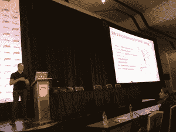
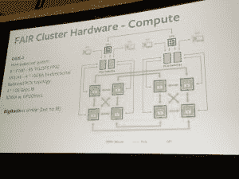
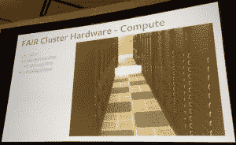

# 脸书大学深度学习研究的系统和软件

> 原文：<https://thenewstack.io/systems-software-deep-learning-research-facebook/>

来自脸书人工智能研究团队的工程师在最近于圣荷西举行的 NVIDIA GPU 技术大会上登台解释他们工作中使用的技术基础设施。[工程经理霍华德·曼塞尔](https://www.linkedin.com/in/hmansell/)和[人工智能研究工程师索史密斯·钦塔尔](https://www.linkedin.com/in/soumith/)在会议中展示了深厚的极客知识。

Howard Mansell，FAIR 的工程经理，在圣何塞的 GPU 技术大会上发言

“我们的使命是推进机器学习或机器智能领域，”曼塞尔说。该团队从事研究，发表论文，参加会议和研讨会，同时专注于围绕人工智能(AI)的长期学术问题。他们积极研究计算机视觉、自然语言理解、语音、机器翻译、无监督学习和强化学习。“几乎所有的事情，”他说。“我们相信这种方法将加快人工智能的发展。”

他们的大部分研究都集中在网络训练上，但他们确实与应用机器学习团队合作，将研究成果产品化。两个例子是使用深度学习和图像分类的新翻译产品，这些规则描述了你发布到脸书的图像中的内容。

Mansell 说，他们的研究人员需要最好、最灵活的硬件和软件，这样他们才能快速行动。项目每天都在变化，所以灵活性是关键。拥有一个真正管理良好的系统非常重要。

可以想象，所有这些都需要巨大的计算能力。

## 培训用数据

他说，在网络上训练数据既是一个数学问题，也是一个工程问题。曼塞尔团队的工作规模是我们大多数人无法想象的。他们的训练模型拥有脸书网络上所有的权重和偏见，这加起来有数百万个参数。他们将数千万个参数放入一个大的数据集中，最终拥有数十万亿字节。所以他们在他所谓的“百万维”空间中进行计算。令人难以置信。

曼塞尔提出了深度神经网络(DNN)训练的基本要求:

*   创建一个有数百万个参数的模型。
*   在多结核数据集上训练。
*   计算机视觉模型需要 5-100+ Exa-FLOPS(每秒浮点运算)的计算以及数十亿次 IOPS(每秒输入/输出操作)。
*   记住梯度下降算法是连续的。

他说，算法本质上是顺序的，所以“你不能只是扔给它大量的 CPU，然后希望它可以扩展。我们必须仔细考虑互联以及瓶颈在哪里。”

## 硬件

这有助于他们建立在脸书的大规模计算机资源和非常大规模的基础设施上，支持脸书，Instagram，What's App 产品。

除了要求极高的性能，他们还需要极高的灵活性。因为他们的研究项目每天都在变化，所以没有时间为特定的产品或项目优化基础设施。

图中的公平簇

公平硬件集群的主要组成部分是 DGX-1。

DGX 1 号线索网是两个交织的环，具有双向、每秒 16 千兆字节的带宽。Mansell 说，对于单个系统来说，这可以实现每秒超过 6 千兆字节的吞吐量。

他说，最重要的组件是 8 帕斯卡 P100 GPU。这些与 NVLink 互连，给他们一个 4 个 16 千兆位每秒的双向混合。该堆栈还包括几个强大的 CPU 和一个良好的 PCI express 拓扑结构。这使他们能够根据需要尽快将数据输入 GPU，以跟上 GPU 不断增长的能力。

为了在尽可能高的带宽下创造最低的延迟可能性，Mansell 说他们通过 NDlink 绕过了 DGX-1。这意味着 GPU 之间的数据传输可以通过快速双向链路进行，从而使它们能够优化 PCI express 拓扑结构，以便向 GPU 提供数据。

物理公平集群

他们还为每对 GPU 维护一个 infinity band 接口卡。他解释说，每张卡都有每秒 100 千兆比特的带宽。他们还使用 IDMA，在不涉及 CPU 内核的情况下，将数据从一台机器的 GPU 传输到另一台机器的 GPU。

他说，生产中使用的计算机平台系统是开源的。它拥有相同的数据板，包含相同关键网格架构中的 GPU。

DGX-1 是一个用于深度学习的伟大系统，他说。“我们用 128 架 DGX-1 建造了 ZX 空军基地。这为我们提供了 10 . 5 petaFLOPS 总量，用于 32 个浮点和计算，是 16 位的两倍。”

他说，因为他们使用多个 DGX-1 来训练一个模块，所以他们建立了一个无阻塞的 IB 网络结构。他解释说，这没有日志记录，这意味着没有瓶颈。“我可以用任何一对普通的 DGX-1，以每秒 400 千兆比特的速度在它们之间进行通信。所有成对的 DGX-1 可以同时这样做。他们不会遇到网络瓶颈。”

该集群的另外两个重要组件是开发服务器和共享存储。Mansell 说，研究人员在笔记本电脑上与计算机进行交互，因此他们使用双四行 GP 100 GPUs 构建了一个迷你 DGX-1，这些 GPU 之间有 N gigalink。

他说，在集群中，存储经常被忽视。“你基本上需要从 SSD 或 RAM 提供数据，因为存在随机访问模式和高吞吐量要求，所以 Pascal GPU 每秒可以消耗数百张图像。”对于一个非常简单的模型来说，这将达到每秒 1000 张图像的峰值。“如果你将其扩展到 1，024 个 GPU，显然你会有很多文件闲置，”他解释道。

由于大型数据集中的随机访问模式，缓存将会受到影响。一旦你离开了本地光盘，你就会遇到问题，他说。他们构建了一个存储系统，可以满足整个集群的 iOS 要求，而无需独立缓存。他说，该系统支持每 100 存储每秒大约 15 万个文件速率，并且他们可以在存储的同时扩展 iOS。“我们将在不同等级之间分割数据集，这样即使我们使用相对少量的数据，也不会出现热点，”Mansell 说。

## 然后是软件

FAIR 团队使用两个框架，都是开源的，由脸书维护，High Torch 和 Caffe2。每一个都有不同的目的。

High Torch 是为研究应用而设计的。它在 Python 中有一个新的前端，它使用了一种叫做定义-层-执行的方法。“这意味着你编写简单的命令式平台代码或在网络上执行完整的计算，这是一个副作用，它构建了一个计算的动态图，我们可以用它来计算活动通道的区域，”他说。

相比之下，Caffe2 更适合生产流程。Mansell 说，根据这一推论，Caffe2 在低端 Android 设备上非常有效。“如果你打开你的脸书应用程序，进入相机，那里有一个新的风格传输，由 Caffe2 提供支持，将在设备中的 Python 上运行，并在某些情况下使用移动 GPU，如果它们可用的话。”

他说，Caffe2 的工作原理是定义-执行。“因此，您可以静态地定义您的计算机图，并且您不必在最终产品代码中包含 Python，而这对于三线应用程序或 ads 之类的超级可扩展低遗留系统来说是很重要的。”

曼塞尔总结道:拥有一个真正管理良好的系统非常重要。“DGX 1 号上的 MVA 线索网能够像交响乐团一样实现快速通信。基于环的集合通常是利用这些东西的最佳方式，快速存储非常重要。”

通过 Pixabay 的特征图像。

<svg xmlns:xlink="http://www.w3.org/1999/xlink" viewBox="0 0 68 31" version="1.1"><title>Group</title> <desc>Created with Sketch.</desc></svg>