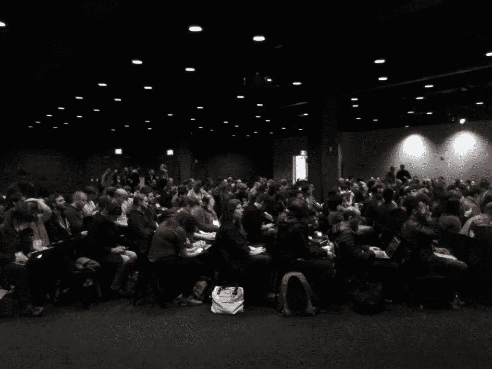
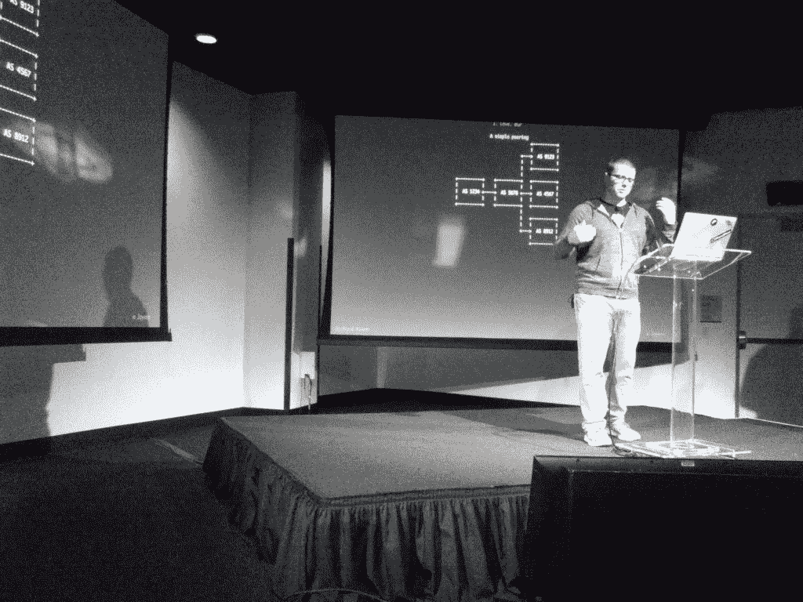

# 我们热爱的系统:过去如何影响我们的现在

> 原文：<https://thenewstack.io/systems-we-love/>

它始于七月的一条推文询问是否有兴趣——在几十个回复(和 161 个“赞”)之后——它开始了。到 10 月中旬，首届“ [Systems We Love](https://systemswe.love/) ”会议的组织者已经收到了 19 个发言时段的 162 份提交材料，“我将 70 个标记为‘希望看到’，”委员会成员兼 Joyent 软件工程师 [Ryan Zezeski](https://twitter.com/rzezeski?lang=en) 在 Twitter 上发布。

本周二，[会议终于召开了](http://systemswe.love/agenda) …

受我们喜爱的[论文](http://paperswelove.org/)的启发——人们在那里谈论他们最喜爱的计算机科学论文——这次活动的特色是谈论最喜爱的*系统*，会议组织者和 Joyent 首席技术官 [Bryan Cantrill](https://twitter.com/bcantrill) 在[的一篇博客文章](http://dtrace.org/blogs/bmc/2016/09/26/systems-we-love/)中解释道。虽然论文很好，但“最终是我们开发的工件——系统本身——代表了我们想法的有形体现”

因此，在旧金山的一个定制活动场所——就在布鲁明戴尔的圣诞装饰品和历史悠久的天光穹顶商场之后——极客们开始聚集。分发完 t 恤衫和点心后，当第一位演讲者上台时，人群满怀期待地注视着他。

这一切始于 Joyent 的软件工程师 Ryan Zezeski(T0)和深情地回忆起他与的互动(T3 ), Roger Faulkner(T5 ),他是 Unix 仍然全部用大写字母拼写的时代的先驱程序员之一，是“工程师的工程师”,也是/proc 文件系统的创建者。

亚当·弗莱彻的[轻松谈话](https://youtu.be/TPe6UXMDMGM?t=49m16s)回忆起他建立航空订票系统的时候，开玩笑说“我没有编写任何可能导致飞机坠毁的软件，但我确实编写了可能导致你在机场延误很多时间的软件。”他继承了一些极其古老的遗留系统，谈到这些系统时，他充满钦佩。

弗莱彻还透露，航空公司确认码是六个字符的原因是因为“在早期，这是磁盘上的块地址…字面上，他们只是打印出一个指针，给你。”

与此同时，该活动的组织者在推特上持续发表评论。

其他几个演示也可以追溯到 Unix 的早期。旧金山软件工程师 [Breanne Boland](https://twitter.com/breanneboland) 在问谁在上个月使用了手册页时，引起了观众的举手[，然后提醒每个人手册页](https://youtu.be/TPe6UXMDMGM?t=1h10m26s)[开始是一个装满打印页的单个活页夹](https://truss.works/blog/2016/12/9/man-splained)。文档是每个人的问题:即使是 Unix 的创造者，Ken Thompson 和 Dennis Ritchie 也被他们的经理告知他们现在也负责文档——剩下的就是历史了。

科迪·梅洛[关于 AWK 的演讲](https://youtu.be/TPe6UXMDMGM?t=7h51m20s)也讲述了 20 世纪 70 年代的故事，当时文本处理工具从肯·汤普森和[李·麦克马洪](http://www.ugu.com/sui/ugu/show?I=info.Lee_McMahon)的工作演变成强大的 Unix 实用程序 AWK。他提醒观众，它仍在积极维护中——68 岁的[布莱恩·克尼根](https://www.cs.princeton.edu/~bwk/)在 2012 年发布了最新版本。Mello 以他自己聪明的 Unix 技巧赢得了一些观众的赞赏，这确保了他总是能够追溯他曾经键入的每一个命令。

Daniel Morsing[关于 UTF 8 号的](https://github.com/DanielMorsing)[演讲](https://youtu.be/TPe6UXMDMGM?t=8h13m57s)有一张我见过的最及时的幻灯片——一张来自这次会议的挂绳的照片，显示它的印刷者已经音译了 Timothée Peigner 这个名字，并用了自己的替代字符，毫无疑问是因为它缺乏对 UTF 8 号的支持。

Brian Troutwine 喜欢的系统是阿波罗导航计算机，尽管他抱怨说每次他的一个关于它的演讲出现在 YouTube 上，评论中的“月球骗子”指责他是隐藏真相的阴谋集团的一部分。

“我想影子阴谋集团付钱给威尔斯，”他开玩笑说，并补充道，“我不是其中的一部分。”

然后，他告诉观众阿波罗 11 号的计算机实际上是如何在任务中重新启动的，“当你试图在一个贫瘠的世界着陆时，这是非常可怕的。”

他相信那些程序员认为他们自己的工作很无聊——令人兴奋的部分是乘坐火箭进入太空——这使他的演讲得出了一个鼓舞人心的结论。“我鼓励你们所有人在枯燥的日常工作中去做一些令人惊奇的事情。”

与此同时，回到推特上，安全极客[莎拉·霍夫曼](https://twitter.com/dangerpudding)已经开始[在推特上发布她所做笔记的照片](https://twitter.com/search?q=systemswelove+dangerpudding):

一名纽约极客甚至[发推文给](https://twitter.com/ColonelMode/status/808729501739917312)说，多亏了直播，他在参加另一场会议的同时也在观看演示*——具体来说，是关于企业 Kubernetes 的[构造峰会](https://thenewstack.io/tectonic-summit-pancake-breakfast/)。*

会议本身的一些推文令人惊讶地尖锐。

Marianne Bellotti 在演讲开始时说，她真的很喜欢大多数工程师讨厌的系统——“凌乱、陈旧、胶带和口香糖…”然后补充道，“幸运的是，我为联邦政府工作。”

具体来说，她是美国数字服务的一部分，该服务将“技术人才”与联邦政府的工作人员配对，并用她的故事取悦观众，这些故事涉及一台建于 20 世纪 60 年代的 IBM 7074 大型机——拥有 100kb 的磁芯内存——它不知何故发现自己正在向 2016 年的网络应用程序输入数据。

[Joyent 的工程师 Jordan hendrick s](https://twitter.com/itsajordansystm),[谈到了](https://youtu.be/TPe6UXMDMGM?t=2h43m17s)Weenix，这是一个“小而全功能的操作系统”，每年都由布朗大学的 Thomas Doeppner 教授的操作系统课程的学生们从头实现。在几十年的教学中，Weenix 向学生们展示了“不存在神奇的东西”，让他们感到自豪，并滔滔不绝地说“有多少人能说他们写了一个操作系统？”

再也不用害怕在大型代码库上工作…

有趣的是，两个不同的人提出了同一个题目的演讲:“我爱 BGP。”Joyent 软件工程师 [Richard Kiene](https://twitter.com/shmeeny) 最终成为向观众解释为什么 BGP 网关协议[像在小镇问路](https://github.com/richardkiene/I_love_bgp/blob/master/notes/notes.md)的人。

当坎特里尔在 3 点左右登上舞台时，他开玩笑说，“通常我是那个转动历史转盘的人……我被超越了，远远超过了……我只是把历史拨回 20 年前。”他的演讲[是关于平板分配器](https://youtu.be/TPe6UXMDMGM?t=6h14m56s)——它已经帮助 Unix 内核管理它们的内存 20 年了——以及他是如何爱上它的，还有一本经典的教科书叫做“ [Unix 内部:新的前沿](https://www.amazon.com/UNIX-Internals-Frontiers-Uresh-Vahalia/dp/0131019082)”

在一个系统要么肮脏、发臭、要么完美的世界里，“对我来说，这是规范的完美系统。”

[亚历克斯·威尔逊](https://github.com/arekinath)深入研究了[我们当前 DNS 系统的历史](https://youtu.be/TPe6UXMDMGM?t=7h4m4s)，当他的演示幻灯片开始模仿老式的 PC DOS 2 用户界面并带有哈佛图形的标志时，赢得了掌声。这是他带观众回到 ARPANET 过渡到 TCP/IP 的时代的方式，并且“每 20 天就有另一台主机出现在网络上。”SRI-NIC 上只有一个名为 host.txt 的文件，网络运营商每天都会下载，以确保他们没有漏掉任何人。

当天晚些时候，会议组织者又发布了一条[公告](https://twitter.com/SystemsWeLove/status/809281266742796289):出于[re-plate.org](http://www.re-plate.org/)的好意，所有剩余的食物都捐赠给了需要的人。

当会议结束时，奥赞·欧奈在博客上发表了一篇赞赏的文章，欧奈是旧金山附近布莱菲尔德计算机科学学院的老师之一，他称这次会议是“我参加过的最愉快的会议之一”

Onay 为几乎每一场演讲都提供了一个视频链接[,他写道:“有一种特殊的工程师，他们对积满灰尘的老掉牙的系统保留着最大的敬意:那些几十年前设计的操作系统、网络协议和博物馆里的硬件系统，它们通常不为人知，也不为人所爱。”](https://youtu.be/TPe6UXMDMGM)

“不管你是否认为自己是这群奇怪的人中的一员，你都得承认他们能讲一个好故事！”

https://youtu.be/TPe6UXMDMGM

Joyent 是新堆栈的赞助商。

大卫·卡塞尔的照片。

<svg xmlns:xlink="http://www.w3.org/1999/xlink" viewBox="0 0 68 31" version="1.1"><title>Group</title> <desc>Created with Sketch.</desc></svg>