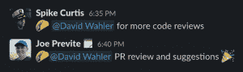
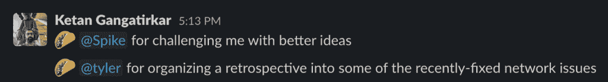

# Tacos，远程软件工程师生产力的关键

> 原文：<https://thenewstack.io/tacos-the-key-to-remote-software-engineer-productivity/>

 [阿马尔·班杜瓦拉

阿马尔·班杜瓦拉是编码器公司的联合创始人兼首席执行官。他构建提高开发人员生产力的产品。](https://www.linkedin.com/in/ammar-bandukwala-439512140/) 

没那么简单，但认可能培养团队精神。

远程工作——以这样或那样的形式——将继续存在。许多人怀疑这对软件开发者和他们的雇主有多好。一路走来，我们学到了很多东西，并希望分享一些来自我们经验的最佳实践，这些实践有助于激励软件工程师，让他们更快乐，同时最大限度地提高生产率。(我们会把关于玉米卷最大的惊喜留到最后。)

让我们从经常出现的基本问题开始，尤其是当涉及到软件工程师和远程工作的生产力时。开发人员应该把所有东西都放在本地机器上还是从云中工作？我们发现，有了云中托管的开发人员工作区，团队可以灵活地从物理位置的任何地方进行连接。

云 ide 允许开发人员像在办公室一样安全地工作，由基础设施团队实施必要的安全预防措施。开发人员不仅仅依赖于他们的本地机器，这意味着他们花在安全性上的时间更少，而且只是在他们选择的位置工作。

此外，由于编译和测试等计算密集型工作正在云中进行，开发人员基本上可以使用任何设备( [甚至 iPad](https://coder.com/blog/i-developed-on-an-ipad-for-two-weeks) )来访问他们的工作区。这可以大大降低公司的成本，因为开发人员工作站往往价格昂贵。它还使“自带设备”(BYOD)成为一种选择，根据开发人员的位置，我们发现这可能是唯一的选择，因为监管向某些国家运送技术的法规。

> 接收者可以用他们的玉米卷换取奖励，如超级大餐、一瓶酒、公司礼品、电子游戏积分或按摩。

软件工程师和远程工作经常遇到的另一个大话题是许多公司对源代码控制的担忧。很多情况下，源代码永远无法离开公司云基础设施的安全性。这怎么能与远程工作的开发人员相协调呢？

首先，远程工作区意味着源代码集中在公司的服务器上，而不是存储在单独的工作区。第二，内置安全工具意味着可以禁止开发者下载文件或者复制粘贴代码保存到其他地方。还有一个选项是间隔您的部署，这进一步限制了从您的工作区的访问，提供了额外的保护，防止未经授权删除源代码。

我们发现让团队成员位于完全不同的时区是改进工作流程的一个机会。在一个开发人员工作日结束时提交的拉请求可以被其他人审阅和处理，这样当开发人员返回工作时，他们可以立即进行下一步。

当人们不常见面时，我们担心会失去友情。在 [Coder](https://coder.com/) 我们发现一个松散的集成非常成功，它允许团队成员 [给彼此数字玉米卷](https://www.heytaco.chat/) 来识别其他人🌮🌮🌮。

每个人每天都被允许送出五个玉米卷，我们表彰他人的事情范围很广。我们经常感谢日常工作中的帮助；尽管这些都是我们对同事的期望，但我们希望永远不要认为它们是理所当然的:

有时，我们的员工会挑战我们的成长:

其他时候，我们会听到有用的工具让我们的工作变得更轻松:

而且，并不是所有的墨西哥玉米卷感谢都与工作有关(我们当中谁没有过不方便的航班？):

接收者可以用他们的玉米卷换取奖励，如超级大餐、一瓶酒、公司礼品、电子游戏积分或按摩。每个玉米卷最终价值约 5 美元，我们的最高收入者每月获得约 700 美元的奖励。虽然很有价值，但我们发现这些奖励不如其他好处重要，例如团队成员之间建立的融洽关系、来自同事和领导的真诚感激，以及对整个公司员工工作的可见性。

不同形式的远程工作已经存在，所以我们都需要学习最佳实践，以最大限度地提高软件工程人才的生产力，同时满足雇主的需求。我们对我们公司的发展非常满意，并且相信我们还需要学习更多的东西。

<svg xmlns:xlink="http://www.w3.org/1999/xlink" viewBox="0 0 68 31" version="1.1"><title>Group</title> <desc>Created with Sketch.</desc></svg>