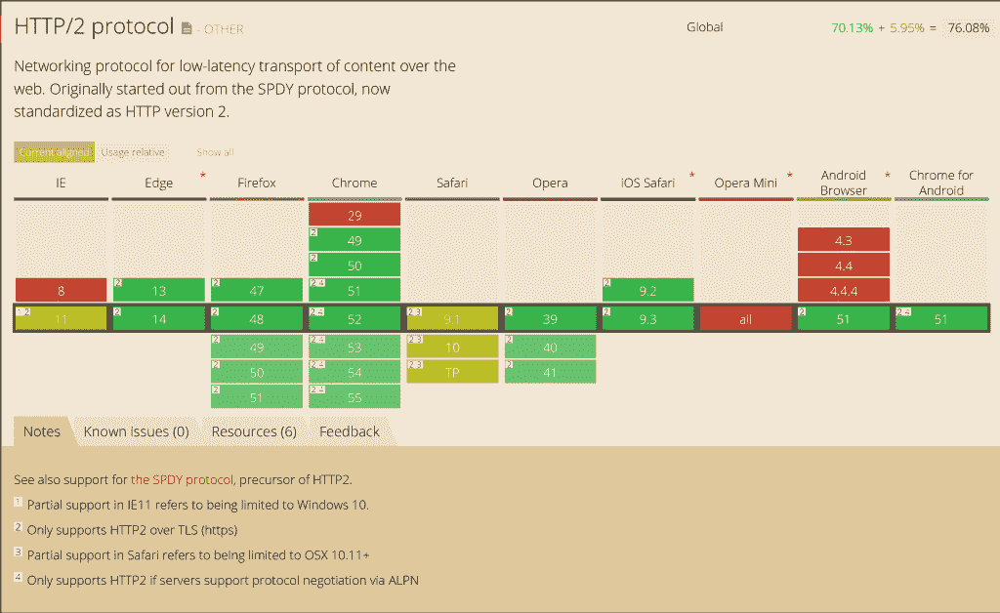

# 如何使用 HTTP/2 加速您的网站和应用程序

> 原文：<https://thenewstack.io/take-advantage-http2-speed-web-sites-apps/>

既然 Chrome 已经不再支持谷歌的 SPDY 协议，如果你想让你的用户比以前的 HTTP/1.1 更快地连接到你的代码，是时候换成 HTTP/2 了。

根据 Mozilla 的[Patrick McManus](https://twitter.com/mcmanusducksong)(Firefox 的 HTTP/2 实现的作者和 IETF HTTP 工作组的联合主席)的说法， [HTTP/2](https://http2.github.io/) 有很多好处:“针对高延迟环境的更快的页面加载，更好的响应，以及更高的安全性和隐私性。”

使用 HTTP/2，用户将看到页面加载时间提高了 30%。McManus 说，在服务器端，HTTP/2 将降低 CPU 和带宽要求。

网络浏览器和服务器[已经为 HTTP/2 做好了准备](http://caniuse.com/)(部分基于 SPDY 协议的[)。但是目前只有大约 9%的网站使用 HTTP/2，因为这不像改变你的网络服务器的配置那么简单——或者甚至改变配置然后比平常更密切地监视它们。](http://www.infoworld.com/article/2616950/internet/google-gives-apache-a-spdy-boost.html)

微软的 IIS(互联网信息服务 web 服务器软件)将在 Windows Server 2016 的[版本 10](https://blogs.iis.net/davidso/http2) 发布之前不支持 HTTP/2。例如，Oracle 刚刚宣布 Java EE 8 将更全面地支持 HTTP/2，如果您使用 NGINX，请确保您使用的是 1.11.0 以避免问题。(这个 HTTP/2 调试工具列表可能会有用，你应该检查一下你的服务器软件处理的是今年黑帽披露的 [HTTP/2 安全问题](http://www.imperva.com/docs/Imperva_HII_HTTP2.pdf))。

您还需要对您的代码进行一些更改来充分利用它，尽管您不需要进行大量的重写来获得立竿见影的效果。你需要获得 SSL 证书并搬到 HTTPS，因为 Firefox 和 Chrome 只支持使用新的应用层协议协商的 TLS 上的 HTTP/2([ALPN](https://tools.ietf.org/rfc/rfc7301.txt))。您需要考虑您调用的任何第三方内容，因为 HTTP/2 不会加快速度。

但更重要的是，你需要考虑如何为性能设计网站，因为正如网络加速技术提供商 [CloudFlare](https://www.cloudflare.com/) 的首席执行官 [Matthew Prince](https://twitter.com/eastdakota) 向我们指出的，HTTP/2 颠覆了我们用来提高网站性能的原则。

## 加密和加速

HTTP1 1.1 是一种固有的同步协议。首先，浏览器请求页面的 HTML，一旦开始解析，它就依次请求页面上的所有其他对象:CSS、JavaScript，然后是不同的媒体格式和所有其他页面内容。为了加快速度，浏览器在每个域中同时建立多个连接。为了利用这一点，网站开始将资源分散到多个领域。Prince 解释说:“有了域分片，你就有了 www1、www2、www3 等等，你可以说‘我们将把所有的 JavaScript 放在这个上，所有的 CSS 放在这个上，所有的图片放在这个上’。

HHTP/2 是异步的，使用二进制流在单个 TCP 连接上复用请求(HTTP/2 是二进制的，而不是基于文本的协议)。仍然有对 HTML 的初始请求，但是对所有其他资源的请求是并行发生的。这对用户来说更快，对服务器来说更有效——这意味着域分片会降低网站的速度，因为浏览器必须再次打开多个连接。(浏览器可以使用 HTTP/2 中的流优先级选项优化它们首先接收的资产。)

然后是加密(HTTP/2 本身并不要求加密，但是每个实现了 HTTP/2 的浏览器都实现了对 SSL 的要求)。谷歌的[伊利亚·格里戈利克](https://twitter.com/igrigorik)([W3C 网络性能工作组](https://www.w3.org/webperf/)的联合主席)说，如果你想在迁移到 HTTP/2 上领先一步，“把你的网站迁移到 HTTPS 吧！这是 HTTP/2 的先决条件。”

> “我们不知道服务器推送将带来的下一个伟大应用会是什么，但我们确实认为这是重塑互联网工作方式的机会之一。”——Matthew Prince，CloudFlare

Web 开发人员有时会避免加密，认为通过加密通道建立和通信会降低连接速度。现代的 CPU 和内容交付网络意味着这种情况很少再发生。由于每个用户较少的 TCP 连接意味着每个用户较少的服务器资源，HTTP/2 中的异步请求远远超过了加密的开销。

“在过去的 HTTP1 世界中，给页面添加加密会影响性能。在新的 HTTP/2 世界中，如果你想获得这些新协议的优势，你必须有加密。普林斯指出:“每一条好建议都会变成坏建议。“如果你想尽可能快，你不使用加密，你分片域，你从不在页面上嵌入任何东西，你试图把东西连接成尽可能大的文件，所以你有更少的文件。在这个世界上，将东西分割成更小的部分是有意义的，这样你就可以缓存更小的部分，你可以并行下载所有东西，你必须在默认情况下启用加密，分片是你能做的最糟糕的事情。”

安全软件提供商 Thawte 的 Ian Fergusson 建议，改变 T1 可能是转向 HTTP/2 最困难的事情；“很多网站花了很多时间来提高速度。在实现 HTTP/2 之前，任何采取的捷径和黑客行为都需要被逆转。”

## 切换到推送

HTTP/2 最初的好处与 SPDY 非常相似；CloudFlare 支持这两者，尽管 Prince 预测“随着人们的升级，SPDY 将在未来 18 个月内消亡。”但是 HTTP/2 有两个额外的特性:头压缩和服务器推送。

每个 HTTP 请求中的报头都非常相似；“有些字段会重复数千次，”普林斯说。HTTP/2 包括一个请求和响应头的压缩字典，所以不用每次都发送纯文本；报头被压缩(并且已经发送过一次的报头字段被引用而不是被复制)。这是更快的游客，并节省您的带宽。普林斯说，当 CloudFlare 打开头压缩时，头中的带宽节省了 30%，而 Dropbox 在打开 HTTP/2 后看到[入口流量带宽减半](https://blogs.dropbox.com/tech/2016/05/enabling-http2-for-dropbox-web-services-experiences-and-observations/)(尽管他们以前使用过 SPDY，但由于安全问题，他们没有使用头压缩)

从“我能用”网站上。

服务器推送是一个更重要的变化。虽然主流浏览器支持 HTTP/2 已经有一段时间了，但服务器推送是最近才加入的。“传统上，浏览器会说‘给我点东西’，然后服务器会做出响应并发回信息。服务器推送将模型翻转过来，这样服务器就可以说‘这是您需要的东西’，并主动将它们推送到浏览器。Prince 解释说:“HTML 仍然需要同样多的时间来渲染，但所有其他资源，CSS 和 JavaScript 以及 JPEGs 和 png 和 gif 都是在你等待 HTML 渲染时主动发送的。

这尤其有助于动态网站，并且它非常适合 web workers、web hooks 和 async/await 等开发模式，这些模式对于 JavaScript、WebRTC 等实时通信以及物联网设备等资源受限的设备正变得越来越重要。

普林斯预计它将产生广泛的影响。“类似 AJAX 的 JavaScript 调用现在可以转换成更简单、更流畅的函数；服务器可以简单地说“你需要的那个查询”。我将把请求发送下去，这样您就可以拥有它了。”

在某些方面，这就像推送电子邮件一样，将电子邮件从桌面工具变成了你可以在手机上实时处理的东西，但适用于广泛的网站和应用程序。

“当你想一想，由于必须不断地来回轮询客户端，移动设备上浪费了多少带宽、电池电量和 CPU 普林斯解释说:“如果你反过来说‘我在这里，我在等待，只要你准备好了，就按下我需要的东西’，这就颠覆了整个模型。”。“我们不知道服务器推送的下一个伟大应用会是什么，但我们确实认为这是重塑互联网工作方式的机会之一。”

但是普林斯警告说，目前服务器推送的工作方式——你必须在服务器的头响应中加入一个链接头——有点笨拙和脆弱；我们正在与开发人员进行对话，以找到更有效的方式来实现这一点。”

期待在 web 服务器和浏览器之外的应用程序和平台中看到这一点；“人们正在开发 WordPress 插件，并在 Rails 和 PHP 中使用它，看看我们如何用它来构建新的工具，”Prince 说。McManus 指出，“Web 超文本应用技术工作组(Web Hypertext Application Technology Working Group)正在讨论如何将推送作为另一个有前途的推送用例直接暴露给 JavaScript。”

您还必须考虑通过使用服务器推送在站点上获得更好的性能和响应性与推送可能不被消耗的资源(尤其是对于移动用户)的带宽影响之间的权衡。

“服务器推送在浏览器中工作可靠，但要确定一个网站可能想要推送什么以获得最佳利益可能很棘手，”McManus 指出。“对移动用户来说，与 HTTP/2 相关的最大收益是由于它在高延迟移动网络上改进了请求并行性。HTTP/2 在管理不同对象的优先级方面也比它的前身好得多，这在较慢的网络上非常重要。”

“开发人员在试验不同的服务器推送策略时应该小心谨慎，因为最佳实践还没有出现，”他说。“有效的策略在很大程度上取决于网站内容。迄今为止的经验是少即是多；过度推送会浪费带宽。强烈推荐真实用户监控来帮助开发者评估他们的站点性能。首先，有针对性的方法比站点范围的策略更有意义。”

McManus 还指出，“推送的最佳影响仅限于页面加载开始时相当短的时间窗口，因此推送一些小而关键的东西，如字体或样式表，将是一个合理的起点。”

格里戈利克同意了。“这里没有一个放之四海而皆准的答案。一些应用程序希望在延迟和冗余字节的风险之间进行权衡，其他应用程序可能希望在延迟上优化字节。这取决于应用程序。”你还必须考虑如何处理第三方内容(尤其是广告网络)，这在 HTTPS 可能还不可用，更不用说 HTTP/2 了。

“对于第三方内容，开发人员可以使用许多技术来解决这个问题，如异步、预加载和预连接，”Fergusson 建议道。

“HTTP/2 有助于解决多源问题的一个重要特性是连接合并，”McManus 解释道。"合并允许共享同一宿主提供程序和安全身份证明的不同主机名共享同一连接，即使它们有不同的主机名。作为最近 IETF HTTP/2 扩展(RFC 7838)的 [HTTP/2 替代服务](https://datatracker.ietf.org/doc/rfc7838/)的出现也有助于这种转变。消除的每一个连接都会增加性能优势。”

你可以考虑将更多的东西转移到你自己的主机上，而不是从外部网站上下载。“在同一台主机上保留更多资产有很多好处。不过，这不是必要条件，”格里戈利克指出。"在最坏的情况下，你也不会更糟。"

<svg xmlns:xlink="http://www.w3.org/1999/xlink" viewBox="0 0 68 31" version="1.1"><title>Group</title> <desc>Created with Sketch.</desc></svg>