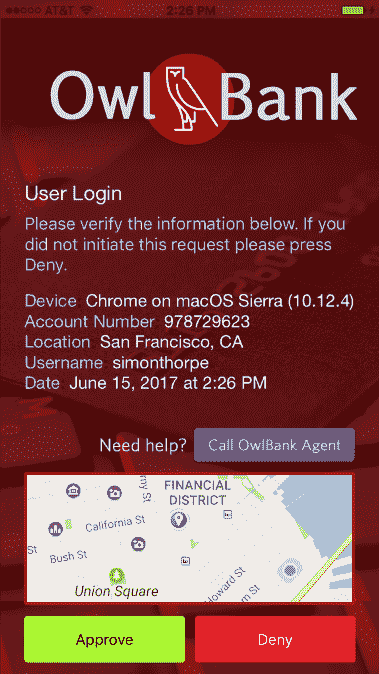
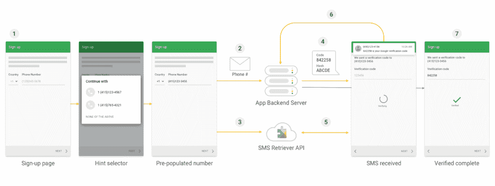
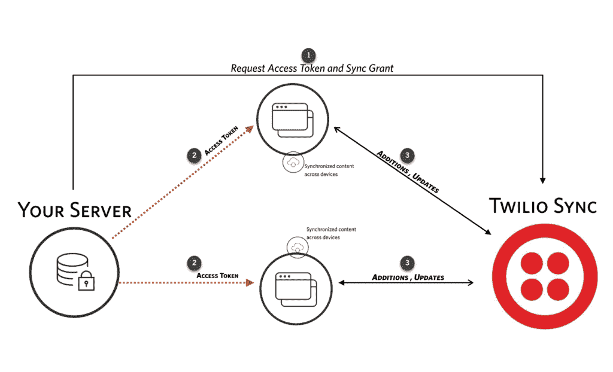

# 新的 Twilio APIs 可以帮助开发人员进行身份验证、会话管理、数据同步

> 原文：<https://thenewstack.io/take-advantage-new-twilio-apis-cover-just-telephony/>

开发人员不需要构建语音或消息工具就能发现 Twilio 的 API 有用。该公司以其通信平台而闻名，也有各种各样的 API，可以帮助开发人员在其应用程序中嵌入更多功能，包括身份验证、会话管理和数据同步

## 证明

Twilio 控制台中新的 [TwilioAuth SDK](https://www.twilio.com/docs/quickstart/twilioauth-sdk-quickstart-tutorials/twilioauth-sdk-how-it-works) 可用于为 iOS 和 Android 上的应用添加推送通知认证、无密码登录和批准应用内交易。

使用 TwilioAuth (credit Twilio)创建像这样的丰富界面，帮助用户区分什么是真正的身份验证确认，什么是网络钓鱼攻击

随着最近对基于 SMS 的身份验证的成功攻击，向您的应用程序方便地添加身份验证代理的能力肯定是有用的。

如果开发者只关注 Android，在开发者预览版中有一个新的用于 Android 的 Twilio 验证[SDK](http://ahoy.twilio.com/verificationsdk)，可以与谷歌短信检索 API 一起工作；这使得向 Google Play 服务注册的应用程序可以使用短信来验证用户的身份，而无需让他们访问您的所有短信——只是应用程序告诉 API 它正在寻找的短信。

谷歌和 Twilio 合作开发了这个 API，让世界各地的开发者更容易使用它，而不用担心地理数字。iOS 不允许以编程方式访问短信，所以 iphone 没有相应的功能，但这让应用程序可以使用电话号码而不是电子邮件进行验证，这更难伪造。

SDK 可以发现使用 VoIP 号码而不是连接到真实设备的诈骗者的电话号码，您不必担心用户在填写电子邮件地址时输入错误，并且永远不会完成注册过程。

## 约会

这项 Twilio 认证服务是 Twilio 所谓的[参与云](https://www.twilio.com/engagement-cloud)的一部分。这是一个 API 包，提供了与客户沟通的不同方式。它包括用于发送推送通知的 Notify API、用于将客户连接到呼叫中心中具有适当技能或说适当语言的代理的 TaskRouter API，以及用于将客户连接到特定员工而无需共享本应保密的个人电话号码的新代理 API。

Lyft 使用这些服务来连接乘客和司机。摩根士丹利财富管理公司(Morgan Stanley Wealth Management)将开始使用 Proxy，让你在不透露真实电话号码的情况下，向经纪人发送短信。

使用 Twilio Verification SDK for Android 来注册用户，而不会出现打字错误或欺诈性应用程序(credit Twilio)

另一个客户是诺德斯特龙。

“Nordstrom 希望个人购物者有高接触度和良好的体验。Twilio 首席执行官杰夫·劳森向新堆栈解释说:“他们希望顾客在看到适合自己的东西时，可以发短信给顾客，但他们不想透露顾客的个人电话号码。”。隐私只是其中一部分；这也是关于会话管理的。“如果我通常的私人购物者离开了怎么办？你希望下一个人无缝地接管对话。借助 Remind，他们希望代理学生和导师之间的通信，确保通信安全可靠，并且希望记录和报告通话情况。”

Proxy 不只是处理电话和文本的路由而不披露原始号码(并管理和负载平衡电话号码池，以便它可以实时提供临时电话号码以避免排队和延迟，使用地理上的本地号码来降低成本)；它还包括会话管理和日志记录。会话是两个人之间对话的 JSON 表示，它可能覆盖多个通道；如果文本消息和语音呼叫的顺序大致相同，您希望将它们分组到同一个会话中并一起记录。

代理使用 [Twilio 通道](https://www.twilio.com/marketplace/channels)，因此会话可以包括通过 [Twilio 聊天 API](https://www.twilio.com/docs/api/chat) 跨一系列服务的聊天，比如脸书墙消息。开发者可以通过 Twilio Chat 设置会话的“生存时间”;当代理处理了支持呼叫时，可以关闭聊天会话，以便他们可以关闭该支持票证，而不必留在渠道中，但是市场中买方和卖方之间的交互可能需要几天或几周的时间(对于持续进行的多年对话，您可以将生存时间设置为零)。

Twilio 聊天服务可以通过检查用户是否可达(他们在设备上是活跃的，或者他们已经注册了推送通知)，或者通过计时器来自动完成；如果客户在网站上与代理聊天，他们关闭了标签，代理不会知道他们离开了，但后端可以使用计时器来关闭聊天并清理会话。

聊天 API 使用前置和后置事件来处理消息；同步前置事件可以在事件被处理之前触发通知或阻止事件——也许是阻止含有脏话或信用卡或电话号码的消息——而在消息被处理之后发生的异步后置事件对于日志记录或触发聊天机器人非常有用。

Twilio 的聊天和代理 API 负责向用户活跃的任何设备发送信息。为了管理和同步用户和设备之间的状态， [Twilio Sync](https://www.twilio.com/sync/API) 有一个用于 Android、iOS 和主要浏览器的 SDK 和 REST API，允许存储、查看和更新设备上的状态，一次 16，000 个，使用令牌认证的 WebSockets 和双向 webhooks 来调用您的后端和处理逻辑。

16000 的限制并没有阻止开发者发送更多的数据；它们可以有多个 16，000 个同步对象，比如文档、列表或无序的 JSON 集合，或者它们可以保留一个同步对象，该对象是一个 S3 桶的指针。开发人员可以使用 Sync 来创建协作或跨平台的应用程序，应用程序的每次更新都会在设备之间来回同步，或者用于实时应用程序，如共同浏览、仪表盘、路线规划、跟踪应用程序和任何其他需要确保状态不丢失的应用程序，因为用户可以随时回头查看存储在云中的状态，以决定需要将哪些信息发送到设备(离线的设备会在本地存储同步，并在连接后重新同步)。Twilio 的可编程聊天实际上建立在 Sync API 之上，存储所有消息和用户对象的状态。

使用 Twilio Sync 跨设备同步应用程序中的内容(credit Twilio)。

Channels 模型将很好地用于 Twilio 的语音识别和自然语言理解 API。最初它是用于语音呼叫，特别是呼叫中心，让任何开发者创建语音驱动的交互式语音响应系统(而不是让用户在他们的电话上按下拨号器上的按钮)；它内置于 Twilio 的 Gather API 中，因此选项是那些在通话中有意义的选项，目前它只能进行 60 秒的语音识别。您可以设置超时，以确保人们在您开始识别之前已经说完，包括暂停，但您必须指定说出的单词是 89 种语言和变体中的哪一种。您可以给识别器提示来增强语音模型，它处理通用的而不是专用的词汇；您可能希望对名称和数字格式也这样做。

但是，劳森告诉我们，“将来我们会有更灵活的方式来使用它。如果你为 IVR 建立了自然语言理解，现在你想用它来发短信或学习 Alexa 技能，你可以重用你的模型。如果 Alexa 或苹果或谷歌下周有新的东西，你可以用它来搭配 Twilio。”而且因为这些是 API，你可以用识别的语音驱动其他代码；通过电子邮件向客户发送一份文本，将其传递到一个表格中，或者使用意图分类器来挑选动词、名词和日期，以便您可以预订或处理订单。

由[约书亚·厄尔](http://unsplash.com/photos/3yLpryRajZs?utm_source=unsplash&utm_medium=referral&utm_content=creditCopyText)在 [Unsplash](https://unsplash.com/?utm_source=unsplash&utm_medium=referral&utm_content=creditCopyText) 上拍摄的特写图片。

<svg xmlns:xlink="http://www.w3.org/1999/xlink" viewBox="0 0 68 31" version="1.1"><title>Group</title> <desc>Created with Sketch.</desc></svg>