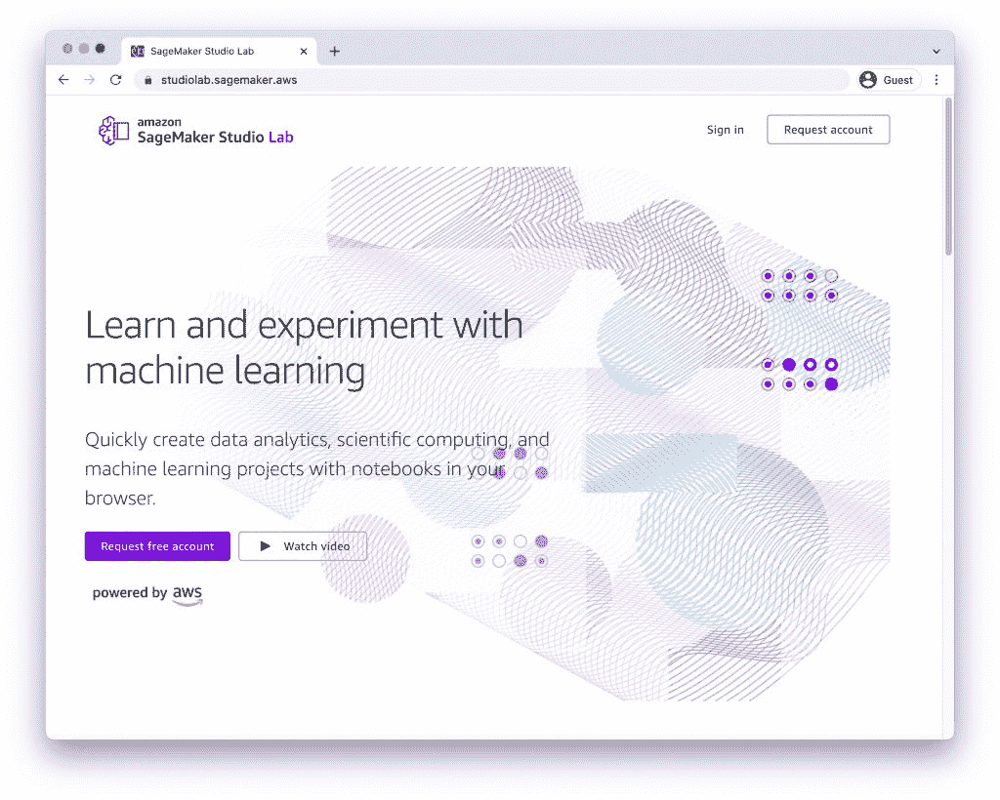

# 带亚马逊 SageMaker Studio 实验室兜一圈

> 原文：<https://thenewstack.io/take-amazon-sagemaker-studio-lab-for-a-spin/>

在[亚马逊网络服务](https://aws.amazon.com/?utm_content=inline-mention)re:Invent 2021 大会上作为预览介绍， [SageMaker Studio Lab](https://aws.amazon.com/sagemaker/studio-lab/) 是一个免费的独立机器学习开发环境，基于流行的 [JupyterHub IDE](https://jupyter.org/) 。除了品牌推广，服务几乎和 SageMaker 没有任何关系。关于这项服务的详细概述，请阅读我的[上一篇文章](https://thenewstack.io/amazon-sagemaker-studio-lab-from-the-eyes-of-an-mlops-engineer/)。

在本教程中，我将带您了解训练端到端深度学习模型的步骤，以基于亚马逊 SageMaker Studio 实验室执行图像分类。我们将建立一个区分猫和狗的模型(请务必在本周查看更多 SageMaker Studio 实验室教程)。

### 步骤 1:请求访问并登录

访问 https://studiolab.sagemaker.aws/，申请一个免费的亚马逊 SageMaker 工作室实验室帐户。

你可能需要几个小时到几天才能接触到环境。等待电子邮件确认。

获得批准后，使用凭据登录您的帐户。

选择 GPU 计算类型，并点击 ***启动运行时*** 按钮。

当运行时准备就绪，点击 ***打开项目*** 。

JupyterHub 环境已经可以进行实验了。

### 步骤 2:准备环境

从启动器中，单击终端图标启动新的终端会话。克隆包含 Conda 环境配置和笔记本的 Git 存储库。

`git clone https://github.com/janakiramm/dogs-vs-cats`

导航到`dogs-vs-cats`文件夹，右击`env_tf2.yaml`文件，创建一个新的 Conda 环境。此文件包含训练 TensorFlow/Keras 模型所需的所有模块。

刷新浏览器，查看名为`tf2:Python`的新内核

在开始训练模型之前，我们需要下载数据集。为此，登录 Kaggle 并从[狗与猫比赛](https://www.kaggle.com/c/dogs-vs-cats)中下载文件`train.zip`。

将文件`train.zip`上传到我们在上一步中克隆的 repo 的`dataset`文件夹中。启动一个终端会话，并将文件解压缩到同一文件夹中。您现在应该有了一个新文件夹— `/dogs-vs-cats/dataset/train/`。

我们现在已经完全配置好了环境，可以在 Amazon SageMaker Studio 实验室开始培训工作。

### 第三步:训练计算机视觉模型对图像进行分类

导航到存储库的`train`文件夹并启动`dogs-vs-cats.ipynb`笔记本。

如果提示输入内核，选择`tf2:Python`。

这个笔记本加载我们下载的数据集，训练图像分类模型。运行单元以完成培训。完成培训可能需要 15 分钟。

在我的实验中，模型的训练准确率达到了 87.5%。这可以通过增加历元的数量来改善。

当模型准备好时，它以 TensorFlow 服务格式导出到`model/export/Servo/1`目录。

### 步骤 3:对训练好的模型进行推理

导航到`infer`文件夹打开推理笔记本。我们从`/model/export/Servo/1/`加载保存的模型，并使用它进行推理。

`model = tensorflow.keras.models.load_model("../model/export/Servo/1/")`

当图像被适当地调整大小和预处理后，它可以被发送到模型。下面是预测正确类别的截图。

您可以使用 [Python Boto3](https://aws.amazon.com/sdk-for-python/) 模块轻松地将模型上传到亚马逊 S3，以将其部署在亚马逊 SageMaker 中。

在本系列的下一部分——将持续一周——我们将利用图像分类模型在 Amazon SageMaker 中创建一个无服务器推理端点。敬请关注。

<svg xmlns:xlink="http://www.w3.org/1999/xlink" viewBox="0 0 68 31" version="1.1"><title>Group</title> <desc>Created with Sketch.</desc></svg>