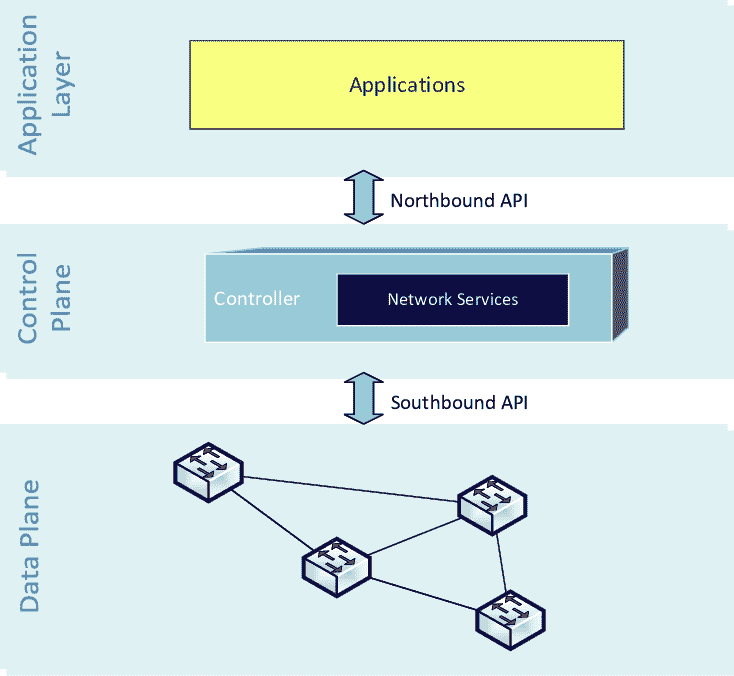
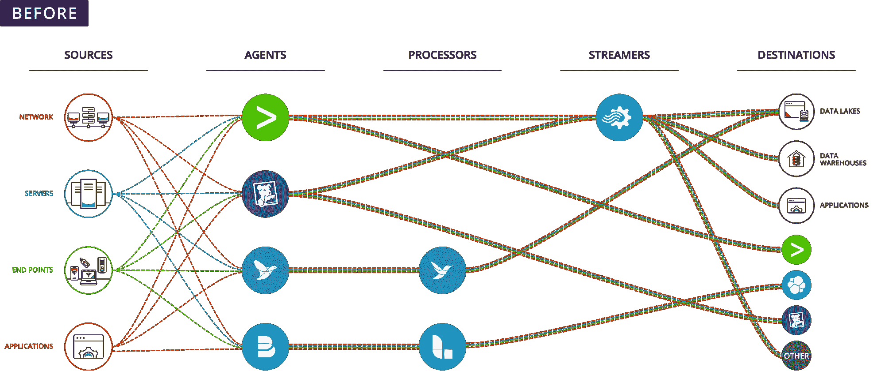
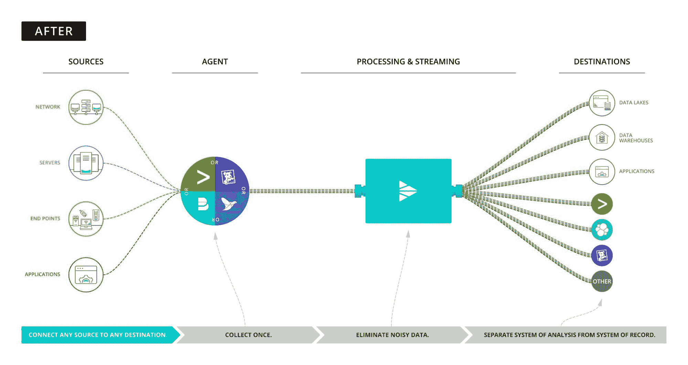

# 在你的可观察性数据控制你之前，先控制它

> 原文：<https://thenewstack.io/take-control-of-your-observability-data-before-it-controls-you/>

 [Ed Bailey

Ed 是一位热情的工程倡导者，在为各种应用、操作系统和硬件提供操作和安全观察方面拥有 20 多年的经验。](https://www.linkedin.com/in/baileyedward/) 

企业正面临前所未有的运营和安全可观察性数据浪潮。数据是复杂的、多维的和高速的。企业总是低估支持其运营和安全可观察性平台所需的数据的规模和范围。

[Steve Waterworth](https://www.linkedin.com/in/steveww/?originalSubdomain=uk) 在 Instana 时，通过为一个非常简单的基于 Kubernetes 的微服务应用程序创建静态工作负载，运行了一个有趣的[实验](https://www.instana.com/blog/cf-the-hidden-cost-of-observability-data-volume/)。他预测，在 24 小时内，总的可观测性数据将少于 100 千兆字节，但实际上是超过 400 千兆字节的数据。仔细想想，在运营数据集的基础上添加安全数据会进一步扩大总数。即使很小的应用程序也可能产生大量高速且复杂的数据。

那么企业如何避免淹没在数据中呢？

套用 [Nick Fury](https://www.youtube.com/watch?v=Jef6OEBXl7w) 的话，企业可以从睁大双眼了解数据增长的驱动因素并认识到他们一直面临的挑战是可以克服的开始。

## **了解数据增长的驱动因素**

*   现代系统正在生成大量的日志数据。
*   严格的安全合规性和政府法规要求企业将更多数据保留更长时间。

## **认识挑战**

*   缺乏标准化的日志格式。
*   高效且经济地管理海量数据的工具。
*   无法持续洞察如此多的数据。

企业必须控制他们的数据平面，即你的数据源和你的可观察性工具之间的中间层，如果他们有任何控制成本和增加他们的可观察性策略的有效性的希望的话。可观察性的本质是获得对数据的深刻见解，如果你有太多的数据而无法有效理解和处理，这几乎是不可能的。

不受管理的数据平面的成本是巨大的。未受管理的可观测性数据会产生巨大的软件许可和存储成本，并且会消耗工程时间，从而导致机会成本。

有三种类型的企业:

1.  记录一切并向可观察性和存储供应商支付巨额费用的企业。
2.  企业将选择不记录他们需要的所有内容，并将接受数据缺口带来的运营和安全风险。
3.  主动管理其数据平面并能够尽可能有效地将正确的数据记录到其可观察性工具中，以便获得最佳质量和数量的数据的企业。

第一种类型的企业对供应商来说是一种恩惠，但可能对他们自己没有好处，因为必须管理数据质量。这些企业实际上只是记录了大量潜在的不良数据，没有保证能够更好地洞察这些数据。

第二种类型的企业选择不将数据消耗到他们的运营和安全可观察性平台中，从而承担了巨大的运营和安全风险。鉴于安全问题不断升级的方式，接受较弱的安全态势还能持续多久？

第三种类型的企业有能力控制其数据平面。It 可以管理其所有数据，并以正确的格式将正确的数据导向正确的工具。它可以从事件流中删除无用的数据，并且不会牺牲数据质量。该企业不必接受不记录相关数据的风险，事实上，由于其控制数据平面的能力，它可以为其可观测性平台带来更多的用例。

## **什么是数据平面，控制它有哪些选项** **？**

我在前面简要解释了什么是数据平面:它是数据源和可观察性工具之间的中间层。但是这个例子做得更好:

更具体地说，数据平面是原始数据以多种形式存在的层。这一层数据的速度和复杂性令人望而生畏。大多数可观察性供应商许可他们的工具使用摄取的数据或由此数据产生的工作负载。他们没有动力去帮助你管理数据层，因为这限制了他们能赚多少钱。企业必须寻求传统平台供应商之外的解决方案，通过购买或构建解决方案来获得正确的功能组合。

以下是大多数企业(可能也是您的企业)的数据平面:

【T2

## **进入可观察管道**

可观察性管道是数据的通用接收者和发送者:它收集任何和所有数据(例如，指标、事件、日志和跟踪)，然后将数据成形并路由到最需要的地方(例如，从 Elastic 到 Splunk 到 Exabeam)，而无需重新培训用户或替换任何现有工具。可观察性管道为消费来自众多来源的数据并将这些数据实时转换为更有效的格式带来了广泛的选择，这可能包括删除字段、添加字段或将一种形式(如日志)压缩为另一种形式(如事件)。最终，[可观察性管道](https://cribl.io/resources/observability-pipelines-for-dummies/?utm_campaign=thewnewstackreferral&utm_medium=sponsoredarticle&utm_source=thenewstack&utm_content=hyperlinktextobservabilitypipelinesdummiesbook)让企业控制数据平面，以获得最佳、最有效的结果来满足其可观察性需求:

## **建造还是购买？**

一旦企业决定在可观察管道上投资，下一个需要解决的挑战是“建造还是购买？”

一个好的引导性问题是，“你想把你宝贵的工程时间投资在哪里？”在具有有限格式的高度标准化的应用程序堆栈中，投资于基于 Logstash 和 Kafka 等开源工具的解决方案来管理您的数据是有意义的，因为复杂性和变化率更低。

然而，要非常小心，确保你分配了足够的时间来构建你的工具、你的可观测性管道和你的可观测性栈之间的集成。对于每个定制的集成，随着工具的发展和安全问题的发现，您将需要分配时间进行更新。这是一个会消耗越来越多工程时间的螺旋。这当然可以成功完成，但是要注意工程时间分配以及它将如何随着时间的推移而增长。

## **底线**

企业必须做出选择，要么接受现状并淹没在数据中，要么采用可观测性管道来控制您的数据，以从您的运营和安全可观测性解决方案中获得最佳、最高效的结果。管理成本更低的更好数据将推动整个企业取得更好的运营和安全成果。

你可以尝试的一个观察管道是 Cribl 的免费托管的 [LogStream 沙箱](https://sandbox.cribl.io/?utm_campaign=thewnewstackreferral&utm_medium=sponsoredarticle&utm_source=thenewstack&utm_content=hyperlinktextlogstreamsandbox)(你不需要安装任何东西，你将获得每门课程的结业证书)。我很想听听你的反馈；在你跑完沙盒后，在 LinkedIn 上联系[我，或者加入我们的](https://www.linkedin.com/in/baileyedward/)[社区 Slack](https://cribl.io/community/) ，让我们来谈谈你的经历吧！

<svg xmlns:xlink="http://www.w3.org/1999/xlink" viewBox="0 0 68 31" version="1.1"><title>Group</title> <desc>Created with Sketch.</desc></svg>