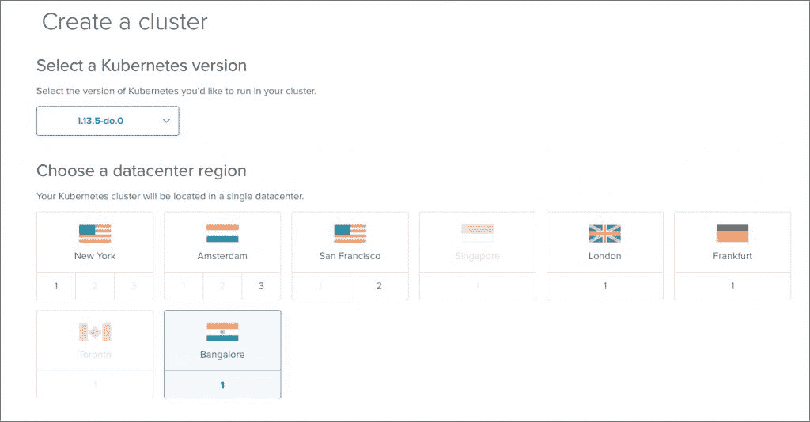
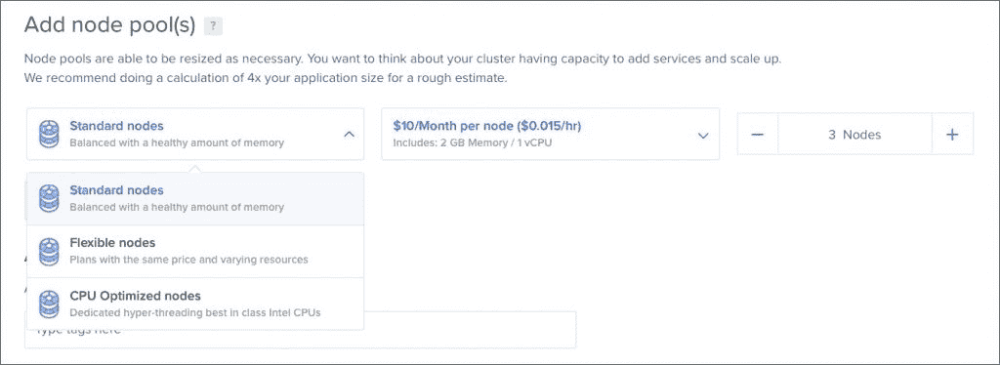
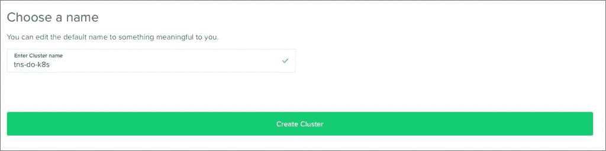
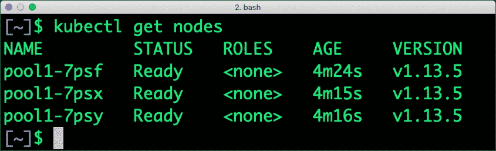
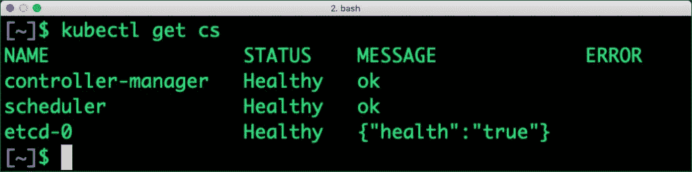
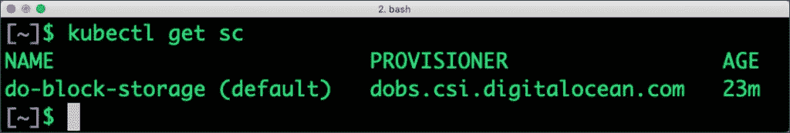
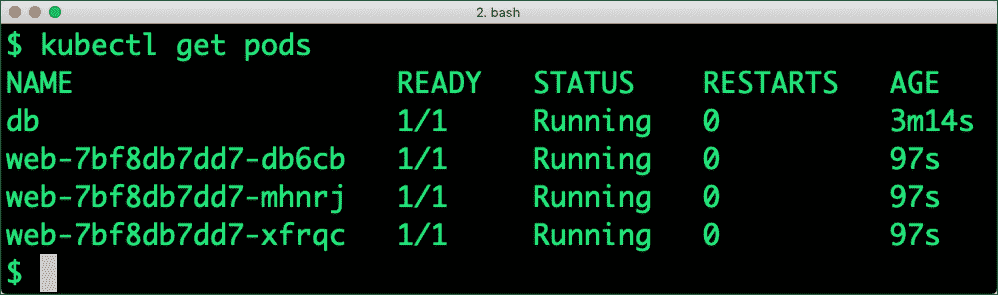
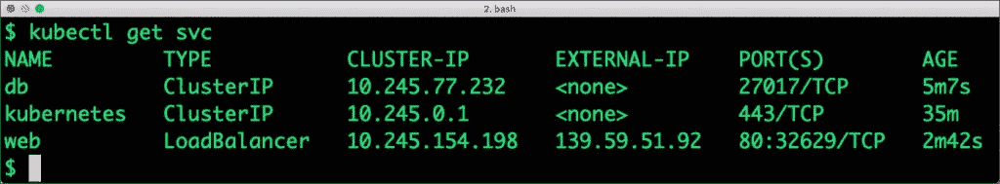
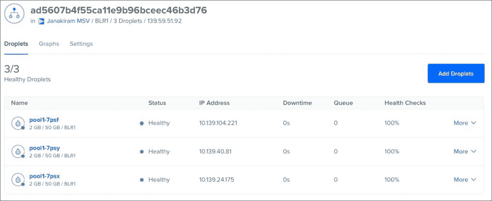

# 乘坐数字海洋 Kubernetes 游轮

> 原文：<https://thenewstack.io/take-digitalocean-kubernetes-for-a-cruise/>

DigitalOcean 是最近加入托管 Kubernetes 潮流的公共云提供商之一。鉴于其管理基础设施的简单性和极简主义方法，DigitalOcean 在其容器即服务(CaaS)产品中遵循相同的理念就不足为奇了。

在本教程中，我们将了解启动 DigitalOcean Kubernetes 集群并在其上部署工作负载的工作流程。

## 启动 Kubernetes 集群

目前，DigitalOcean 提供了两个版本的 Kubernetes — 1.12 和 1.13。该服务目前的可用性有限，这意味着它可能不会在所有地区都可用，并且尚未准备好投入生产。

让我们通过数字海洋控制面板启动一个三节点集群。

这一切都始于选择一个特定的 Kubernetes 版本，然后是地区。



下一步是用 droplets 创建一个节点池，作为工作节点。DigitalOcean 提供三类节点——标准、灵活和 CPU 优化。标准节点是提供基本到高级配置的通用 droplets。Flexible droplets 的费用是固定的，但每种配置的内存容量和 CPU 内核数量都有所不同。CPU 优化意味着运行需要强大虚拟机的计算密集型工作负载。



如果您的部署需要这些 droplets 的组合，您可以为每个配置创建单独的节点池，并在以后添加它们。每个节点池都可以有选择地用于特定的工作负载。

最后，给你的集群命名，然后点击按钮。



同样可以用漂亮的 [doctl CLI](https://github.com/digitalocean/doctl/blob/master/README.md) 用下面的命令启动:

```
doctl kubernetes cluster create do-tide  \
 --region blr1  \
 --version  1.13.5-do.0  \
 --tag demo  \
 --node-pool  "name=pool1;size=s-1vcpu-2gb;count=3"

```

一旦集群启动并运行，下载 kubeconfig 文件并将其指向 kubectl 工具。

```
doctl kubernetes cluster kubeconfig save do-tide

```

该命令将配置文件放在 *~/中。kube/config* 目录。

通过运行几个标准的 kubectl 命令来验证集群。

 

## 部署和扩展工作负载

有了集群，让我们继续部署一个普通的 web 应用程序。MongoDB Pod 将由一个块存储卷提供支持，以实现持久性。无状态 web 应用程序被部署为一个可伸缩的副本集。

DigitalOcean Kubernetes 自带用于块存储的存储类。我们将使用它来创建一个持久的音量控制(PVC)。



创建指向存储类的 PVC。

```
apiVersion: v1
kind: PersistentVolumeClaim
metadata:
  name: mongo-pvc
spec:
  accessModes:
  -  ReadWriteOnce
  resources:
    requests:
      storage: 5Gi
  storageClassName: do-block-storage

```

使用下面的定义启动 MongoDB Pod。请注意，PVC 指向上一步中创建的 mongo-pvc。

```
apiVersion: v1
kind: Pod
metadata:
  name: db
  labels:
    name: mongo
    app: todoapp
spec:
      containers:
      -  image: mongo
        name: mongo
        ports:
        -  name: mongo
          containerPort: 27017
          hostPort: 27017
        volumeMounts:
          -  name: mongo-storage
            mountPath: /data/db
      volumes:
          -  name: mongo-storage
            persistentVolumeClaim:
              claimName: mongo-pvc

```

通过 ClusterIP 服务公开 MongoDB Pod。

```
apiVersion: v1
kind: Service
metadata:
  name: db
  labels:
    name: mongo
    app: todoapp
spec:
  selector:
    name: mongo
  type: ClusterIP
  ports:
    -  name: db
      port: 27017
      targetPort: 27017

```

现在，让我们部署用 Node.js 构建的 web 应用程序。该部署有三个副本。

```
apiVersion: apps/v1
kind: Deployment
metadata:
  name: web
  labels:
    name: web
    app: todoapp
spec:
  replicas: 3
  selector:
      matchLabels:
        name: web
  template:
    metadata:
      labels:
        name: web
    spec:
      containers:
      -  name: web
        image: janakiramm/todo
        ports:
        -  containerPort: 3000

```

为了访问 web 应用程序，我们将通过外部负载平衡器来公开它。

```
apiVersion: v1
kind: Service
metadata:
  name: web
  labels:
    name: web
    app: todoapp
spec:
  selector:
    name: web
  type: LoadBalancer
  ports:
 -  name: http
 port: 80
 targetPort: 3000
 protocol: TCP

```

我们现在有一个 MongoDB 单元和三个运行 web 应用程序的单元，分别通过 ClusterIP 和 LoadBalancer 公开。





外部 IP 对应于由 Kubernetes 动态创建的 DigitalOcean 负载平衡器。您可以通过访问控制面板网络部分下的负载平衡器来验证这一点。



DigitalOcean 在将其核心基础设施与 Kubernetes 整合方面做得非常好。用于块存储和负载平衡器集成的存储类使得部署和管理有状态和无状态工作负载变得极其简单。

*贾纳基拉姆·MSV 的网络研讨会系列，“* [【机器智能和现代基础设施(MI2)](https://mi2.janakiram.com/) *”提供了涵盖前沿技术的信息丰富、见解深刻的会议。* [注册](https://mi2.janakiram.com/) *参加即将举行的 MI2 网络研讨会，了解如何使用 Azure IoT Edge。*

<svg xmlns:xlink="http://www.w3.org/1999/xlink" viewBox="0 0 68 31" version="1.1"><title>Group</title> <desc>Created with Sketch.</desc></svg>