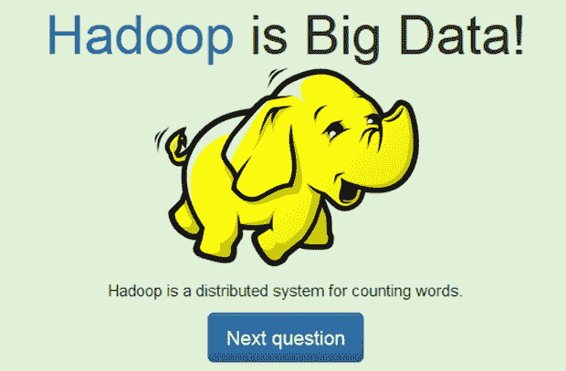

# 考:大数据还是神奇宝贝？

> 原文：<https://thenewstack.io/take-test-big-data-pokemon/>

六尾。托库特克。阿柏怪。阿瓦多斯。这些是大数据公司的名字，还是神奇宝贝的角色？这是一个令人惊讶的棘手问题——也是一个有趣的新在线测验的前提。由旧金山 SaaS 创业公司 Algolia 的软件工程师 Tim Carry 维护，这个页面简单地用大而粗的字母显示一个名字，然后让访问者从两个按钮中选择一个。大数据？还是神奇宝贝？

做出选择后，答案会以公司标志或神奇宝贝卡通形象的卡通插图以及一些幽默的评论显示出来。例如， [Arvados](https://arvados.org/) ，一个数据科学平台，被描述为拥有自己的神奇宝贝般的超能力，因为它“围绕不知情的系统管理员旋转一个微服务网络”游客被问及海马(一家大数据公司)和 Horsea(一个神奇宝贝角色)。

对于讽刺网站来说，大数据或神奇宝贝有着受人尊敬的血统。这实际上是“大数据波拉特”创建的测验的早期版本[的更新那个受欢迎的模仿推特账户](https://docs.google.com/forms/d/1kckcq_uv8dk9-W5rIdtqRwCHN4Uh209ELPUjTEZJDxc/viewform?edit_requested=true)[一直在提供讽刺性的推文，嘲笑大数据，采用了 2006 年纪录片*波拉特*中萨莎·拜伦·科恩角色的逆向乐观主义和蹩脚英语。](https://twitter.com/BigDataBorat)

“学习大数据，使哈萨克斯坦成为领先的数据科学家国家，”Twitter 时间轴的标语承诺。(哈萨克斯坦是波拉特虚构的故土)。2014 年 4 月，“大数据波拉特”通过使用谷歌表单发布的最初版本的测验获得了成功。

“你能说出哪个无意义的单词是神奇宝贝字符，哪个是#bigdata 技术的最新热潮吗？“你可能有资格成为#大数据专家，”阅读模拟波拉特原始测验的介绍。

奇怪的是，在接下来的八天里，768 名受访者提交了他们的测验结果，让“大数据波拉特”[进行自己的数据分析](https://twitter.com/BigDataBorat/status/457657512011898880)。超过 94%的受访者正确识别了 Hadoop，但不到一半的人能够识别出 Tokutek(40.8%)和 aki ban(41.5%)是大数据公司。超过一半的人错误地认为神奇宝贝角色 Crebase 实际上*是*一家大数据公司，只有 46.7%的人正确识别。)

最初测试的网址在*黑客新闻* 上获得了可观的 140 分[，同时也有一些人抱怨使用的神奇宝贝名称不是标准的英文翻译。一位评论者分享了](https://news.ycombinator.com/item?id=7683428)[的 URL，这是一个类似的测验](http://evilbrainjono.net/pages/startup-or-pokemon.py)，挑战访问者区分神奇宝贝人物和创业公司的名称。波拉特的网址引发了热烈的讨论，吸引了 37 条评论，并最终启发蒂姆·凯瑞创建了他自己版本的测验。

因此，具有讽刺意味的是，大数据波拉特可能发现自己正处于自己的炒作泡沫之中。

* * *

## WebReduce

<svg xmlns:xlink="http://www.w3.org/1999/xlink" viewBox="0 0 68 31" version="1.1"><title>Group</title> <desc>Created with Sketch.</desc></svg>