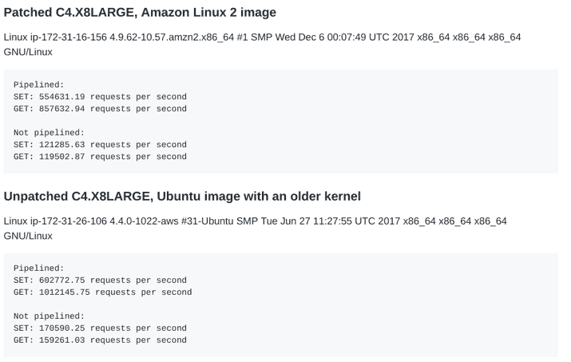
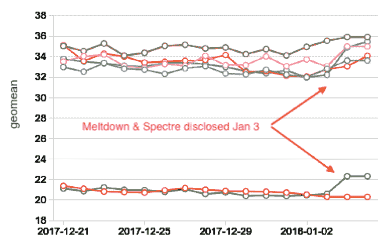
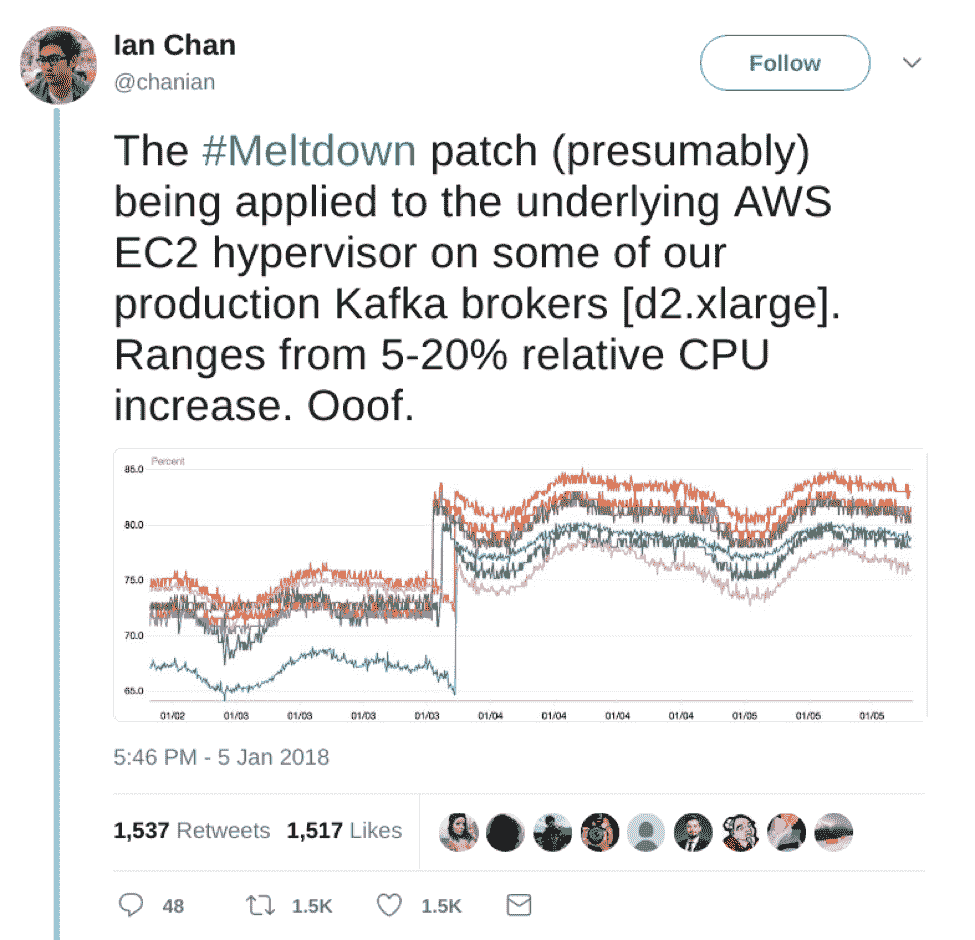
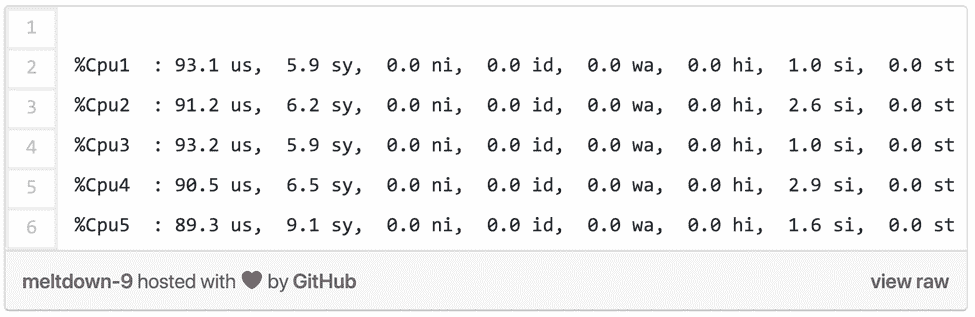

# 如何最小化熔毁补丁的性能损失

> 原文：<https://thenewstack.io/takeaways-cpu-apocalypse/>

 [Dor Laor，ScyllaDB 的 CEO

Dor Laor 是 ScyllaDB 的 CEO。之前，Dor 是被 Red Hat 收购的 Qumranet 下的 KVM hypervisor 的创始团队的一员。在 Red Hat，Dor 已经管理 KVM 和 Xen 开发好几年了。Dor 拥有 Technion 的理学硕士学位和单板滑雪的博士学位。](https://www.scylladb.com/) 

跨行业渠道攻击(Meltdown 和 Spectre)的传奇还没有结束。随着 CPU 厂商发布新的微码并召回以前的微码，混乱仍在继续。为了理解仍然需要做的工作的范围，考虑 Linus Torvalds [使用的语言](https://techcrunch.com/2018/01/22/linus-torvalds-declares-intel-fix-for-meltdown-spectre-complete-and-utter-garbage/)关于精英开源内核开发人员发送的处理 Spectre 的补丁——特别是“间接分支限制推测”

当供应商努力降低这些修复对性能的影响时，开发团队只能袖手旁观。例如，AWS [声称](https://aws.amazon.com/de/security/security-bulletins/AWS-2018-013/)“我们没有观察到对绝大多数 EC2 工作负载的有意义的性能影响”，然而大多数大数据工作负载都受到了严重影响。

不幸的是，[对于这些类型的尚未被发现的安全缺陷、漏洞等等，还没有免疫](https://thenewstack.io/cpu-patches-unstable-might-want-consider-detection/)。攻击者只会越来越擅长他们所做的事情，而战利品会继续变得更大——在云时代，远程访问让您拥有全世界。但是，有一些技术可以限制性能开销和云工作负载的风险。在我们深入探讨之前，让我们快速回顾一下这个问题。与您的应用程序运行在同一 CPU 上的恶意代码可以推断出您的进程、内核或系统管理程序的内容。解决这个问题的一个重要步骤是使用一个叫做内核页表隔离 (KPTI)的[过程添加了另一个虚拟地址空间的转换步骤。](https://www.redhat.com/en/blog/what-are-meltdown-and-spectre-heres-what-you-need-know)

> 与其运行许多小型机器，不如运行一个更大的虚拟机，并在该机器上拥有所有可能的 CPU 内核。

这种修复的问题是它会损害频繁改变上下文的工作负载。数据库、流基础设施和缓存等 I/O 密集型应用程序极易受到性能影响。 [Red Hat](https://www.openshift.com/) 测量到在这种负载下性能下降了 18 %,而 CPU 中持续运转的 CPU 密集型负载不会受到明显影响。

事实上，Redis 缓存维护者[萨尔瓦托勒·桑菲利波](https://github.com/antirez)，[测量了](https://gist.github.com/antirez/9e716670f76133ec81cb24036f86ee95)一个从低至 8%(设置，流水线)到高达 31%(设置，非流水线)的回归！这是有意义的，因为在后面的工作负载中，没有批处理，因此有更多的上下文切换。

Databricks 发布了关于 Spark 性能影响的非常详细的[博客](https://databricks.com/blog/2018/01/13/meltdown-and-spectre-performance-impact-on-big-data-workloads-in-the-cloud.html),以及非常好的建议和对违规的详细见解:

以下是卡夫卡在灾难性 CPU 税中的合理份额:

虽然英特尔继续不懈地搜索[未受影响的](https://newsroom.intel.com/news/firmware-updates-and-initial-performance-data-for-data-center-systems/)工作负载，但请记住，有一种方法可以处理开销并限制安全风险。理论上比较简单。如果您希望降低上下文切换的开销，只需最小化它们。

完全避免虚拟化来宾和容器之间的大量上下文切换是可能的。是的，拥有整台机器！嘈杂的邻居效应(同一主机上消耗大量 I/O 的相邻虚拟机)是一个已知的问题，但其安全风险更大。

与其运行许多小型机器，不如运行一个更大的虚拟机，并在该机器上拥有所有可能的 CPU 内核。然后，您可以使用运行您自己的受控代码、虚拟机管理程序或可扩展到所有内核的框架的容器来划分机器。

另一个技巧是减少对内核的依赖。通过将更多的工作转移到用户空间，并将更多的操作批处理到相同的内核访问中，来最小化上下文切换的数量。两个使用这种技术同时具有大量 I/O 的项目是:

### 1.DPDK

英特尔的[数据平面开发套件](https://dpdk.org/) (DPDK)是一套用于快速数据包处理的库和驱动程序。它是由英特尔驱动的，你可以把它看作是一个用户空间设备驱动程序，完全绕过内核，可用于第 3-7 层应用。

它对性能的影响[极小](https://access.redhat.com/articles/3307751) : Linux 加速器技术一般绕过内核，支持用户直接访问，受影响最小，测量的开销不到 2%。已经测试过的例子包括 DPDK([vs perf](https://wiki.opnfv.org/display/vsperf/VSperf+Home)64 字节)。

### 2.ScyllaDB

我举个离家近的例子。在构建我们的 NoSQL 数据库时，我们利用了 Seastar 引擎及其异步 I/O 模型。Scylla 采用每核心线程架构，这意味着它的内部任务被固定在 CPU 上运行，没有线程池或任何其他多线程争用。每个 I/O 都是通过 Scylla 的内部 I/O 调度程序通过批量异步系统调用发出的。根本不使用 Linux 页面缓存。此外，由于我们的轮询架构，系统调用被大量批处理，并且理想情况下只在特定的时间间隔(称为轮询周期)进行调度。

为了说明结果，让我们看看在 Meltdown 修复后执行内部基准测试时的服务器内部。查看一个 CPU 示例，我们看到以下配置文件:

如您所见，绝大多数时间都花在用户空间中。这本身表明系统的系统调用和上下文切换数量很少。因此，与基于线程的数据库相比，Meltdown 修复对 Scylla 性能的影响更小，这是合乎逻辑的——如果操作系统只占您时间的 10 %,最糟糕的情况是 10%。

## 关键要点

最近对 Meltdown 和 Spectre 漏洞的披露点燃了整个行业。操作系统的软件修复是可用的，但是它们使得与操作系统的每次交互更加昂贵。尽管供应商的声明各不相同，但 Meltdown 和 Spectre 补丁带来了巨大的性能开销。请不要错误地认为你在某种程度上可以免除这个问题。如果您在 CPU 云监控中没有注意到任何事情，您可能希望首先检查您测量的是正确的事情。

你对下一场风暴准备得如何？如果您已经从这次经历中吸取了教训，您将会为尽快修补基础设施做好更充分的准备。您将拥有合适的配置管理和供应工具。您将确保自己不会受到针对旧软件副本的任何零日攻击。考虑通过细分来增强安全性和降低风险。将相同的工作负载虚拟机、容器等分组。通过他们自己的物理机器。最后，尽量减少上下文切换有助于防止性能下降。通过消除虚拟机管理程序/容器和对内核的访问来减少您的堆栈。

Red Hat 是新堆栈的赞助商。

<svg xmlns:xlink="http://www.w3.org/1999/xlink" viewBox="0 0 68 31" version="1.1"><title>Group</title> <desc>Created with Sketch.</desc></svg>