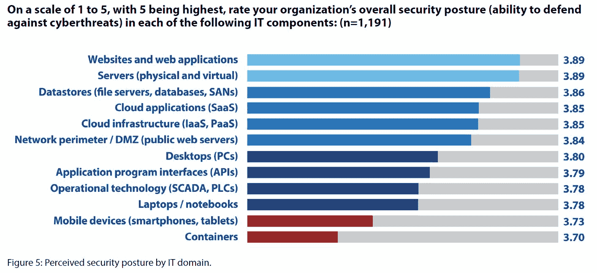
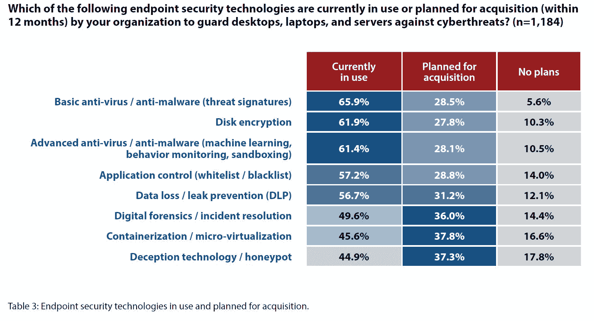

# 借助 DevOps 将容器安全性提升到新的水平

> 原文：<https://thenewstack.io/taking-container-security-to-the-next-level-with-devops/>

[CyberEdge Group](https://cyber-edge.com/) 最近发布了其第六份年度网络威胁防御报告，其中包括来自一项针对 IT 安全决策者和实践者的供应商无关调查的各种有趣发现。在其结论中，报告的作者仔细确定了最需要“主动关注和投资”的安全领域。[集装箱安全](https://thenewstack.io/ci-cd-devops-and-containers-a-winning-trio/)连续第二年成为他们建议的重点领域之一，这在很大程度上是因为调查受访者认为集装箱是他们最无法抵御网络威胁的 IT 组件。

容器安全性没有跟上云原生架构和容器基础设施的快速采用，因此，应用容器仍然是组织防御中最薄弱的环节。清楚地认识到潜在的安全风险，受访者还引用容器作为他们计划购买的领先技术。

## 集装箱安全的战略方法

 [米歇尔·麦克林

作为 StackRox 的产品营销副总裁，Michelle McLean 负责监督公司的所有产品和营销战略及计划。她拥有 20 多年的市场定位、GTM 和需求挖掘经验。在加入 StackRox 之前，她是 ScaleArc 的营销副总裁，负责监督所有的对外营销活动，此前她曾在 Silver Spring Networks、ConSentry Networks、Peribit Networks 和 Trapeze Networks 担任产品营销总监。她曾在研究公司 META Group 担任项目总监，为全球 2000 强企业客户提供技术和战略指导。她以一名科技记者开始了她的职业生涯。McLean 在加州大学伯克利分校获得了英语学士学位。](https://www.stackrox.com/) 

根据第六次年度网络威胁防御报告，组织需要对容器安全采取更具战略性的方法，以将其防御提升到一个新的水平。对强调漏洞扫描的战术安全工作的依赖限制了 DevOps 团队实现云原生架构和容器带来的许多好处的能力，包括更高效的应用程序更新和部署、改进的资源利用率和可伸缩性。

查看受访者容器堆栈中的常见安全差距，团队需要在容器安全平台中寻找的“下一级”功能有:

*   **基于上下文的所有漏洞和配置发现的优先级:**简而言之，CVE 是不够的。同样的漏洞在公开的生产服务中比在隔离的开发容器中造成更高的风险。将来自容器编制器的大量声明性信息组织在一起，以对组织中最危险的部署进行堆栈分级的能力至关重要。没有这个环境，团队将无法确定什么资产需要立即关注以及为什么。把这个问题看作是 Equifax 的问题——每个人都知道 STRUTS 是一个关键的漏洞。那里的团队不知道 STRUTS 的这个实例比其他实例给他们带来了更高的风险。拥有这种环境只能通过容器本地和 Kubernetes 本地的容器安全解决方案来实现——通知风险优先级的大部分信息依赖于与 Kubernetes 平台深度集成的容器安全解决方案。
*   **自动应对应用程序行为变化的威胁/异常检测:**大多数集装箱安全平台会对环境进行初始快照，然后对未来的异常发出警报。这种方法远远不够，会导致警觉疲劳。当安全工具标记后续应用程序更改时(这在容器化环境中经常发生)，团队将会陷入误报，从而有可能遗漏漏洞、延迟开发时间表甚至停止操作。利用行为建模的解决方案，特别是在容器生命周期的运行时阶段的检测，将跟踪应用程序行为如何随时间变化，因此可以减少与简单应用程序变化相关的错误警报。
*   **通过安全信息的自动化、跨阶段共享实现持续状态改进:**持续集成和持续部署(CI/CD)流程已成为软件开发的事实标准，这是由采用 DevOps 原则推动的，旨在生成更加灵活、安全和敏捷的应用和基础设施。CI/CD 是 DevOps 的核心，有效的容器安全解决方案应该使用这些原则来持续改进环境的安全状况。利用在容器生命周期的构建和部署阶段学到的信息在运行时通知警报的能力在“下一级”容器安全性中是至关重要的。类似地，运行时数据(包括检测到的漏洞)应该用于调整后续构建和部署阶段的配置。这种持续的强化是持续不断地改进容器和 Kubernetes 安全状况的关键。

## 将所有这些整合在一起:协调开发运维与安全性

支持这三种能力对于容器安全工具来说是必不可少的，以提供保护容器化环境所需的全套功能。但是这些功能还不够——组织还必须促进开发人员和安全团队之间的协作和协调，以充分实现容器安全的优势。

“下一级”容器安全解决方案必须无缝集成到组织的 DevOps 实践和工具中，包括与 CI/CD 系统、部署工具、容器注册表和其他安全产品的集成。他们还必须利用云原生开发堆栈中的原生控制(尤其是在 Kubernetes 中),以实现强大、可扩展的安全性，并确保开发人员和安全团队共享关于安全策略的共同信息来源。转移 IT 工作流并集成将安全性更早纳入开发运维流程所需的工具，将加快转型计划、改善应用开发并释放新的运营效率。

来自 Pixabay 的托马斯·穆勒特写图片。

<svg xmlns:xlink="http://www.w3.org/1999/xlink" viewBox="0 0 68 31" version="1.1"><title>Group</title> <desc>Created with Sketch.</desc></svg>