# 乘坐 Kubernetes API 兜风

> 原文：<https://thenewstack.io/taking-kubernetes-api-spin/>

对于任何对分布式计算着迷的人来说， [Kubernetes](http://kubernetes.io/) 提供了一个终极游乐场。这是我们这个时代集群管理软件的最佳实现之一。谷歌不仅开源了 Kubernetes，还简化了它，让开发者可以使用它，这一点必须得到赞赏。

Kubernetes 的核心是应用编程接口(API)。事实上，平台中的所有东西都被视为 API 对象。诸如创建和删除 pod、服务和副本集之类的任务都被转换成适当的 REST API 调用。

本文通过详细的演练发现了 Kubernetes API 隐藏的瑰宝。为了从本教程中获得更多，建议您为自己创建一个集群。

## 建筑和背景

Kubernetes 控制平面的关键组件之一是 API 服务器。它负责处理 REST 操作，同时提供集群共享状态的前端，所有其他组件通过它进行交互。涉及改变 Kubernetes 对象(如 Pod)状态的每个操作都要经过 API 服务器。

[Kubectl](http://kubernetes.io/docs/user-guide/kubectl-overview/) ，Kubernetes 的命令行接口，是这个 API 的一个简单而强大的客户端。

鲜为人知的事实是，Kubernetes API 有多个可用的客户端库。虽然 Go 客户端是官方的，但是 Github 上也有 Node.js、PHP、Python 和 Java 的第三方客户端。

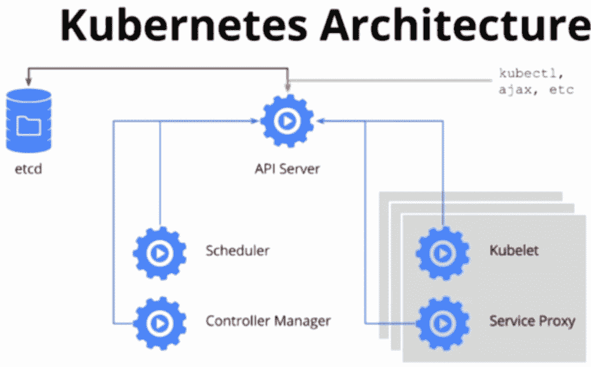

在典型的 Kubernetes 集群中，API 在端口 443 上公开，可以通过 TLS 连接访问该端口。在集群创建或配置期间生成的自签名证书可从 **$USER/获得。用户机器上的 kube/config** 。但是通过代理可以简化对 API 服务器的访问，我们将在教程中配置代理。

API 服务器执行客户端的身份验证、授权和准入控制。更多详情，请参考 [Kubernetes API 文档](http://kubernetes.io/docs/admin/accessing-the-api/)。

## 设置集群

有三种方法可以启动并运行 Kubernetes 集群:

1.  这是在 Mac 或 Windows 机器上获得 Kubernetes 集群的最简单的方法。遵循 [GitHub 页面](https://github.com/kubernetes/minikube)上的说明。
2.  **多节点漫游–**如果你想超越基础知识，了解真正的 Kubernetes 集群，克隆 [CoreOS Kubernetes repo](https://github.com/coreos/coreos-kubernetes) 并启动*多节点漫游*CoreOS 的工作人员按照[分步指南](https://coreos.com/kubernetes/docs/latest/kubernetes-on-vagrant.html)出色地维护了 repo。
3.  **Google Container Engine–**这是迄今为止访问成熟的 Kubernetes 集群最简单的方法。注册谷歌云平台，下载[云 SDK](https://cloud.google.com/sdk/downloads) 并运行强大的 [GKE 集群](https://cloud.google.com/container-engine/docs/clusters/operations)。

本教程的完整脚本也可以在 [GitHub](https://github.com/janakiramm/k8s-api-tutorial) 上获得。

## 验证安装

一旦访问了正在运行的集群，通过运行以下命令来验证一切都完好无损:

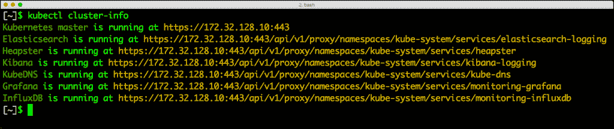

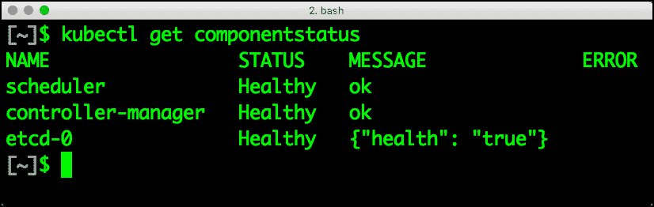

如果您看到类似的输出，那么 Kubernetes 集群处于完美的状态。我们已经准备好探索 API 了。

## 配置代理

访问 Kubernetes API 最简单的方法是配置一个代理。幸运的是，kubectl 提供了一个选项来配置它。

打开一个新的终端窗口，运行以下命令创建代理。

```
kubectl proxy  --port=8000

```


通过这个代理会话，任何发送到 **localhost:8000** 的请求都将被转发到 Kubernetes API 服务器。

现在我们都设置好了，让我们继续进行我们的第一个 API 调用。但在此之前，我们先来探索一下 Swagger UI。

## 访问和调用 API

从浏览器访问 http://localhost:8000/swagger-ui/访问 Swagger。如果您使用 Minikube，此功能可能不可用。

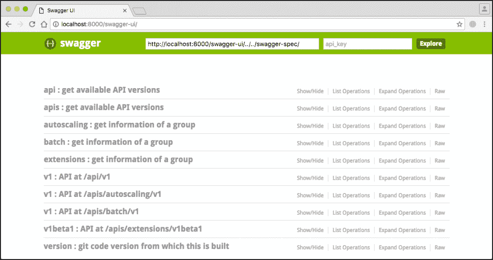

展开 **/api/v1** 部分将向我们显示所有可用的端点。

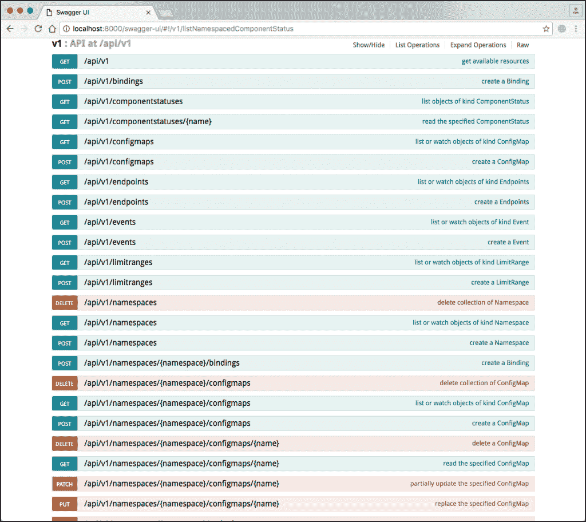

现在让我们使用 **cURL** 来玩这个 API。

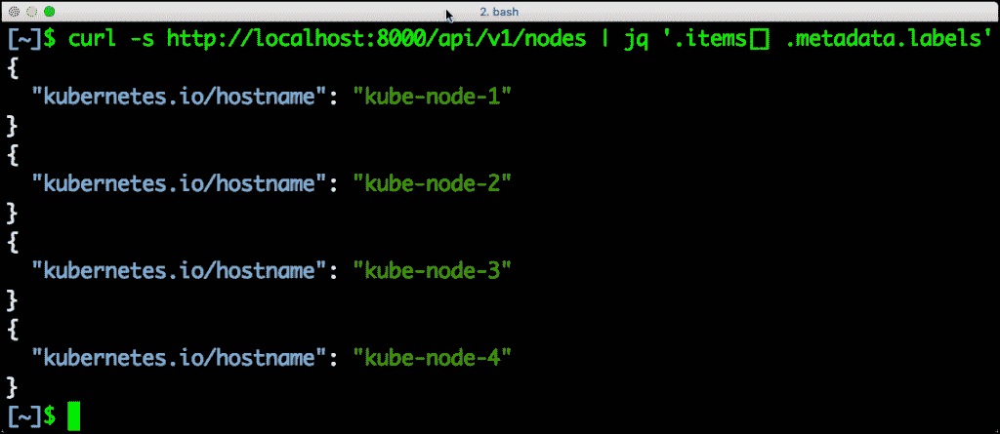

```
curl http://localhost:8000/api

```

让我们来玩玩这个 API 吧。为了便于阅读，安装通用的 JSON 命令行解析器 [jq](https://stedolan.github.io/jq/) 。

最常用的命令之一是 **kubectl** get nodes *，*，它返回以下输出。

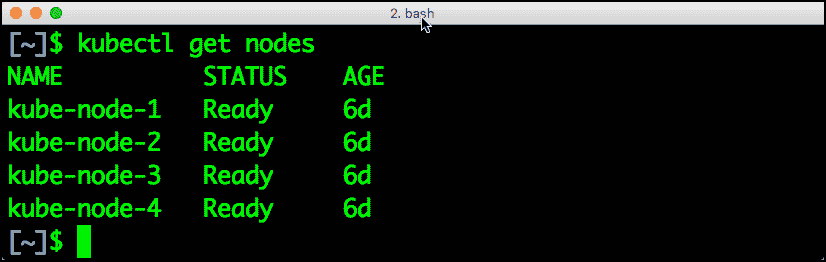

获取所有节点的等效 curl 命令非常简单。 **Jq** 用于使输出更美观，更易读。

```
curl  -s  http://localhost:8000/api/v1/nodes | jq '.items[] .metadata.labels'

```


如果你愿意，你也可以使用[邮差](https://www.getpostman.com/)来探索 Kubernetes API。

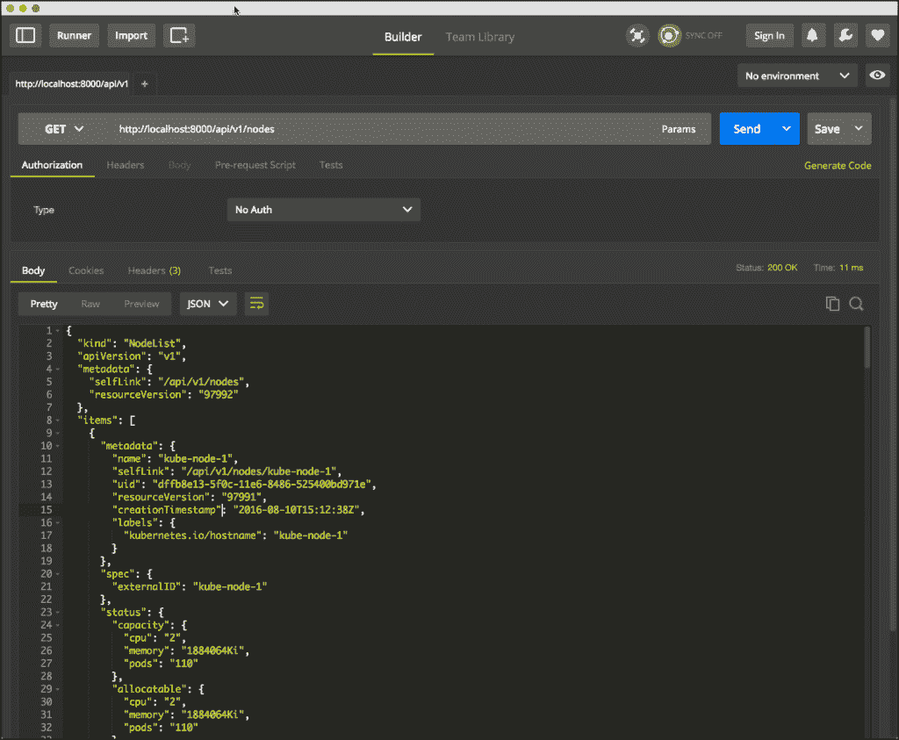

让我们通过 API 创建一个 pod 来更进一步。

## 从 API 创建 Pod 和服务

首先，让我们定义一个 pod。下面的命令将创建一个简单的 NGINX pod。

```
cat  &gt;  nginx-pod.json  &lt;&lt;EOF
  {
       "kind":  "Pod",
       "apiVersion":  "v1",
       "metadata":{
           "name":  "nginx",
           "namespace":  "default",
           "labels":  {
               "name":  "nginx"
           }
       },
       "spec":  {
           "containers":  [{
               "name":  "nginx",
               "image":  "nginx",
               "ports":  [{"containerPort":  80}],
               "resources":  {
                   "limits":  {
                       "memory":  "128Mi",
                       "cpu":  "500m"
                   }
               }
           }]
       }
  }
  EOF

```

然后，我们将创建一个服务定义来公开刚刚调度的 NGINX pod。

```
cat  &gt;  nginx-service.json  &lt;&lt;EOF
  {
  "kind":  "Service",
  "apiVersion":  "v1",
  "metadata":  {
  "name":  "nginx-service",
  "namespace":  "default",
  "labels":  {"name":  "nginx"}
  },
  "spec":  {
  "ports":  [{"port":  80}],
  "selector":  {"name":  "nginx"}
  }
  }
  EOF

```

下一步是通过调用以下命令创建 pod 对象。

```
curl  -s  http://localhost:8000/api/v1/namespaces/default/pods \
-XPOST  -H  'Content-Type: application/json'  \
-d@nginx-pod.json  \
|  jq  '.status'

```

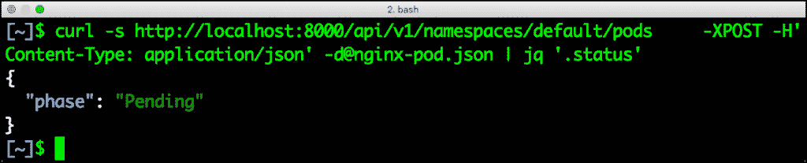

我们过滤 cURL 输出只是为了显示状态。几秒钟后，NGINX 映像将被下载并安排在其中一个节点上。

有了 NGINX pod，我们还可以创建一个服务。这个过程与 pod 的创建非常相似。

```
curl  -s  http://localhost:8000/api/v1/namespaces/default/services \

-XPOST  -H  'Content-Type: application/json'  \

-d@nginx-service.json  \

|  jq  '.spec.clusterIP'

```

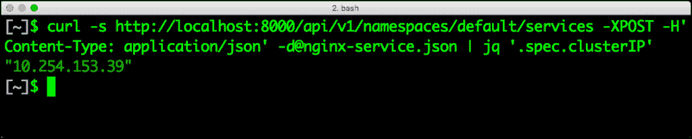

让我们确保两个对象都已创建。我们将使用 kubectl 来列出 pod 和服务。

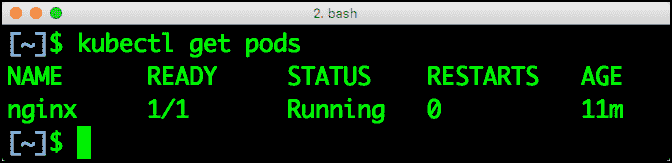

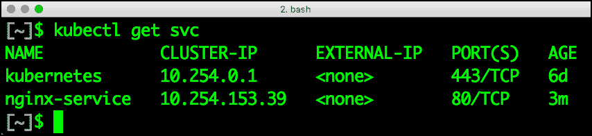

最后，让我们通过代理访问 Nginx 服务。

```
curl http://localhost:8000/v1/proxy/namespaces/default/services/nginx-service/

```


是时候通过删除 pod 和我们创建的服务来进行清理了。

```
curl http://localhost:8000/api/v1/namespaces/default/services/nginx-service -XDELETE

```

```
curl http://localhost:8000/api/v1/namespaces/default/pods/nginx -XDELETE

```

## 摘要

Kubernetes 是当今最具可扩展性的容器编排引擎之一。凭借谷歌在管理大型基础设施方面数十年的经验，它为大众带来了网络规模的计算。API 优先的方法使得 Kubernetes 可编程和可扩展。正如我们在演练中看到的那样，开始使用 API 很容易。任何可以通过仪表板或 kubectl 客户机执行的任务都作为 API 公开。

<svg xmlns:xlink="http://www.w3.org/1999/xlink" viewBox="0 0 68 31" version="1.1"><title>Group</title> <desc>Created with Sketch.</desc></svg>