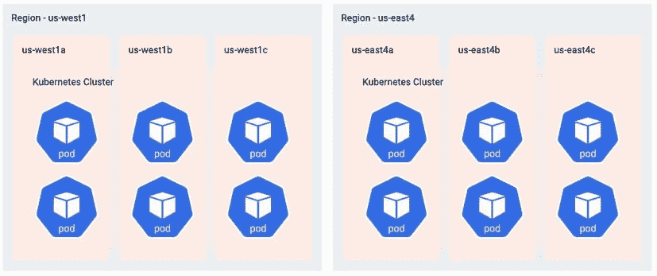

# 让您的数据库超越单个 Kubernetes 集群

> 原文：<https://thenewstack.io/taking-your-database-beyond-a-single-kubernetes-cluster/>

*在本帖中，我们将让您先睹为快，看看我们在*[*kube con 2021*](https://kccncna2021.sched.com/event/lV2m/taking-your-database-beyond-the-border-of-a-single-kubernetes-cluster-christopher-bradford-datastax-ty-morton-google?iframe=no)*上的演示，其中 DataStax 和谷歌云平台将向您展示如何利用 Kubernetes 和 Apache Cassandra 更轻松地管理分布在内部和云中的数千个节点的分布式应用程序。*

 [克里斯托弗·布拉德福德

Christopher 热衷于通过自动化提高效率。从通过 Cassandra 促进轻松扩展到使用基础设施自动化和容器的 DevOps 管道，他在这里完成工作并让运营商高枕无忧。](https://www.linkedin.com/in/bradfordcp/) 

全球应用程序需要一个与其服务的用户一样分布的数据层。Apache Cassandra 已经迎接了这一挑战，为苹果、网飞和索尼等公司处理数据需求。传统上，管理分布式应用程序的数据层是由专门的团队来管理数千个节点的部署和操作，无论是在内部还是在云中。

为了减轻 DevOps 团队的负担，我们在 [K8ssandra](https://k8ssandra.io/) 中发展了许多这样的实践和模式，使用了由 [Kubernetes (K8s)](https://thenewstack.io/category/kubernetes/) 提供的公共控制平面，但是有一个问题:如果没有适当的关注和预先的计划，跨多个区域或 K8s 集群运行一个数据库或任何应用程序都是很棘手的。

为了向您展示我们是如何做到这一点的，让我们从在一个单独的 [Kubernetes 集群](https://thenewstack.io/what-does-it-take-to-manage-hundreds-of-kubernetes-clusters/)上运行的单个区域 K8ssandra 部署开始。它由分布在该区域内三个可用性区域的六个 Cassandra 节点组成，每个可用性区域有两个 Cassandra 节点。在这个例子中，我们将使用[谷歌云平台](https://cloud.google.com/) (GCP)区域名称。然而，我们在这里的例子可以很容易地应用于其他云，甚至是本地云。

我们现在的情况是这样的:

我们云数据库的现有部署。

目标是有两个区域，每个区域有一个 Cassandra 数据中心。在我们这里的云管理 K8s 部署中，这转化为两个 K8s 集群，每个集群都有一个单独的控制平面，但使用一个通用的虚拟专用云(VPC)网络。通过将我们的 Cassandra 集群扩展到多个数据中心，我们可以在发生区域性故障时提供冗余，并在本地访问数据的情况下缩短客户端应用的响应时间和延迟。

这是我们的目标:拥有两个区域，每个区域都有自己的 Cassandra 数据中心。

 [泰·莫顿

Ty 是谷歌的一名客户工程师，专注于零售业。在过去的两年里，他一直专注于帮助客户交付云原生架构，主要关注 Kubernetes 和其他应用程序现代化方法。](hhttps://www.linkedin.com/in/ty-morton-2b55b82/) 

从表面上看，我们似乎可以通过简单地旋转另一个 K8s 集群，部署相同的 K8s [YAML](https://www.redhat.com/en/topics/automation/what-is-yaml) 来实现这一点。然后只需为[可用区域](https://cloud.google.com/about/locations#network)的名称添加一些调整，我们就可以称之为完成了，对吗？最终，资源的形状非常相似，都是 K8s 对象。那么，这不是应该就行了吗？嗯，也许吧。根据您的环境，这种方法可能行得通。

如果您真的很幸运，您可能离完全分布式数据库部署还有一段防火墙距离。不幸的是，事情很少这么简单。即使这些障碍中的一些很容易被清除，还有许多其他无害的东西可能出错并导致降级状态。你选择的云提供商、K8s 发行版、命令行标志，是的，甚至是 DNS——这些都有可能把你引上一条黑暗的暴风雨之路。所以，让我们来探讨一些你可能遇到的最常见的问题，这样你就可以避免它们。

## 规模化竞争中的常见障碍

即使您的一些部署最初看起来工作得很好，当您成长为一个多云环境、升级到另一个 K8s 版本或开始使用不同的发行版和补充工具时，您可能会遇到一两个障碍。说到分布式数据库，还有更多。了解 K8s 正在做什么来支持在一系列硬件上运行容器，这将有助于您开发高级解决方案，并最终开发出符合您确切需求的解决方案。

### 您的 Cassandra 节点需要唯一的 IP 地址

你可能遇到的第一个障碍是基本的人际关系。回到我们的第一个集群，让我们看一下所涉及的网络层。

在下面的 VPC 中，我们有一个无类域间路由(CIDR)范围，代表 K8s worker 实例的地址。在 K8s 集群的范围内，有一个单独的地址空间，pods 在其中操作，容器在其中运行。pod 是具有共享资源(如存储、网络和进程空间)的容器的集合。

在一些云环境中，这些子网被绑定到特定的可用性区域。因此，您的 K8s 工作人员进入的每个子网可能都有一个 CIDR 范围。您的 VPC 中可能还有其他虚拟机，但在本例中，我们将坚持让 K8s 作为唯一的租户。

具有 K8s 图层的 VPC 使用的 CIDR 范围。

在我们的示例中，10.100.x.x 用于节点，10.200.x.x 用于 K8s 级别。每个 K8s 工作者为在那个单独的实例上运行的 pod 获得 10.200.x.x CIDR 范围的一部分。

回想一下我们的目标结构，如果两个集群使用相同或重叠的 CIDR 地址范围，会发生什么情况？初次接触网络时，您可能还记得这些错误消息…

尝试连接两个网络时的常见错误消息。

K8s 的错误不是这样的。您没有弹出警告您集群无法有效通信的警报。

如果您有一个具有一个 IP 空间的集群，然后您有另一个具有相同 IP 空间的集群或它们重叠的地方，那么每个集群如何知道特定的数据包何时需要离开它的地址空间，而是通过 VPC 网络路由到另一个集群，然后进入该集群的网络？

默认情况下，这里没有任何提示。有一些方法可以解决这个问题，但在高层次上，如果你重叠，你是在自找麻烦。这里的要点是，您需要了解每个集群的地址空间，然后仔细规划这些 IP 的分配和使用。这允许 Linux 内核(K8s 路由发生的地方)和 VPC 网络层适当地转发和路由数据包。

但是，如果你没有足够的 IP 怎么办？在某些情况下，您不能给每个 pod 分配自己的 IP 地址。在这种情况下，您需要后退一步，确定哪些服务绝对必须有唯一的地址，哪些服务可以在同一个地址空间中一起运行。例如，如果您的数据库需要能够与所有其他 pod 通信，它可能需要自己唯一的地址。但是，如果您在东海岸和西海岸的应用程序层只是与他们的本地数据层通信，他们可以拥有自己的专用 K8s 集群，具有相同的地址范围并避免冲突。

拉平网络。

在我们的参考部署中，我们将 K8s 集群中的非重叠范围专用于基础架构层，这些范围必须是唯一的，并且重叠 CIDR 范围中的服务不会进行通信。最终，我们在这里做的是将网络扁平化。

有了非重叠的 IP 范围，我们现在可以将数据包路由到每个集群中的 pod。在上图中，您可以看到西海岸为 10.100，东海岸为 10.150，K8s pods 接收来自这些范围的 IP。K8s 集群有自己的 IP 空间，200 个对 250 个，而 pod 像以前一样被分割。

### 如何处理 Cassandra 数据中心之间的路由

所以我们有一堆 IP 地址，这些地址是唯一的。现在，我们如何处理这些数据的路由以及所有这些数据的通信和发现？目的地为集群 A 的数据包无法知道它们需要如何路由到集群 b。当我们尝试跨集群边界发送数据包时，本地 Linux 网络堆栈会发现这不是本地主机或本地 K8s 集群中的任何主机。然后，它将数据包转发到 VPC 网络。从这里开始，我们的云提供商必须有一个路由表条目来了解这个数据包需要去哪里。

在某些情况下，这将只是开箱即用。VPC 路由表会根据 pod 和服务 CIDR 范围进行更新，告知数据包应该路由到哪些主机。在其他环境中，包括混合环境和内部环境，这可能采取通过 BGP(边界网关协议)向网络层通告路由的形式。雅虎！日本有一篇很棒的[文章](https://kubernetes.io/blog/2016/10/kubernetes-and-openstack-at-yahoo-japan/)介绍了这种确切的部署方法。

然而，这些选项可能并不总是最佳答案，这取决于您的多集群架构在单个云提供商中的表现。它是混合云还是多云，是本地云和两个不同云提供商的组合？虽然您当然可以在所有这些不同的环境中使用所有这些工具，但是这需要大量的时间和维护。

## 一些要考虑的解决方案…

### 覆盖网络

一个更简单的答案是使用覆盖网络，其中您为您的应用程序构建一个单独的 IP 地址空间，在本例中，它是一个 Cassandra 数据库。然后，您可以在现有的 Kube 网络上运行，利用代理、侧柜和网关。在这篇文章中，我们不会深入探讨这个问题，但是我们有一些关于[如何跨 K8s 集群](https://dtsx.io/3l8sMPN)连接有状态工作负载的精彩内容，将在较高层次上向您展示如何做到这一点。

那么，下一步是什么？数据包是流动的，但现在你有一些新的 K8s 诡计要处理。假设您已经准备好了网络，并且有了所有适当的路由，那么这些集群之间就存在一些连接，至少在 IP 层是这样。您有 IP 连接单元，集群 1 可以与单元和集群 2 通信，但是您现在还需要考虑一些新的事情。

### 服务发现

在 K8s 网络中，身份是短暂的。由于群集事件，pod 可能会被重新调度并接收新的网络地址。在某些应用中，这不是问题。在其他情况下，如数据库，网络地址是身份，这可能导致意外的行为。尽管 IP 地址可能会改变，但随着时间的推移，我们的存储以及每个 pod 所代表的数据会保持持久。我们必须有一种方法来维护地址到应用程序的映射。这就是服务发现的切入点。

在大多数情况下，服务发现是通过 K8s 中的 DNS 实现的。即使 pod 的 IP 地址可能会更改，它也可以拥有一个基于 DNS 的永久标识，该标识会随着集群事件的发生而更新。这听起来很棒，但是当我们进入多集群的世界时，我们必须确保我们的服务可以跨集群边界被发现。作为集群 1 中的一个 pod，我应该能够获得集群 2 中的一个 pod 的地址。

### DNS 存根

解决这个难题的一种方法是 DNS 存根。在本例中，我们将 K8s DNS 服务配置为将特定域后缀的请求路由到我们的远程集群。有了完全合格的域名，我们就可以将 DNS 查找请求转发到适当的集群进行解析并最终进行路由。

这里的问题是，每个集群都需要一个通过 kubelet 标志设置的单独的 DNS 后缀，这并不是所有 K8s 都有的选项。一些用户通过使用名称空间名称作为 FQDN(完全限定的域名)的一部分来配置存根来解决这个问题。这是可行的，但是这有点像黑客，而不是设置正确的集群后缀。

### 托管 DNS

另一个类似于 DNS 存根的解决方案是使用托管 DNS 产品。在 GCP 的案例中，有一个[云 DNS](https://cloud.google.com/dns) 产品，它处理复制本地 DNS 条目，最高可达 VPC 级别，以供外部集群甚至同一 VPC 内的虚拟机解析。这个选项提供了很多好处，包括:

*   消除管理群集托管的 DNS 服务器的开销。云 DNS 不需要扩展、监控或管理 DNS 实例，因为它是一项托管的谷歌服务。
*   每个 Google Kubernetes 引擎(GKE)节点上 DNS 查询的本地解析。与 NodeLocal DNSCache 类似，云 DNS 在本地缓存 DNS 响应，提供低延迟和高可扩展性的 DNS 解析。
*   与[谷歌云的操作套件整合。](https://cloud.google.com/stackdriver/docs)这提供了 DNS 监控和日志记录。
*   [VPC 域名系统。](https://cloud.google.com/kubernetes-engine/docs/how-to/cloud-dns#vpc_scope_dns)这提供了多集群、多环境和 VPC 范围的 Kubernetes 服务解决方案。

用于多群集服务发现的复制托管 DNS。

云 DNS 抽象掉了大量传统的开销。云提供商将管理扩展、监控、安全补丁以及托管产品的所有其他方面。对于一些云提供商来说，GKE 提供节点本地 DNS 缓存也有一些额外的好处，它通过在较低的级别运行 DNS 缓存来减少延迟，因此您不必等待 DNS 响应。

从长远来看，如果你只在一个云中，一个专门针对 DNS 的托管服务将会工作得很好。但是，如果您跨多个云提供商的集群和您的内部环境，托管服务可能只是解决方案的一部分。

[云本地计算基金会](https://www.cncf.io/) (CNCF)提供了多种选择，并且有大量的开源项目在帮助缓解这些棘手问题方面取得了很大进展，特别是在跨云、多云或混合云类型的场景中。

如果您想了解更多关于如何利用 Kubernetes 和 Apache Cassandra 来更好地管理您的本地和云中的分布式应用程序，我们将在 Kubecon 2021 上向您展示。我们还将讨论一些容器网络接口(container network interface，CNI)方法，以及如何在 K8s 基础设施之上使用服务网格来管理集群和服务之间的网络流量。所以[今天就注册](https://events.linuxfoundation.org/kubecon-cloudnativecon-north-america/register/)来获得满满一勺好东西吧！

*关注* [*DataStax 科技博客*](https://dtsx.io/3B9gc8E) *了解更多开发者故事。查看我们的*[*YouTube*](https://dtsx.io/3a1Kz4W)*频道获取教程，点击这里获取数据，点击*[*Twitter*](https://dtsx.io/2Ym54qA)*获取关于我们开发者社区的最新消息。*

<svg xmlns:xlink="http://www.w3.org/1999/xlink" viewBox="0 0 68 31" version="1.1"><title>Group</title> <desc>Created with Sketch.</desc></svg>