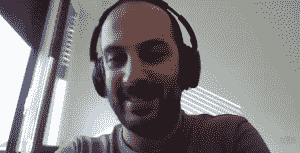

# 红帽质量工程经理的故事

> 原文：<https://thenewstack.io/tales-from-a-red-hat-quality-engineering-manager/>

我们可以从周围的人身上学到很多东西，以及他们在自己的角色和组织中应对挑战的方式。GitHub 的高级解决方案架构师 Bassem Dghaidi 就亲身经历过这一点。

今年 8 月，Bassem 在 YouTube 上推出了一个名为“ [glich](https://www.youtube.com/channel/UC6iKOXJ9PD-n8DcFPBjLD0w) 的节目，承诺“来自现实世界的软件工程课程”，他通过采访技术社区的其他人来不断扩大自己的知识库。“我希望我的内容会对你的旅程产生积极的影响，”Dghaidi 在[欢迎他的观众的第一个视频](https://www.youtube.com/watch?v=kYKbGJp2VZg)中说。从那时起，话题包括了从人工智能和 GitHub Copilot 到产品经理的重要性，甚至到 Docker 和 podman 的比较。

最近，戴迪采访了 Joe Rahme，他已经在 Red Hat 担任了两年多的质量工程经理，领导一个由 10 名质量工程师组成的团队验证 Red Hat 云计算平台 OpenStack 的新版本。

Rahme 对质量工程经理的角色提出了令人惊讶的深刻见解——从监督开发团队和创造支持性文化的独特挑战，到测试庞大的云计算平台的更大的软件相关挑战。

Dghaidi 将视频命名为“[红帽的工程经理是做什么的？](https://www.youtube.com/watch?v=ut1_QcXfRYA)

在谈话结束之前，还有一些其他有用的教训…

## 建立技术权威

第一课？要做好质量工程经理的工作，一定的技术知识是有帮助的。

Rahme 指出，这项工作需要与开发人员密切合作，“你越了解他们的工作、工具、流程和组织方式，你就越能与他们合作。”

Rahme 自己的背景包括早期的集成、打包/源代码控制合并、系统管理和质量工程——所有这些他描述为围绕开发人员工作，如果不是真正作为开发人员工作的话。(他还当过一段时间的网页开发员。)因此，他的管理风格最终取决于对产品和流程的熟悉程度。

> “如果我没有这方面的技术背景，我不可能做到这一点”——乔·拉赫姆

这也是 Rahme 强调的一点。“我要说的是，对我来说，你没有技术知识，但你仍然想管理它，这听起来很可怕……”Rahme 后来解释说，“明显的废话，不应该通过你。”

而建立某种技术权威“立即奠定了基调。人们开始尊重你。”

一旦你得到了团队的尊重，经理的角色就变得更加明显。Rahme 承认，他只能在 Red Hat 自己的角落里讲述自己的经历，但这是一次有益的经历。

在某一点上，Rahme 描述了出现的风格“我们有工程师；让他们来设计。我不会在工程上胜过工程师。那不是我的角色。甚至在一定程度上——我的角色不是给出一个技术问题的解决方案。我的角色甚至不是给出一个解决方案，说明流程是怎样的，以及我们如何组织自己。但我有很大影响的是我们如何将文化塑造成有意义的东西。”

举个例子，拉赫姆指出，如果有人害怕说*我不知道*或*我不理解*，“作为一名经理，这是你能解决的事情，其他人不能。事实上，你可以真正解决这些事情，这从长远来看会有很多积极的影响。”后来，他补充了一个额外的影响领域:确保每个人的意见都得到考虑。他还强调了一些经常被忽视的东西:文化“非常具有传染性”

后来，拉姆简明扼要地总结了这一切。“我认为，一名优秀的经理不负责流程或解决方案，他们负责文化。”

他对所有远程办公室也有一些建议:让你的整个团队每年至少会面一次或两次。“撞击是疯狂的！在我第一次和我的团队这样做后，我回到家，我想，'现在我认识这些家伙了！'"

## 学会改变

那么好的管理者来自哪里呢？Red Hat 为所有新经理提供为期 9 个月的培训课程 Rahme 认为这在另一方面也很有价值。“让你接触到其他发现新事物的经理——他们中的许多人是前工程师、长期工程师，他们中的许多人是来自其他公司的长期经理。与他们接触、分享故事和分享策略开始让我看到了一些模式，一些方式——“好吧，我看到了在这种情况下，一个好的经理是如何做出改变的……”我明白了管理是如何帮助工程师的。"

这是他对其他管理培训项目的建议。除了运行示例场景，“分享实际经验……这是一种能让你成为优秀经理的培训，因为它会迫使你思考，我是如何增加价值的？我如何在这里有所作为…？”

他用一个精心挑选的短语来描述那些不给管理者提供培训的组织的管理哲学:一厢情愿。

但他后来强调，通过训练，一切皆有可能。“我真的相信，即使你不是生来就有这种能力，你也能学会。”

那么作为一名红帽质量工程经理，你是做什么的呢？不久，Rahme 将分享他自己的实际工作经验。例如，Red Hat 如何测试像 OpenStack 云计算平台这样大的东西？

Rahme 指出许多测试和质量保证是从上游的开发人员和测试人员社区“继承”来的:“现在，我说‘继承’好像他们是完全独立的人，但是 Red Hat 是上游社区的一部分。因此，许多上游测试(据说与我们正在做的不同)是由红帽子公司完成的。所以我们首先测试上游，然后一旦我们打包了我们的下游构建，我们就分别测试它们。”

“在下游，很多重点放在测试不同组件之间的集成上……我们可以接触到更大的部件，更多的节点，更多的物理硬件，然后我们开始测试所有这些与不同项目的集成。我们确定了具体的版本，”他说。

## 未选择的道路

在一个令人惊讶的私人时刻，Dghaidi 问 Rahme 在进入管理层后是否错过了一些事情。“显而易见的一点当然是花时间在你的代码编辑器上，”Rahme 开始说道。“我现在仍然喜欢——不是不喜欢——而是不喜欢了。”

但后来他坦率地承认，他最怀念的是参与那些激烈的评论——“当你有一些有争议的事情，很多人有自己的看法。就像在战场上，听取每个人的意见。试图找到妥协，试图找到谁有意义，谁没有意义。

“现在，我更多地后退一步，我更多地是一个推动者。尽管我有自己的观点，但我不再像过去那样强烈、有力地附和了，”他说。

这似乎触及了更深层次的东西。“但总的来说，也有”——说到这里，Rahme 沉思地停顿了一下，然后说，“我怀念在不做‘经理’的情况下与团队交流的感觉。”比如可能参与谣言，或者可能给出我的观点——或者可能给某人*鼓励*，而没有‘这是你的经理在和你说话……’

他在管理他曾经共事多年的人。“所以有一点我很怀念——能够更自由地说话和游手好闲。”

这是 Rahme 在节目的后半部分提到的主题，他承认，在他整个管理生涯中，他最大的挑战是对其他人的工资、加薪和奖金承担真正的责任。

“当你是一名工程师时，你说的大多数话是——这很有趣。我知道我们应该在詹金斯做什么。我有关于我们应该如何测试这个 Python 东西的想法。它只影响你周一到周五，朝九晚五，然后你关掉笔记本电脑，继续你的快乐之路，做你想做的任何事情……但现在如果我负责你的加薪和奖金，我影响的就不止这些了。我正在影响你的周末，我正在影响你的 T2 假期，我正在影响你的圣诞购物，我正在影响对我来说新的和不同的事物…

“我不能像以前那样轻率地做出这个决定…如果我搞砸了，我真的会把别人搞砸…”

这是一个沉重的责任，对于那些将它视为职业的人来说，拉赫姆最终警告说，“这不是一个非常迷人的角色。很多都是支持那些做有趣事情的人。但是当你看到团队在工作，有很好的凝聚力时，说‘嘿，这是我们一起建立的……’是一件非常有趣的事情

“提升他人是世界上最美好的感觉之一…”

<svg xmlns:xlink="http://www.w3.org/1999/xlink" viewBox="0 0 68 31" version="1.1"><title>Group</title> <desc>Created with Sketch.</desc></svg>