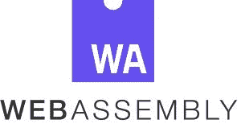

# WebAssembly 如何重塑我们在 Web 上编写和发布代码的方式

> 原文：<https://thenewstack.io/talking-wasm-paul-milham-webassembly-may-reinvent-write-ship-code-web/>

WebAssembly (WASM)是一种新的(ish)计算机汇编语言[，可以在浏览器](https://thenewstack.io/ready-web-assembly-revolution/)中运行。这也是邪恶的快。为了与 JavaScript 协同工作， [WebAssembly](http://webassembly.org/) 的紧凑二进制格式允许它以接近本地的性能运行。更强大的是，WebAssembly 还是一个编译目标——这意味着它可以允许其他语言如 C、C++和 Rust 在 web 上运行。

[Paul Milham](https://www.linkedin.com/in/paul-milham-6693a810/) 是 [WildWorks](http://www.wildworks.com/#welcome) 的首席开发人员，在那里他使用 WebAssembly 开发了动物果酱等游戏——他将其描述为“JavaScript 的一种新的超级力量”

米尔汉姆做了一个名为“什么是 WASM”的概述性演讲在最近的 [Node.js Interactive](http://events17.linuxfoundation.org/events/node-interactive) 大会上，他对这门语言的热情鼓舞人心。New Stack 最近采访了米尔勒姆，谈论了他的感觉，即 WebAssembly/WASM 有可能“彻底改造我们在网络上编写和发布代码的方式”，以及开始学习的方法。

## 那么，什么是 WASM 呢？

首先，声明:我不是任何重要的人；我没有设计 WebAssembly 之类的东西。我认为这太棒了，对于我们如何在网络上编码来说，这可能是一件大事。实际上，我希望我能更多地了解 WebAssembly 的历史——最好的来源可能是 [Brendan Eich 的 Twitter feed](https://twitter.com/BrendanEich?ref_src=twsrc%5Egoogle%7Ctwcamp%5Eserp%7Ctwgr%5Eauthor) 。它似乎也最直接地来源于 [asm.js](http://asmjs.org/) 。我确信其他项目，比如谷歌的 PNaCl，可能也影响了它的设计。就像其他与网络相关的事物一样，有一种感觉是这些神奇的东西不知何故从原始的软泥中爬出来的。

我喜欢 webassembly.org 的定义，简单地说“WebAssembly，或 WASM，是一种新的、可移植的、大小和负载有效的格式，适合编译到网络上。”

二进制编码汇编是对 WebAssembly 语言的一个很好的描述。不要期待像 for-loop 这样的花哨东西——它的级别要低得多。这是一个高效快速的堆栈机器，安全、开放且可调试。是网络技术！它不是某个单独的东西；这维护了网络的所有价值。这是真的。很多人没有意识到这一点，但 WebAssembly 现在就在你的浏览器中。它在火狐浏览器中，在 Chrome 浏览器中。在野生动物园，在边缘。它在 Node.js 中。下载 Node 的最新版本，键入 webassembly，按 enter，你会看到那里有一个对象。

是什么让你个人对 WebAssembly 感兴趣，以至于你决定坐下来自己学习这门语言？

所以，作为一名工程师，我总是在研究新技术。如果你想保持相关性，你需要保持不断学习的心态。WebAssembly 尤其让我感兴趣，因为它承诺了速度和可预测的性能——这两个特性对游戏开发者非常有吸引力。

网络很棒，我喜欢它，但是 Javascript 不是编写游戏的理想语言。稳定的渲染性能对于多种游戏的连续性和沉浸感非常重要。如果你打开你的浏览器开发工具，打开分析器，你会发现有很多事情正在发生。JavaScript 引擎跨越了许多障碍来提供我们所看到的惊人性能，但随之而来的复杂性往往会导致不可预测的性能。WebAssembly 解决了围绕速度和性能可预测性的问题。平稳性能的前景是多么令人兴奋，很难轻描淡写。

除此之外，WebAssembly 还能提供更多，但这是我个人最感兴趣的。

**你有目前最喜欢的使用 WASM 的地方的例子吗？**

WebAssembly 仍然很新，但是目前所有主流浏览器都支持它，我们看到有趣的用例开始涌现。Mozilla 用它和 Rust [一起解析源码图](https://hacks.mozilla.org/2018/01/oxidizing-source-maps-with-rust-and-webassembly/)，几个游戏引擎像 [Unity](https://unity3d.com/) 和 [Unreal](https://www.unrealengine.com/) 都用它作为编译目标。我认为我们很快就会看到它在许多性能关键领域的应用。

它有潜力被用于各种有趣的东西。人们现在正在试验用它来构建虚拟 DOM。另一件事是，你可以利用这些 C++库——那里有很多 C++代码——你可以利用它们，编译成 WebAssembly，并在 web 上有效地运行它们。有时我看到 JavaScript 模块本质上是，“我不喜欢 C++代码，我只是要用 JavaScript 重写它”——我希望我们将看到其中一些转移到 WA。你会看到速度几乎一样好，它完全便携。

重要的是要明白我们才刚刚开始。随着开发人员在框架和构建工具中利用 WebAssembly，您可能很快就会在不知不觉中使用它。目前还只是猜测，但 WebAssembly 有可能彻底颠覆我们在 web 上编写和发布代码的方式。所有主要的浏览器供应商都支持它,著名的 JavaScripters 开发者对此非常兴奋。

**最大的问题是，这如何让我作为开发人员的生活变得更好，或者更容易？**

WebAssembly 代码执行起来很快，下载起来也很快，并且有一些锦囊妙计，比如可以在下载的同时进行编译。简而言之，WebAssembly 使 web 成为一个更高性能的平台。最终，对网络有益的东西也会对网络开发者有益。

重要的是要记住 WebAssembly 是一个编译目标。如果您手工编写 WebAssembly 代码，就不要指望字符串或 for 循环之类的花哨东西。用编译成 WebAssembly 的语言写，比如 C 或者 Rust。WebAssembly 模块可以用许多不同的语言构建。有很多很酷的东西不是用 JavaScript 写的。如果可以像加载其他模块一样加载它，并通过 JavaScript 访问它，那就太酷了，对吧？

**那么，如果 WASM 最令人兴奋的地方之一是允许几乎任何语言针对浏览器，甚至 node.js，那么这种力量有哪些潜在的利用方式呢？**

关于 WebAssembly 最酷的事情之一是它是一个编译目标，我认为我们最终会看到几乎所有东西都编译到它上面。尽管它缺少像垃圾收集这样的特性，但我们已经看到许多语言宣传对它的实验性支持。

能够选择你的语言是一大胜利。举个例子，我喜欢 Javascript，但不是每个人都喜欢。不想使用 JavaScript 或者甚至不能在当前项目中使用它的原因有很多。WebAssembly 确实可以帮助解决这个问题。

**对 WA 感兴趣的人开始学习/使用的最好方式是什么？**

从[ [马特奥·巴索的 WASM 资源库](https://github.com/mbasso/awesome-wasm)说起。这个仓库是纯金的。只是一个庞大的 WebAssembly 资源列表。要获得实际操作经验，我建议您只是随便玩玩。

然后， [WasmFiddle](https://wasdk.github.io/WasmFiddle/) 真的很酷，不用建立工具链。你只需在浏览器中输入 c 代码，它就会为你处理 WebAssembly 的编译。

如果你想手工编写代码，那么 [Wabt](https://github.com/WebAssembly/wabt) (发音为 wabbit)是一个很好的资源。这就是我用来编写我的第一个 WebAssembly 模块。

不过，事先警告一下，这有点像石器时代写代码的方式。不要忘记 WebAssembly 是一个编译目标，因此您可以查看您的首选工具是否支持它，并尝试这样做。我个人现在最喜欢的是 Rust [to] WebAssembly。那里发生了很酷的事情。像 [Unity](https://docs.unity3d.com/Manual/webgl-building.html) 这样的高级工具正在增加 WebAssembly 支持。使用类似的东西，您可以在完全不了解底层技术的情况下获得 WebAssembly 的好处。

<svg xmlns:xlink="http://www.w3.org/1999/xlink" viewBox="0 0 68 31" version="1.1"><title>Group</title> <desc>Created with Sketch.</desc></svg>