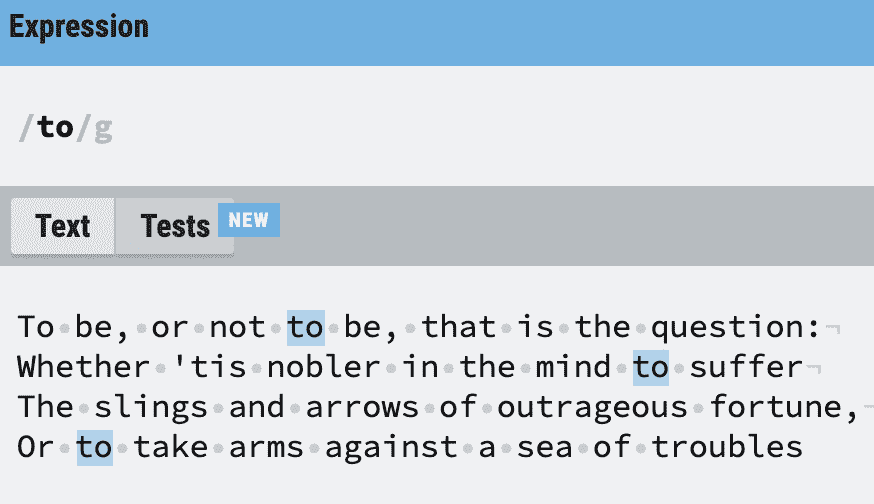
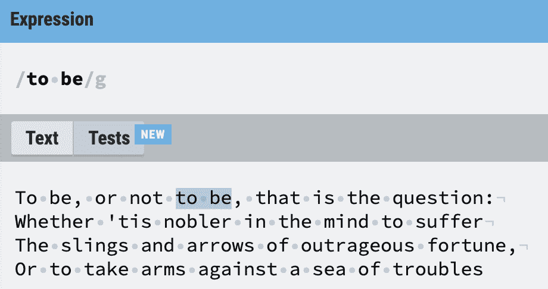
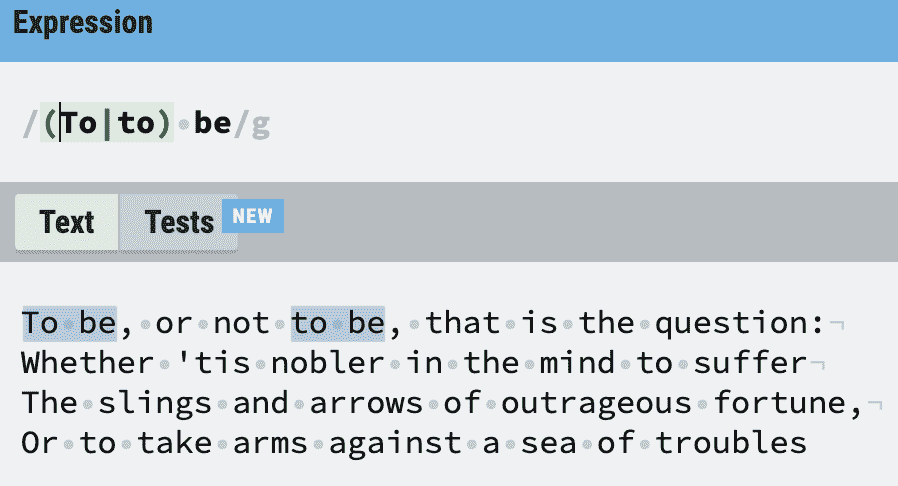
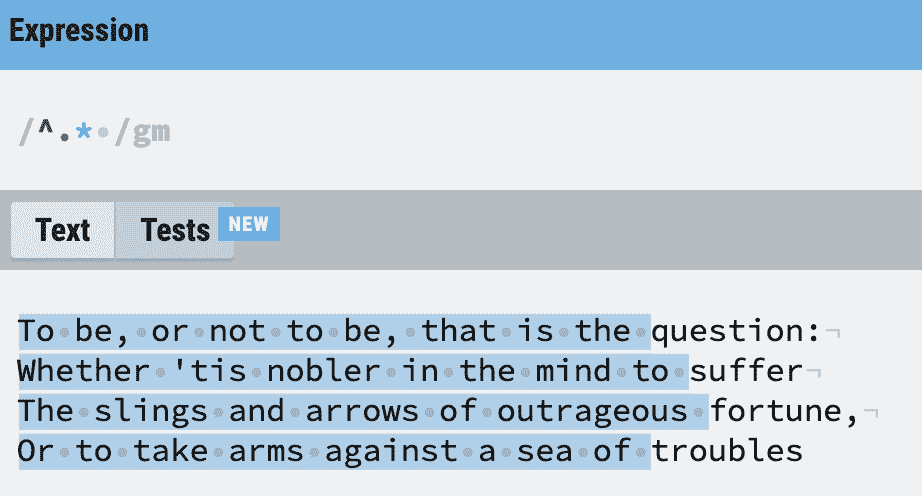
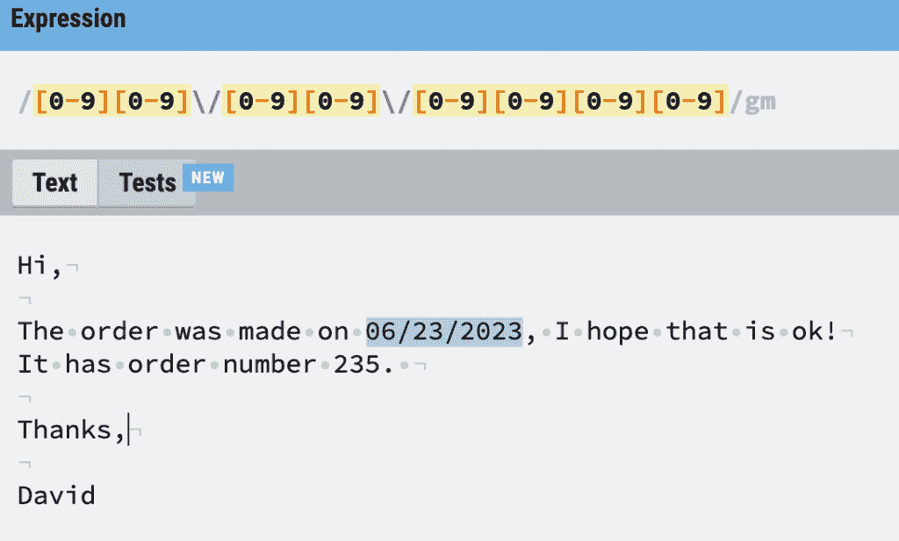
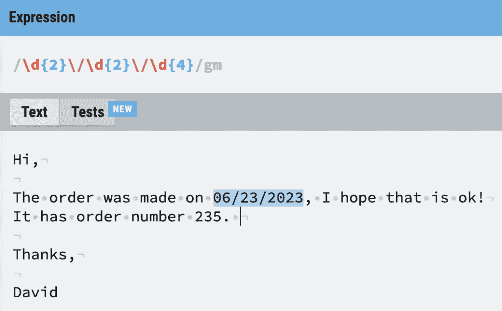

# 用正则表达式的力量驯服文本搜索

> 原文：<https://thenewstack.io/taming-text-search-with-the-power-of-regular-expressions/>

模式匹配是智人在残酷的千年掠夺性竞争中保持优势的一项技能。我们的大脑非常善于在草丛中发现一条蛇，即使我们不熟悉那条蛇，或者那片土地。

当你看到说服计算机做类似的“模糊”匹配是多么困难时，你很快就会意识到我们在这方面有多擅长；计算就是遵循预先定义的规则。这就是为什么自动驾驶汽车从未真正到来。然而，有一种工具让人类去解决模式，而只是管理机制。

对于单词领域，正则表达式(或 **regex** )是指定搜索模式的一种很好的方式，以便找到隐藏在大量文本中的单词和字符。例如，您如何找到电子邮件中提到的所有日期？这正是 regex 的问题所在。有如此多的网站允许你转储大量的文本并对其应用正则表达式搜索，只需一个浏览器就可以很容易地学习和做有价值的工作。

然而 regex 是开发人员知道他们应该学习的技能之一，就像触摸输入一样，但是他们经常直到最后一刻才开始学习。但是对于每个处理文本的人来说，这是一个有用的技能，因为许多文本编辑器都允许正则表达式搜索。我推荐的是你先学一个小的核心，然后在需要的时候再扩展你的知识面。如果你喜欢文字游戏(甚至是 *Wordle* )，你理解 regex 的来龙去脉不会有任何困难。

因为 regex 是一门计算学科，所以我们需要快速了解文本在计算中是如何表示的。一个印刷体字母或一个美元符号就是字符的例子，它们在计算机内存中组成一个**串**。文本的**行**是以**新行**字符结尾的字符串。

当您按下键盘上的 return 键时，新的行字符将被追加到字符串中。因此，整个莎士比亚文本可以表示为一个字符串，或许多行。例如，该文本可能使用新的行字符来表示段落的结尾；这个网页自然会使用自动换行在屏幕上将段落拆分成许多行。

有很多正则表达式符号，但是我将一次介绍几个，这样您会发现更容易搞清楚您能做什么。首先，每一个现存的印刷字母代表它自己，除非它是一个特殊的正则表达式符号。

让我向您介绍两个重要的正则表达式符号:

> **。**(句号)–任意字符
> 
> ***** (星号)——零次或多次

句号可以代表任何单个字符，除了新的一行。

星号，一个**量词**的例子，指定它前面的字符可以重复零次或多次。

您可能会对没有使用特殊符号感到有点惊讶。这可以追溯到 regex 时代，当时只有键盘字符可用。

以下是可以代表我名字的所有有效正则表达式:

> 大卫
> 
> Da.id
> 
> D…d
> 
> D.*d
> 
> .*

也许你发现了一个窍门，句号后面跟一个星号可以代表任何长度的字符串。现在，正则表达式通常以“渴望”而闻名，因为它会尽可能地匹配，这就是为什么对这种组合非常小心是很重要的。

这些重要的符号是**锚**:

> **^** (帽子)–字符串或行的开始
> 
> **$** (美元)-字符串或行的结尾

这些确保您可以找到相对于行首或行尾的内容。理解你的文本是由行组成的，还是由单个字符串组成的，这是解决问题的最初分析的一部分。

最后，我们有**交替**这是一个 OR 操作符。管道符号为我们提供了一点逻辑控制:

> (这个|那个)

你可以把上面读成“这个或者那个”。

现在，我将使用[regexr.com](http://regexr.com)来放置一些例子；有很多网站做同样的事情。正则表达式嵌入在许多需要搜索功能和实用程序的应用程序中，比如 sed 和 AWK。

在我们开始野外搜索之前，这里有一些注意事项:

*   就像我们用引号将字符串括起来一样，我们用向前倾斜的斜线将正则表达式括起来:

**/我的正则表达式/**

*   有一组被称为**标志**的东西在最后一个斜杠后表示。例如，“g”用于表示“全局”模式，在第一次命中后将继续搜索:

**/我的正则表达式将继续搜索/g**

*   因为注意空格和换行符很重要，所以大多数正则表达式工具可以使这些通常不可见的标记可见。

让我们检查几个简单的正则表达式模式应用于一个众所周知的由行组成的文本的结果:

好了，这只不过是在整篇文章中简单地搜索“to”这个词。不是很有用。

这提醒我们**正则表达式搜索是区分大小写的**。除非打开不区分大小写标志，或者显式查找大写字符，或者执行以下操作:

现在让我们用我们的锚找到每行的第一个单词。那应该很容易。首先，我们添加多行标志“m”。我们搜索行首，后跟任意数量的字符和一个空格…

哦不！尽管我有这个意图，但这个表达(正如我之前警告的那样)太急切了，得到的比我希望的要多。所以我们需要多学一点——事实上，就像滑雪一样，我们需要知道如何停下来！

幸运的是，我们还可以将搜索限制在一个“类”或一个字符范围内。我们使用方括号并将允许的字符放在里面。我们也可以用破折号来表示范围。

所以我们可以创建这些过滤器:

> **【AEIOU】**只有大写的元音
> 
> **【0123456789】**只有一个号码
> 
> **【0-9】**只有一个数字
> 
> **【A-Z】**只有大写字母
> 
> **【A-Za-z】**只有一个字母

所以我们可以回过头来用下面的方法解决我们的“只有第一个单词”的问题:

这表示“从行首开始，查找大写字母，然后查找任意数量的小写字母”。所以这一次我们使用一个空格字母作为被排除的组——它被看门人阻止了。这对吟游诗人来说已经足够了。

那么，有了这些小技巧，我们准备好做一些有用的事情了吗，比如像我承诺的那样，在文本中搜索日期？好吧，让我们来看看美国式约会的一小部分:

> 6 月 23 日
> 
> 2023 年 6 月 13 日
> 
> 06/23/2023

现在我们也许可以做最后一个…但是等等。正斜杠不是我们需要的特殊符号的一部分吗？是的，所以当我们想要使用一个特殊的正则表达式符号作为我们搜索字符的一部分时，我们使用一个反斜杠来“转义”它们:

用反斜杠对正斜杠的转义是—丑陋的。欢迎来到**倾斜牙签综合征。**在上面的例子中，你能发现改进过滤的方法吗？例如，月份只能以“0”或“1”开头。

为了完整起见，我将使用额外的方法使其更简洁，这些方法以更简单的方式定义了“一个数字”,并且量化了重复的确切次数:

现在，有了这些知识，您应该能够

*   尝试搜索其他类型的日期。
*   了解一些其他的类，量词和逻辑的东西，使正则表达式更加丰富。
*   了解如何对搜索结果进行分组和替换。
*   警惕一些像 **lookahead** 这样的技巧，因为它们确实很棘手，不一定在所有的正则表达式工具中都实现。
*   查看您自己的编辑器，看看它是否使用了许多编辑器内置的 regex 功能。
*   学会阅读又长又难看的正则表达式，并弄清楚它们是如何工作的。

<svg xmlns:xlink="http://www.w3.org/1999/xlink" viewBox="0 0 68 31" version="1.1"><title>Group</title> <desc>Created with Sketch.</desc></svg>