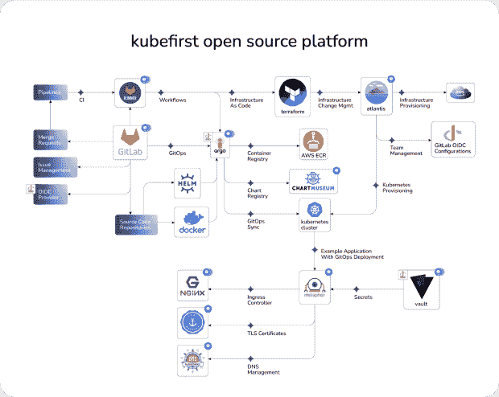

# 用 Kubefirst 驯服 CNCF 的风景

> 原文：<https://thenewstack.io/taming-the-cncf-landscape-with-kubefirst/>

[云计算原生计算基金会(CNCF)的前景](https://landscape.cncf.io/)是巨大而复杂的，有来自数百个贡献者的项目。一个人从哪里开始？

 [约翰·迪茨

约翰是 Kubefirst 的联合创始人。他在 IT 领域拥有超过 20 年的领导经验，包括测试、性能、开发、数据、开发运维、平台架构和云工程。他在将《今日美国》转移到云计算方面发挥了重要作用，并在过去五年中帮助初创公司采用 Kubernetes。](https://www.linkedin.com/in/jd-k8s/) 

无论您是即将开始 Kubernetes 之旅，还是已经意识到它的复杂性， [Kubefirst](https://kubefirst.com/) 都可以通过其自以为是的云原生应用交付和基础设施管理平台提供帮助，集成来自[云原生计算基金会](https://cncf.io/?utm_content=inline-mention)的一些一流工具。它是一个可扩展、开源、独立于供应商的自托管平台，可在几分钟内交付到您的公共云，而不是从头构建需要几个月的时间。

2017 年，我和贾里德·爱德华兹(Jared Edwards)在一家房地产大数据创业公司的云工程团队一起工作时相遇。我们的任务是构建一个完全基于 Kubernetes 的基础设施管理平台和应用交付系统。

一起构建我们的第一个 Kubernetes 平台花了大半年的时间，最终我们继续为其他希望采用云原生实践的公司创建基础架构管理。尽管我们有构建基础设施和部署平台的经验，但我们惊讶地发现，从头开始构建一个伟大的 Kubernetes 平台总是要花好几个月的时间，即使您知道自己在做什么。

由于对耗时的过程感到沮丧，爱德华兹和我开始在晚上和周末一起工作，以创建一个开源解决方案来自动化平台供应的过程，于是 [Kubefirst](http://kubefirst.io) 项目诞生了。

我们知道，构建以 Kubernetes 为中心的平台是一项复杂而耗时的任务，尤其是在尝试驾驭庞大的 CNCF 云原生环境时。

## 使用 Kubefirst 跳过 Kubernetes 旅程的第一部分

Kubefirst 允许您对一个空的 AWS 帐户运行一个命令，以构建一个自托管、全自动的基础设施管理和应用交付生态系统。

Kubefirst 将 Terraform 用于基础设施作为代码，HashiCorp Vault 用于机密管理，cert-manager 和 external-dns 用于证书和域管理，NGINX 作为入口控制器，GitLab 和 ArgoCD 用于支持 GitOps 工作流。

跳过 Kubernetes 之旅的前六个月，从这些非常受欢迎的、有良好文档记录的开源技术开始，所有这些技术都以一种简单的面向声明性 GitOps 的方式集成在一起，并加入使用相同 Kubernetes 工具的开源用户社区。

Kubefirst 已经加入 [Kubeshop](https://kubeshop.io/) ，以加速其增长并扩展其开源平台能力。在 Kubeshop 的支持下，Kubefirst 正在围绕该平台建立一个工程团队和社区，并很高兴能够专注于为云原生项目提供一个出色的开源自托管起点。

我们已经在这个项目上倾注了我们的心血，并且[希望你作为用户和贡献者加入我们](https://docs.kubefirst.com/community/index.html)的使命。我们是来帮忙的，我们很乐意多谈一些。请加入我们的 [Slack 社区工作空间](https://join.slack.com/t/kubefirst/shared_invite/zt-r0r9cfts-OVnH0ooELDLm9n9p2aU7fw)并注册[办公时间](https://calendly.com/kubefirst/intro)。我们很高兴看到你用 Kubefirst 做的东西！

<svg xmlns:xlink="http://www.w3.org/1999/xlink" viewBox="0 0 68 31" version="1.1"><title>Group</title> <desc>Created with Sketch.</desc></svg>