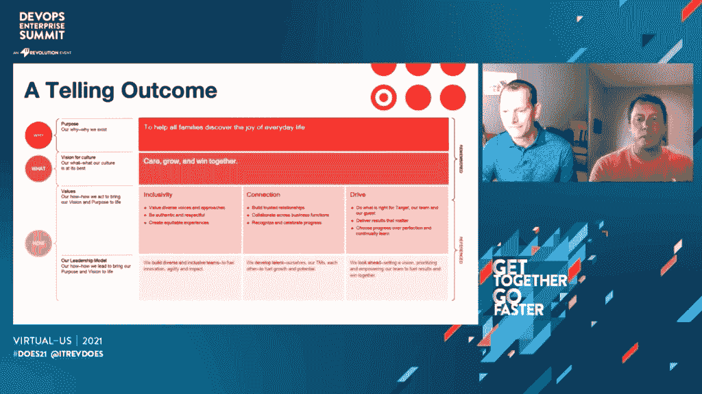
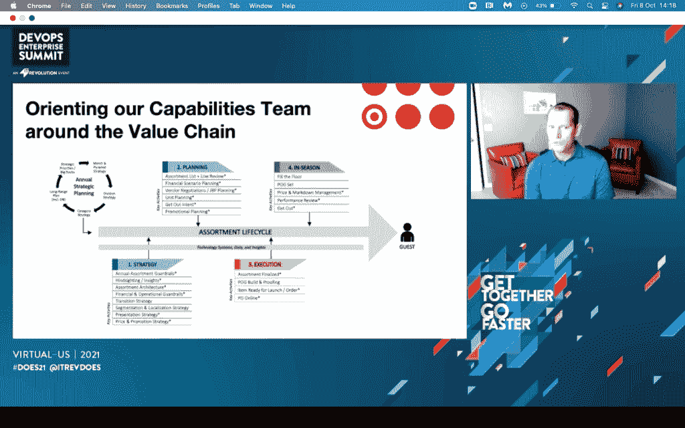

# 目标接受跨组织的 DevOps 文化

> 原文：<https://thenewstack.io/target-embraces-cross-organizational-devops-culture/>

在新冠肺炎之前，目标零售连锁店的销售文化有一个非常孤立的决策过程和操作，只关注对每个“独特的”部门或类别最好的，而不关心对端到端操作或客户最好的。

在过去的四年里，该公司努力改变这种运营状态，疫情实际上帮助加快了这一进程。

Target 是北美最大的零售商之一，拥有 350，000 名员工，1，914 家商店，46 个配送中心，去年的收入为 935 亿美元。2014 年，来自 Target 的人们在 DevOps 企业峰会(DOES) 上发表了关于如何在一个以前几乎外包一切的组织中重建卓越工程的演讲。 [金](https://twitter.com/RealGeneKim) 说它启发了他著名的 [独角兽计划](https://thenewstack.io/the-unicorn-project-author-gene-kim-on-why-management-still-doesnt-get-it/) 2018 年，目标团队回来谈论重新思考架构和治理在实现开发人员生产力方面的作用。

Target 员工在上周举行的今年的活动中再次发言。 [商品功能产品管理高级总监 Luke Rettig](https://www.linkedin.com/in/lucas-rettig-ba4bb730/) 和数字高级副总裁 [Brett Craig](https://www.linkedin.com/in/brett-craig-4b165313/) 走上虚拟舞台，分享 Target 在过去几年的历程，以及 DevOps 心态如何不仅影响技术工作，还影响整个组织文化。

> “当我们有了疫情，不得不专注于购买必需品，而每个人都在试图解决健康和安全问题以及远程工作时，我们变得更加开放。这是我们利用 DevOps 精神的又一次机会——将专家聚集在一起，确保我们专注于最重要的事情。”——布雷特·克雷格，目标

## 目标转向以学习为导向的 IT 组织

这一切都是从 2015 年左右开始的，当时克雷格说，塔吉特百货在技术运营上举步维艰。“我们支出占销售额的比例太高了。我们有如此多的优先事项，却进展甚微。而且，在我们真正交付项目的罕见情况下，我们的交付模式主要依赖于第三方，所以我们实际上没有保留 IP(知识产权)。”

这一切都加剧了士气和稳定性的挑战。他们植根于传统的工作方式，强调外包，而不是在内部发展技术技能。

技术管理团队指出了需要解决的几个弱点:

*   跨组织优先排序
*   劳动力技能组合的现代化
*   培育定制开发的工程文化，创造知识产权
*   更好的锚定架构
*   从项目转移到产品思维
*   拥抱敏捷原则
*   消除组织孤岛的分层

“哪些是我们绝对不能错过的，为什么系统中会有其他噪声？”克雷格说，他们需要减少他们的风险姿态，并重新考虑优先事项。“有很多事情对某人来说很重要，但它们对我们所有人真的重要吗？”往往不会。

虽然这最终是一个积极的结果，但这是一个痛苦的开始，第一个假期非常艰难，生产率下降。目标团队很快意识到他们缺乏产品、工程、分析和用户体验方面的关键技能。

为了对抗这一点，他们允许每个工程师每年花 50 个工作日投入自己的学习之旅。技术技能的持续改进和现代化带来了强大的跨团队协作。

接下来，目标 IT 团队建立了架构原则和治理委员会，致力于关注他们的零售平台架构。他们的目标是通过微服务和技术升级实现松散耦合但高度一致。模仿谷歌的网站可靠性工程模型，他们确保他们不仅仅关注特性和功能，而是实际上将运营健康纳入这些对话，克雷格称之为 DevOps 文化的体现。

敏捷和 DevOps 最佳实践被引入到整个大型组织中，甚至帮助非技术团队:

*   打破筒仓
*   通过反馈循环实现知识共享
*   共同创造和建立信任
*   绘制价值链

## 简化“新鲜”价值链

早在 2018 年，Target 就无法保持高质量的易腐食品库存，以至于虽然它吸引了顾客到商店，但管理层质疑他们是否应该长期经营，特别是在竞争日益激烈的情况下。这是目标商业模式的重要组成部分，但正如 Craig 所说，它在所有核心指标上都表现不佳。

他们开始在这个问题上投入更多的管理层，并雇佣了一个 50 人的咨询团队来解决这个问题。

把他们引向了错误的方向。他们意识到他们需要更少的人，而不是更多。

他们将策略转移到一个小型的、[跨职能的](https://thenewstack.io/how-engineering-leaders-drive-cross-functional-collaboration/)业务、运营、技术和产品内部团队，该团队只专注于一组特定的可交付成果。买家、规划者、空间分配者、供应商联络人和其他职能专家与雷蒂格和几名工程师共处一地——“进行人与人之间的交流，而不是幻灯片与幻灯片之间的交流。”

他们在冲刺、看板和快速反馈循环中工作，他们设置了一个护栏:在不牺牲新鲜业务销售的情况下推动利润，包括熟食店、面包店和易腐食品。

新的跨职能能力团队致力于有限范围的可交付成果，尤其是空间，这是实体建筑中最受限制的资产。他们努力变得非常以数据为导向，特别是他们可以为近 2000 家商店中的每一家进行细分和本地化的水平。他们努力利用数据和情报来确定每个类别在获得利润回报递减之前应该获得多少空间。他们还旨在减少机械收缩——在它变质之前，向商店发送比他们可以出售的更多的东西。

最终，这个规模较小、完全跨职能的团队取得了几项成就:

*   毛利润增加了 32%,销售额仅下降了不到 2%。
*   将分配给新鲜品类的镜头减少了 15%，这意味着他们可以利用这一空间来销售利润更高、更容易腐烂的商品。
*   构建了产品组合规划产品套件的 1.0 版本，其他业务领域可以使用。

也许这个试点项目最成功的部分是它催生了第一批内部提倡 [DevOps](/category/devops) 工作方式的人，这种工作方式后来允许 Target 在保护团队和客户健康的同时快速响应疫情。

Craig 说，他们发现“通过授权给组织中的一小部分人，这实际上有助于克服我们每天遇到的一些不确定性和新挑战。”

## 减少销售孤岛，提高 Covid 响应

Rettig 说，每周的跨组织会议更多的是庆祝单个团队的成就，而不是这些团队如何更好地合作。这个会议和每周的运营会议是分开的。通常会做出一些决定，然后将这些决定发送给产品和营销部门去执行，而没有连贯的意图。

2020 年 3 月和 4 月，突然出现了食品等必需品的供应链延迟，而各地的百货公司都在商店和配送中心储备了服装和配件。

这个相当新的能力团队希望围绕商品销售价值链及其关键路径为自己定位，包括制定战略、分配空间、决定产品组合，以及如何管理店内变化。

Rettig 称之为大规模的站立:“这是我们来自整个价值链的业务所有者真正走到一起，告诉我们应该为我们的团队和我们的客人做出什么样的最佳决定，”这是 Target 对其客户的说法。

这需要整个企业思维模式的转变。包括增加另一个 DAM 会议——或日常行动会议——旨在保护团队成员免受所有不必要的噪音影响，这些噪音会分散安全服务客户的注意力。有趣的是，虽然他们每天都见面，以便更快地做出决策，但他们也将战略从季度业绩转移到为客户和员工制定最佳的两年长期目标。

Craig 说，该团队一直在问:“在不假设或默认我们一直以来处理事情的方式的情况下，处理这件事的正确方式是什么？”

Rettig 的团队暂停了大量的清场计划和在最初几周开始的季节性过渡，以减轻团队的重新售票负担。他解释说，这些被认为是重大的企业决策，可以在跨职能的 DAM 会议上做出。他们首次利用 Target Circle 忠诚度应用对积压的非必需品进行即时促销。

Craig 说，这需要拥抱真正的 DevOps 心态——为了一个单一的目的召集不同的团队——大多数人甚至不知道 DevOps 实际上是什么。

该能力团队致力于“帮助所有家庭发现日常生活的乐趣”这一目标，以及“关爱、成长、共赢”这一愿景 Target 采用了有助于实现这一目标的三个新价值观:

*   包容性
*   关系
*   动力，包括超越完美的进步

随着他们的精简，价值链之外的一切都被砍掉了。

## 塔吉特走向数字化的下一步

在主持会议期间，金说会议的目标很明确:“我们都在努力拼凑关于科技文化的知识。”这就是为什么他的团队要求每个演讲者以他们还不知道的事情或者他们需要帮助的事情结尾。

克雷格最近在塔吉特百货(Target)获得晋升，负责全面的数字业务。他说，对于世界上许多地方来说，数字已经成为零售的门户，然而，美国却落后于这一趋势。  为了迎头赶上，Target digital 正专注于完善其产品思维，并在整个大型组织中推动 DevOps 精神。

最重要的是，他们强调 [的目标是招聘所有学科的](https://corporate.target.com/careers/) 。

<svg xmlns:xlink="http://www.w3.org/1999/xlink" viewBox="0 0 68 31" version="1.1"><title>Group</title> <desc>Created with Sketch.</desc></svg>