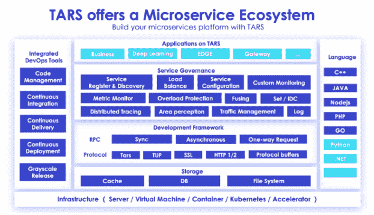

# TARS 微服务扩展至 ARM 架构

> 原文：<https://thenewstack.io/tars-microservices-extended-to-the-arm-architecture/>

Linux 基金会赞助了这篇文章。

 [凯瑟琳·王

Katharine 是一名工程师，通常为开源社区贡献代码，尤其是 TARS 项目及其基金会。她专注于微服务和容器、开发运维、测试、区块链等领域。](https://www.linuxfoundation.org/) 

基于互联网的平台公司腾讯已经为 ARM CPU 架构开发了 TARS 微服务。

TARS 是一个成熟的开源远程过程调用(RPC)框架，被开发人员广泛用作快速构建系统和自动生成代码的工具箱。开发人员现在可以为基于 ARM 的服务器开发和生成代码。ARM 的 TARS 微服务现在也可以通过 Akraino Blueprint 生态系统访问。

在本文中，我们将描述 4G 和 5G 网络中 tar 的基本系统架构和部署场景，这将是 ARM 架构端口的初始目标垂直市场。

## TARS ARM 架构端口概述

TARS 旨在支持多种编程语言，包括 C++、Golang、Java、Node.js、PHP 和 Python，允许 ARM 开发者和企业在基于 ARM 的系统上快速构建稳定可靠的分布式应用。该框架已在腾讯内部开发和强化了 10 多年，在腾讯的社交媒体、视频、电子竞技、在线游戏、地图、应用市场和安全以及数百个其他核心业务中得到了广泛应用。

TARS 建筑概述。

由于 TARS 在腾讯内部的开发，该项目于 2018 年 6 月捐赠给了 Linux 基金会。迄今为止，TARS 微服务部署的规模已达到一百万，采用了行业标准的 DevOps 理念和腾讯的服务方法。

腾讯在过去一年中一直与 ARM 合作，将 TARS 微服务完全移植到 ARM 架构，前两个基于 ARM 的部署将专注于 AR/VR 和自动驾驶汽车用例，供腾讯内部使用。这些解决方案代表了一个市场机会，可以将 TARS 从传统应用扩展到下一代应用，从而满足更多企业和个人用户的需求。

从系统架构的角度来看，TARS 微服务蓝图由四个主要层组成:

*   **硬件层** : TARS 运行在广泛可用的社区硬件之上，广泛支持基于多种架构的服务器，包括 ARM Neoverse 平台。
*   **IaaS 层** : TARS 也可以部署在虚拟环境中。还支持虚拟机、容器以及其他 IaaS 主流软件平台(如 OpenStack、Kubernetes 等)。
*   **PaaS 层** : TARS 可以部署为平台即服务蓝图的微服务框架。TARS 可以提供高性能的 RPC 调用，在更大的横向扩展场景中高效地部署微服务，并提供易于理解的服务监控功能。
*   **SaaS 层**:根据不同的用例，TARS 可以作为应用程序中的组件，作为软件即服务来部署。

从网络架构的角度来看，TARS 微服务蓝图可以部署在 4G 和 5G 网络中。需要注意两个要点:

数据卸载到边缘 MEC 平台。数据卸载策略可基于不同的应用进行配置。

edge 可以与其他 edge 以及远程数据中心进行通信。在某些使用案例中，单个边缘上处理的数据量无法满足应用的独特需求，在这种情况下，可以从不同的边缘收集数据，以确定应用的“结论”。

## 结论

TARS 可以快速构建系统，自动生成代码，兼顾易用性和高性能。同时，TARS 支持多种编程语言，包括 C++、Golang、Java、Node.js、PHP 和 Python。TARS 可以帮助开发者和企业以微服务的方式快速构建自己稳定可靠的分布式应用，以专注于业务逻辑有效提升运营效率。

<svg xmlns:xlink="http://www.w3.org/1999/xlink" viewBox="0 0 68 31" version="1.1"><title>Group</title> <desc>Created with Sketch.</desc></svg>