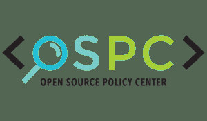

# 向你的大脑征税:开源挑战政府黑箱经济学

> 原文：<https://thenewstack.io/tax-yor-brainzz-open-source-vs-government-black-boxes/>

长期以来,“开源”加上“联邦政府”就等于矛盾修饰法，这是有充分理由的。美国政府可能依靠数字运行，但这些数字——以及用于分析它们的算法和模型——对我们这些在华盛顿特区庞大机构之外工作的人来说是一个谜

法律要求联邦机构在将他们的提案编入现行法律之前证明其合理性。理由很充分:比如，税收政策的变化会影响整个经济。然而，“正当性”通常是以估算的形式出现的，这些估算是基于在像[税务分析办公室](https://www.treasury.gov/resource-center/tax-policy/Pages/Tax-Analysis-and-Research.aspx)这样不见天日的地方深入分析的数字。在那里，无名的官僚使用未公开的统计模型计算结果，这些模型基于我们其他人，包括起草这些法律的立法者，无法看到的假设。

然而，多亏了[开源政策中心](https://www.ospc.org/)，这个伟大国家的公民现在可以一窥数据，以及用来推导和分析这些数据的方法，这些数据推动了公共政策和新法律的制定。简而言之，这个总部位于 DC 的非营利组织寻求让一点开源阳光进入政府数据建模的黑匣子。作为美国企业研究所的一部分，OPSC 于 2016 年 4 月启动，其使命是让公共政策分析变得透明，或者至少更容易理解。

OPSC 称自己是“预测公共政策效果的实验室”——即统治我们所有人的政府项目和法律。这可能经常感觉像一条单行道——他们决定，我们遵守——但是像 [OPSC 的 TaxBrain](https://www.ospc.org/taxbrain/) 这样的项目旨在将一些权力放在人民手中，或者至少放在一些书呆子手中。

TaxBrain 使用开源经济模拟模型来模拟联邦税收政策变化的影响。用户可以通过 web 应用程序(也是开源的)来改变他们选择的号码，或者下载代码在本地运行。

OPSC 孵化的所有项目都是开源的，GitHub 上有完整的源代码。这些存储库包括旗舰项目 TaxBrain，第一个也是目前最广泛采用的 OPSC 产品，以及另一个名为 Cost of Capital Calculator 的项目，这两个项目都可以从 OPSC 网站下载。十几个左右的计划正处于不同的完成阶段，可以在组织的代码库中进行检查。

这些主要是用 [Python/Anaconda](https://www.continuum.io/downloads) 写的，带一点 R 和一点点 [Matlab](https://www.mathworks.com/products/matlab.html) 和 [Jupyter 笔记本](http://jupyter.org/)。

## 黑箱经济学

Matt Jensen 是开源政策中心的创始人和常务董事，他最近在本月早些时候在奥斯汀举行的 [AnacondaCon 2017](https://anacondacon17.io) 上谈到了他的团队的计划。根据 Jensen 的说法，美国目前做出的大多数重大政策决定都是基于专有的数据分析和算法——这些过程由各自的联邦机构高度保密。他的 AnacondaCon 演讲重点介绍 TaxBrain 如何利用 Anaconda 使税收政策分析对任何地方的任何人开放和可用。

> 美国目前做出的大多数重大决策都是基于专有的数据分析和算法——这些过程由各自的联邦机构高度保密。

Jensen 表示，TaxBrain 的一个非常引人注目的用例是能够在制定新政策的过程中访问建模和影响估计，而不是在制定新政策之后。

他解释说，当前的体系要求政策制定者首先精心设计他们的改革方案，然后将它们送到外部进行测试和分析。立法者提出想法，与律师协商，将其写成正式法案，然后提交给负责评估潜在影响和结果的任何实体。例如，拟议的税收立法会提交给联合税收委员会，后者通过其专有的建模资源运行拟议的政策，并最终(可能长达一年后)返回分析结果。

这种情况有很多问题。一个是，联合税收委员会从设计上来说是一个狭窄的管道:只有一个可用的建模资源，这意味着该机构一次只能分析一个账单。一个更重要的问题是，无论速度有多快或多慢，整个过程都是在一个“黑匣子”中进行的。

“你没有得到方法论，你没有得到他们使用的假设列表，你肯定没有得到代码，”詹森说。“这是我们的政策制定者在制定税收政策时必须依赖的。”

## 捕虫

Jensen 认为，开源税收政策数据建模的主要好处之一在于发现漏洞。很多虫子。

“开源自然有助于我们发现系统中的错误，因为一个项目会吸引更多的眼球。找到他们是至关重要的，因为如果我们不这样做，那么我们将根据影响数百万人的有缺陷的分析作出政策决定。与此同时，他补充道，“我知道在专有的(政府)模型装备中有一些缺陷没有被发现。因为没人在找他们。”很明显，没人有兴趣开始。

根据 Jensen 的说法，联邦模型是闭源的最初原因是因为它们就是这样开始的。“20 世纪 70 年代的这些商店，他们不知道做开源建模意味着什么，他们现在也不想开始，因为我认为，他们的代码中有错误，而且很乱，一个主要的人已经在这方面工作了很长时间，他不想让所有人都知道，”他解释道。

此外，詹森说，许多联邦机构商店正在使用专有语言，似乎认为因为他们正在使用，比如说 [SAS](https://www.sas.com/en_us/home.html) ，他们不能使他们的代码开源:“有很多错误信息。”

詹森并不打算用这句话来诋毁他的 GS 同事。他说，政府经常雇佣优秀的建模师。然而，他补充说，“全国各地的大学里都有尖端的计算机科学家和经济学家，他们可以提供他们的专业知识和资源，帮助我们的政府变得更好。”

显然，华盛顿的内部人士也有同样的感觉。事实上，奥巴马政府的税收政策人员在制定新的立法时使用了 OPSC 工具，詹森说，现任政府的税收人员也一直在使用这些工具。

结论是:“不管意识形态如何，我们希望我们的政府是透明的，产生可复制的结果，负责任的。毕竟，他们为我们工作，”詹森说。

如果透明度不是来自内部，那么获得它的最好方法就是从外部发出一束光。我们希望我们的政策制定者能够根据最新、最准确的数据提出更好的问题，以制定出最好、最相关的法规。这些都是开源数据科学所允许的。如果将它们纳入联邦分析系统，我们将能够制定出更好的政策。

这并不意味着詹森的开源政策中心正在努力成为华盛顿的下一个一站式数据处理中心。詹森说，OSPC 只是希望把有价值的工具放到任何非政府组织手中，让他们能够最有效地使用这些工具。

“我们的影响在于孵化这些工具的开发，并将研究留给经验主义经济学家和统计学家——或者普通公民。”

*OSPC 边界调整计算器:*

专题图片:[自由鸟世界卷饼](https://www.instagram.com/p/BQPPA3Bh7y2/?taken-by=joabjack)，得克萨斯州奥斯汀。

<svg xmlns:xlink="http://www.w3.org/1999/xlink" viewBox="0 0 68 31" version="1.1"><title>Group</title> <desc>Created with Sketch.</desc></svg>