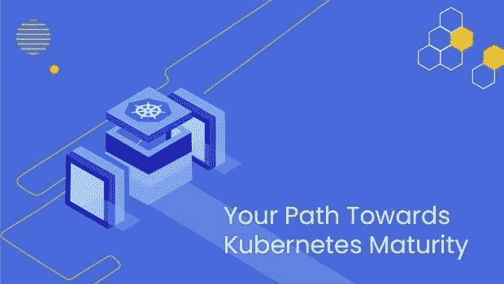
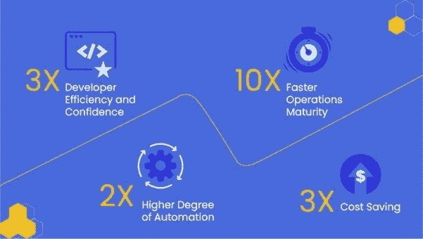
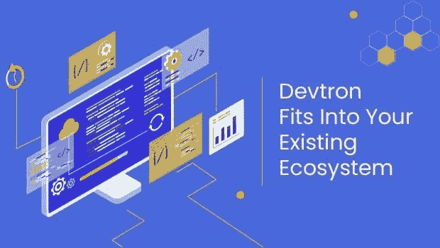

# 技术背景介绍:Devtron，K8s 原生 DevOps 平台

> 原文：<https://thenewstack.io/tech-backgrounder-devtron-the-kubernetes-native-devops-platform/>

Devtron 抽象出复杂性，并帮助公司快速采用容器编排器。Devtron 通过其跨越软件供应链的构建、部署、安全、成本优化和调试阶段的 Kubernetes 感知工作流，帮助组织快速提高开发人员的工作效率，同时在 Kubernetes 上成熟他们的 [DevOps](https://thenewstack.io/what-is-devops/) 实践。

## **微分器**

Devtron 专注于提高 Kubernetes (K8s)软件供应链的成熟度，因此在某种程度上与 [Harness](https://harness.io/products/continuous-integration?utm_content=inline-mention) 竞争。但是，Devtron 提供了以下独特的功能:

*   Devtron 触及 Kubernetes 的各个方面，包括构建、部署、安全性、成本优化、可见性和调试，以加快 Kubernetes 的采用。
*   Devtron 允许开发人员在没有供应商限制的情况下拥有卓越的开发体验，通过与他们首选的开源工具进行深度集成，如 [Argo CD、](https://argo-cd.readthedocs.io/en/stable/) [Argo Workflows、](https://argoproj.github.io/argo-workflows/) [Clair、](https://github.com/quay/clair) [Trivy、](https://thenewstack.io/aqua-securitys-trivy-security-scanner-can-scan-anything-now/) [KEDA、](https://thenewstack.io/kubernetes-autoscaling-keda-moves-into-cncf-incubation/) [Knative](https://thenewstack.io/knative-brings-event-driven-and-serverless-computing-to-kubernetes/) 和 [Flagger、](https://flagger.app/)等等。
*   Devtron 提供了更高级别的构造，如短暂环境、环境漂移管理、多集群部署和集群调试，从而允许公司快速提高其 DevOps 成熟度，并拥有更快的发布周期。

## **问题空间**

想要采用 Kubernetes 的公司对采用的速度不满意，最终要花费数月甚至数年的时间来完善他们的 Kubernetes 系统，因为:

*   Kubernetes 的学习曲线很陡，需要大量投资来提高开发者/运营商的技能。
*   Kubernetes 有低级别的 API，这些 API 经常更新——导致配置管理不善。
*   从开发到构建和部署，整个软件供应链中的工具数量非常多，它们需要用户具备高水平的操作知识。因此，浪费了数百个宝贵的开发时间。

## **Devtron 的优势**

Devtron 的目标是使 Kubernetes 的采用民主化，以便公司能够实现 Kubernetes 的高水平成熟度，而不必进行大量的前期投资。它还对开发人员的开发速度产生了显著的积极影响，并允许他们以更快的速度发布功能和产品，并试验新技术，以便公司可以专注于建立竞争优势。

> “Devtron 是一个游戏改变者，因为它使公司能够更快地采用 Kubernetes。开发团队能够在几周内部署和管理基于微服务的应用程序并配置他们的 Kubernetes 环境，而不是几个月，并且不需要 Kubernetes 内部的专业知识。通过这样做，Devtron 帮助团队克服了迁移到 Kubernetes 的复杂性，同时也为他们节省了大量的时间和金钱。”
> 
> **–Josh zel man，Insight Partners 的负责人**

使用 Devtron 的公司在 Kubernetes 的采用和稳定性方面取得了显著的进步。一些公司能够在不到一个月的时间内将大约 20 个微服务转移到 Kubernetes 的生产中，而其他公司则看到他们运行的微服务数量显著增加，在一年内从 20-30 个增加到 200 多个，因为他们的团队规模增加了一倍以上，并扩大了产品组合。

## **公司**

Devtron 的联合创始人拥有数十年的经验，曾在快速增长的行业领先公司工作，涉及开发、质量保证、DevOps、数据科学、前端开发、机器学习，并作为个人贡献者和技术主管在团队中工作。Devtron 的诞生源于他们对扩展 DevOps 系统的挑战的第一手挫败感，这些系统的 DevOps 资源有限，预算有限，流失率高。

在 Kubernetes 之前，没有标准的方式来与操作系统和运行在其上的软件[交互。Kubernetes 用其统一的 API 定义改变了这一切，但它并不容易被采用。](https://thenewstack.io/why-kubernetes-has-emerged-as-the-os-of-the-cloud/)

事实上，在他们当前的组织中采用 Kubernetes 时，Devtron 的联合创始人意识到复杂性是采用 Kubernetes 的最大障碍之一。公司必须在多年内投资数百万美元，才能从中获得任何有意义的收益。

从这些观察中产生了开源产品的想法，以使 Kubernetes 的采用民主化，因此公司应该能够采用 Kubernetes，而不管他们的资金和规模如何。

## **栈**

Devtron 运行在 Kubernetes 上，这是它唯一的依赖。它可以与所有口味和版本的 Kubernetes。

## 合作伙伴/客户

作为开源产品，Devtron 在美国、欧洲和东南亚安装了数千台，其著名的付费客户包括 Delhivery、BharatPe、Livspace、xoxoday、Tata1MG、Nykaa 等许多其他公司。

## 定价

定价取决于使用 Devtron 的开发人员数量，以及环境的复杂性，如微服务、工作负载等的数量。Devtron 提供分级定价，这不仅取决于上面讨论的因素，而且有按月计费的年度订阅合同。

[https://www.youtube.com/embed/XfBrtNZ2OCw?feature=oembed](https://www.youtube.com/embed/XfBrtNZ2OCw?feature=oembed)

视频

<svg xmlns:xlink="http://www.w3.org/1999/xlink" viewBox="0 0 68 31" version="1.1"><title>Group</title> <desc>Created with Sketch.</desc></svg>