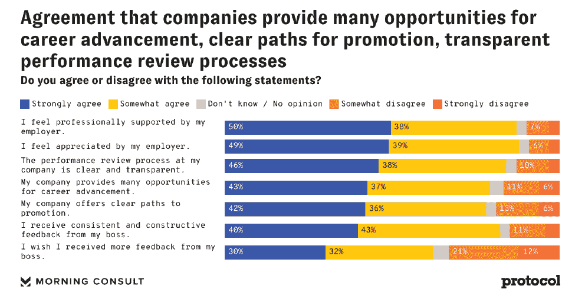
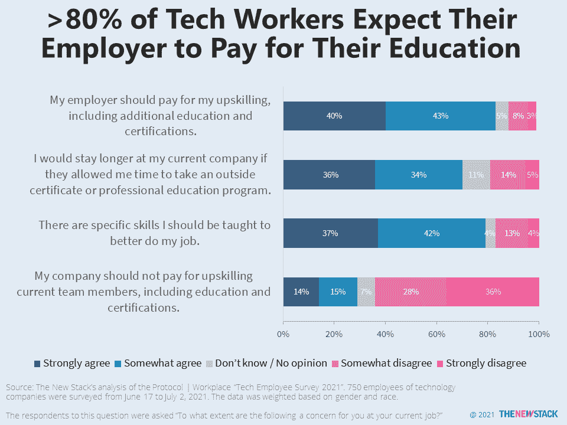
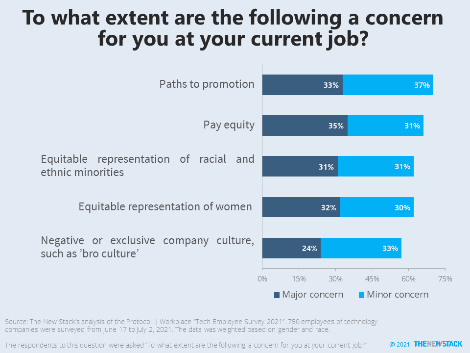
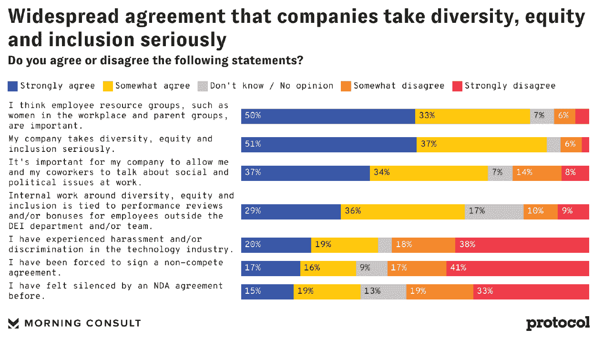
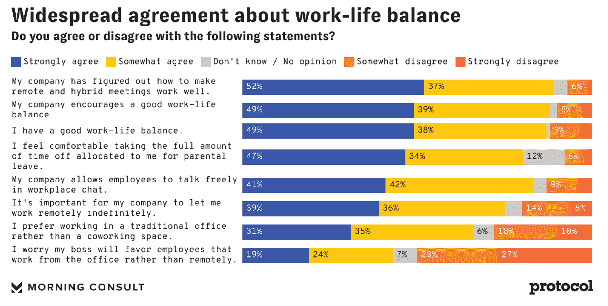

# 科技雇主从行业劳动力调查中获得好消息

> 原文：<https://thenewstack.io/tech-employers-get-good-news-from-survey-of-industry-workforce/>

陷入困境的科技公司领导人有理由微笑，因为根据几周前为 [Protocol | Workplace](https://www.protocol.com/workplace/) 进行的一项有 750 人参加的在线调查，88%的科技行业员工感觉受到了雇主的赏识。绝大多数员工都感到专业上的支持——50%的人非常赞同这一说法，另有 38%的人表示赞同。

更好的消息是:87%的人认为他们有很好的工作生活平衡。这听起来不像被广泛报道的[倦怠](https://thenewstack.io/young-female-developers-burn-out-because-of-expectations/)，但这些员工似乎也有更擅长设定期望的老板。工作与生活的平衡可能正在上升，因为 89%的人说他们至少在某种程度上同意他们的公司已经找到了如何让远程和混合会议工作得很好的方法。

多元化、公平和包容(DEI)是另一个亮点，83%的黑人科技行业员工和 81%的西班牙裔科技员工至少在一定程度上同意他们的公司重视 DEI。虽然没有人能肯定会发生什么，但 77%的人相信他们公司的人力资源部门会安全有效地处理性侵犯、骚扰和/或歧视的指控。黑人雇员(63%)和在小公司工作的人(69%)都缺乏信心。

所有这些好消息足以让键盘前的普通人感觉像被煤气灯点亮了一样。也许你是。也许这些公司多达 40%的员工不是技术人员，而是管理人员、销售人员、门卫等等。然而，79%的调查对象至少拥有学士学位。这是美国教育率的两倍多。如果你不是二元的，你甚至不存在于这个调查中——人口统计是 64%男性和 36%女性。深入研究数据，女性不太可能看到职业发展的机会。

换句话说，还有很长的路要走。让我们继续努力。 

女性对自己的职业发展和晋升机会更加怀疑。这些问题的男女比例分别为 85%对 72%和 82%对 70%。来源:Protocol | Workplace“2021 年科技员工调查”。

技术人员希望别人为他们的培训买单，即使他们最终会去另一家公司工作。

70%的人担心晋升途径，而 57%的人担心负面的公司文化。

17%的人无法回答 DEI 与绩效考核挂钩的问题。这可能会随着时间的推移而改变。来源:Protocol | Workplace“2021 年科技员工调查”。

收入较高的男性和受访者更倾向于在传统办公室工作。来源:Protocol | Workplace“2021 年科技员工调查”。

<svg xmlns:xlink="http://www.w3.org/1999/xlink" viewBox="0 0 68 31" version="1.1"><title>Group</title> <desc>Created with Sketch.</desc></svg>