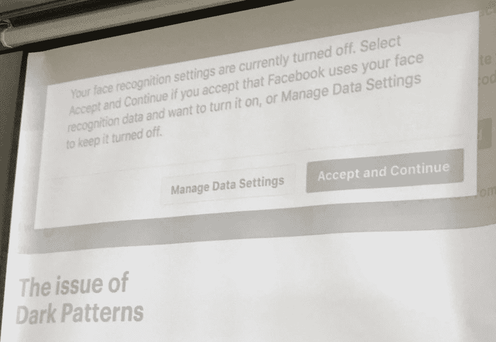

# 科技伦理新年决心:不要开发你会后悔的软件

> 原文：<https://thenewstack.io/tech-ethics-new-years-resolution-dont-build-software-you-will-regret/>

新年是下决心的日子，对吗？然后二月发现它们像上一季的必备玩具一样被丢弃了。决心经常失败，因为人们没有制定计划，只有愿望。考虑到这一点，在新的一年里，在现代技术道德前沿人士的帮助下，我们 New Stack 不仅会帮助您下定决心以更道德的方式工作，还会为您提供实现这一目标的框架。

毕竟，我们不应该只是为了支付账单而工作，而是要确保我们不会开发出将来会后悔的软件。我们[需要更清楚我们在建设什么](https://www.talkabouttechpodcast.com/1712587/8114604-please-hype-responsibly-talking-about-complex-systems-with-gemma-milne)以及如何建设。

## 警告:到底什么是技术伦理？

在新的堆栈中，我们谈论了很多关于[避免技术债务](https://thenewstack.io/day-software-dies/)，但是道德债务呢？让我们从尝试定义什么是道德的技术交付开始。黑胡椒软件公司的[山姆·华纳](http://linkedin.com/in/samuel-warner)在[好技术会议](http://goodtechconf.org)上——一个关注技术为社会造福的会议——简化了这个伟大的大学哲学话题，说道德软件:

*   不会造成负面的社会影响
*   不会让这个世界变得更糟糕

在[男女同校伦理](http://coedethics.org)上，另一个致力于技术伦理的会议[今年早些时候](https://thenewstack.io/are-programmers-ethically-and-legally-responsible-for-their-code/)报道了新的堆栈，每个人的[山姆·布朗](https://twitter.com/samcatbrown)附和华纳，说“负责任的技术考虑它创造的社会影响，并寻求理解和最小化其潜在的意想不到的后果。”作为一个组织，每个人都致力于支持负责任的技术，将其作为积极和包容性增长、创新和技术信任的关键业务驱动力。

但是，我们这些构建未来代码的人应该感到有义务为社会公益做些贡献吗？华纳认为，我们应该更进一步，以一种显著的方式为造福最多人的工作做出贡献。

那么，如果这是我们的目标，我们从哪里开始？

毫无疑问，隐私是一个热门的伦理话题，这是一个很好的技术伦理用例。随着欧盟和加州不断增加的数据法规，加上令人尴尬的公开违规的持续风险，数据处理成为我们关注的焦点非常重要。事实上，公司内部应该指定一个人来记录并与公司的其他人分享个人数据，如邮寄地址和信用信息，是如何在公司中流动的。现在，组织中的每个人都要对通过它处理的数据负责，并且每个人都必须知道数据流。

虽然我们才刚刚开始处理跨组织的信息流，但这也是开始观察贵公司技术道德的良好开端。公司应该考虑的数据使用问题可以应用于整个软件生命周期和用户体验，尤其是在设计阶段。

除了预见任何明显的负面社会影响，我们必须不断问自己以下问题:

1.  我们的代码连接到什么？
2.  他们有必要联系吗？
3.  特定的数据有必要流经它吗？
4.  我们要把这些数据保存多久？为什么我们需要存储它？
5.  我们应该与该实体共享这些数据吗？
6.  这边缘化了谁？这个软件不包括谁？
7.  这段代码最糟糕的可能用例是什么？

在这个相互关联的世界中，这不仅仅是信任我们自己的团队，也是信任我们所连接的系统的道德规范，而且是记录我们的道德考量，以便我们增强客户信任。

华纳说，我们需要超越诸如好与坏这样的模糊术语的讨论，因为“我们都会犯错误。有时我们甚至意识不到自己正在犯错，否则就太晚了。”

尤其是开源软件——通常被认为比闭源软件更值得尊敬——你无法预测人们会如何使用和滥用你的代码。任何道德发展的第一步都是考虑你最坏的情况。

然后你必须准备好从错误中吸取教训，经常公开承认错误——特别是在客户数据泄露的情况下——并解释你如何试图修复它们。

"犯罪不是从你的错误中吸取教训，并努力继续前进."华纳继续说，“脸书是一个很好的用例——当马克·扎克伯格在他的宿舍卧室制作脸书时，他可能并没有试图制作这种多巴胺诱导工具。”

补救措施可能并不总是显而易见的，但我们必须朝着它们努力。

华纳说，意识是重要的，但作为一个行业，我们也需要开始意识到为什么我们会犯错误。医学有几个世纪的时间从它的错误中学习，但是远不成熟的软件业只有大约 60 年的研究时间，以及大约 20 年人们在口袋里携带计算机的时间。

简而言之，我们要学的还有很多。

### 合乎道德的设计:我们应该建造这个吗？

我们现在有机会利用教育和意识来减轻我们可能犯的错误。每一个重大的数据泄露或排放丑闻都不应该只是头条新闻，而是一个反思的学习机会。

开放的文化是一个良好的开端。

同样在男女同校的伦理学院，[容器解决方案](https://container-solutions.com/)’[安德里亚·多布森](https://twitter.com/andrea_kock)首先阐述了人们为什么经常做出这些糟糕的决定:

*   一致
*   服从
*   他们不知道还能做什么

我们如何抵消这一点？多布森说，这一切都是为了建立一种心理安全文化。

“做起来并不容易，但这主要归结于教育那些拥有感知权力角色的人，让他们知道心理安全是成长的必要条件。不犯错误就学不会。”

就像推动技术伦理的开放交流主题一样，她继续说道，这种安全性来自于“与人们一对一地交谈并向他们提问。”

[国际发展机构 Aptivate](http://aptivate.org/services/) 实践并教授共识决策，将其作为一种主动放弃自我、考虑每一种声音并分享所做决定的方式。如果个人意见受到重视，有人更有可能更早地反对有道德风险的行为。其他公司，如英国以外的 Booking 租车公司 BookingGo，将道德作为志愿者委员会的一部分，在 1200 人的团队中，约有 10%的人积极、公开地讨论基于道德的决策。谷歌为其人工智能创造了[伦理原则，以回应其 4%员工的愤怒，承诺不再继续 Maven 项目或任何其他人工智能武器化。](https://ai.google/principles/)

科技公司——以及一般公司——可以从关于道德的棕色袋子讨论开始。接下来，对内部流程进行道德审计，并积极宣传你对道德发展的承诺，分享好的和坏的真实例子。

未来研究所和技术与社会解决方案实验室共同创建了一系列 pdf，它们构成了一个[道德操作系统工具包](http://ethicalos.org)，帮助技术团队预测当今技术的未来影响。对于任何被委托组织道德考虑的人——同样，每个人都应该考虑它——该工具包包括八个区域，帮助您识别软件未来的新兴风险和社会危害领域:

1.  真相、虚假信息和宣传
2.  成瘾和多巴胺经济
3.  经济和资产不平等
4.  机器伦理和算法偏见
5.  监视状态
6.  数据控制和货币化
7.  隐性信任与用户理解
8.  可恶的罪犯

当然，你不会构建任何东西来促进这一切，但是有人会利用你所构建的东西来实现上述任何一个反目标吗？Warren 认为伦理可行性应该被纳入敏捷和 Scrum 工作流的设计阶段。

应用基于共识的设计流程，反复允许任何人对以下内容做出回应:

*   我们应该建这个吗？
*   我们应该发布这个吗？(仅仅因为你投入了时间和金钱来建造它，并不意味着你应该把它推向世界。)

你的团队也可以做很多活动来帮助你确定代码的道德，包括开放数据研究所的[数据道德画布](https://theodi.org/article/data-ethics-canvas/)。

### 道德 UX 是以人为中心的设计

有时候道德软件开发就像建立用户第一或者为人类设计一样简单，而不仅仅是你的直接人类用户。在 Good Tech Conf 上，峡湾互动设计师[霍利·卢伯克](https://twitter.com/hollielubbock)谈到了道德用户体验设计。她创造了自己的一套界限来决定她会做什么或不做什么，这是我们所有自由职业者和承包商都应该做的事情。

为什么 UX 设计对此如此重要？正如人道技术中心的特里斯坦·哈里斯所说:“谁控制了菜单，谁就控制了选择。”

或者如拉伯克所说，“设计把设计强加给其他人”，提供了一个脸书弹出窗口的巧妙例子。

卢伯克说设计涉及实践伦理。

“每次我们做出设计决定时，我们实际上是在选择人们如何与我们的工具互动”。

她提醒我们，技术正在“让我们这个社会变得更加孤独、更加不满足、更加低效。屏幕时间与孤独感有关，“因为自动化并没有让我们更有效率，而是消除了朝九晚五的界限。

我们需要大规模考虑以人为中心的设计。Lubbock 说，我们需要在每个设计决策中考虑这些基本问题:

*   如果我们正在构建的东西非常受欢迎，每个人都在使用它，那该怎么办？
*   会如何渗透到人们的生活中？
*   谁会被冷落？

问题通常是性能目标，如点击和注册，看到团队操纵用户体验以达到公司目标，这反过来又会无意中把我们的代码带入这八个风险区域中的一些。

尽管有自上而下的影响，卢伯克认为每个团队都应该优先考虑以下事项:

1.  尊重人权:分散的、私有的、开放的、可互操作的、可访问的、安全的和可持续的
2.  **尊重人的努力**:实用、方便、可靠
3.  **尊重人类体验**:取悦你的用户

[设计师伦理](http://ethicsfordesigners.com)提供了一个道德价值地图，帮助设计师优先考虑增强人类潜力，同时承认人机交互是如何不断增加的。

**道德设计法则第一条:** **透明设计** —卢伯克说“技术不是魔法，人们不能假设它在幕后，也不能理解发生了什么。确保人们了解这个系统是如何运作的。”这可能涉及简单的设计线索，如 Transferwise 的无隐藏费用或网飞如何提供他们的建议符合你的观看习惯的百分比。

**道德设计规则第二条:** **用心设计** —尽管我们的发布周期很快，但我们必须评估我们正在构建的东西的影响。我们一直致力于实现无摩擦、无缝的服务，但是“尽可能让服务变得简单，我们这样做是不是以牺牲他们的选择为代价？有了赌博工具，也许我们应该得到更多的摩擦。”

最后，对于各种咨询工作，卢伯克说，我们需要花时间停下来思考:

1.  这个项目是给谁的？你喜欢那个牌子吗？你相信人民和使命吗？
2.  是什么项目？这是永远的吗？
3.  你能创造积极的影响吗？(即使前两个问题是否定的，如果这个项目产生了积极的变化，它仍然是值得的。)
4.  你感觉如何？

道德很大程度上是相信你的直觉。

最后，“挑战每一个人，让他们每天质疑:这个世界对我来说更好吗？”ThinkNation 的利齐·霍奇森提醒我们“我们需要改变关于年轻人、希望和技术的叙述。”

“我们都有筒仓，”霍奇森继续说道。“我不认为我们应该躲在我们的技术和算法后面，告诉下一代矛盾的事情:不要相信技术，但要使用它。”

她说“我们有责任帮助这些年轻人了解这个世界。”

但也许我们需要先了解它？最后，我们必须记住，这个故事是可以写出来的。我们的代码也可以。

### 为什么科技行业需要承担道德责任(而且要快！)

最后，作为一个作者的笔记，提到为什么必须是技术行业将技术伦理放在第一位似乎很重要。

首先，如果你看过美国国会最近审问脸书和谷歌的领导人，我们似乎无法相信这些代表会对技术有足够的理解来监管它。在撤销网络中立性时，我们中的许多人可能会同意，也许他们不应该有这种能力。

当然，也有不进监狱的动机。大众汽车排放丑闻很好地提醒了我们，无论是谁让我们编写代码，我们都要对自己编写的代码负责。

但我们也必须记住，对我们正在创造的东西承担集体和个人的责任，这与当今行业内正在发生的其他文化变革是一致的。我们正在见证 DevOps 和敏捷软件开发的持续趋势，这推动个人对我们所创造的东西拥有更大的所有权——从设计到测试到发布和维护——同时我们也被期望与公司范围的业务目标更好地联系起来。技术伦理也应如此。

为了增加上面谈到的所有事情的紧迫性，我们似乎正在到达人类进步的一个点——从人工智能在科技领域的迅速崛起到基因工程胚胎和恐龙复活的冲击——我们真的必须停下来思考我们每个工作的未来伦理影响。

那么，我们为什么不下定决心在 2019 年打造更多道德软件呢？人们肯定开始觉得机不可失，时不再来。

通过 Pixabay 的特征图像。

<svg xmlns:xlink="http://www.w3.org/1999/xlink" viewBox="0 0 68 31" version="1.1"><title>Group</title> <desc>Created with Sketch.</desc></svg>