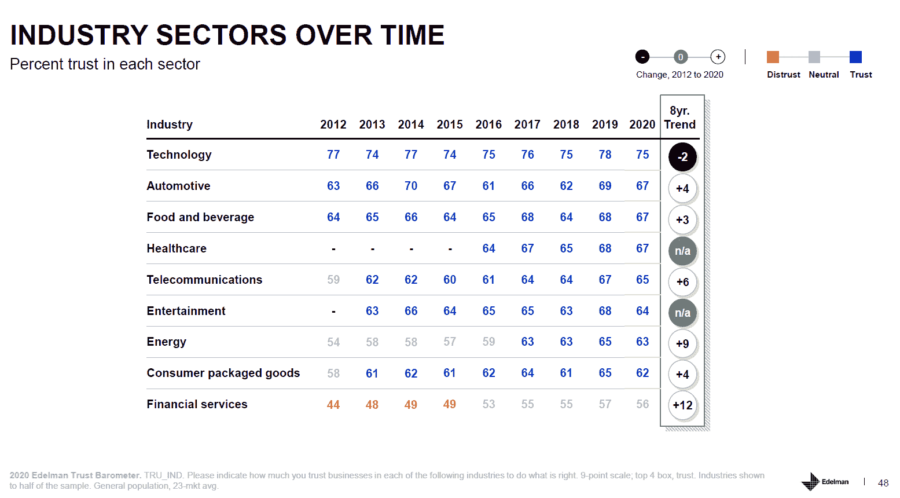
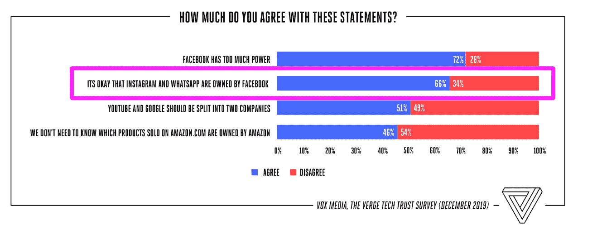

# 科技，甚至是大型科技，仍然值得信任

> 原文：<https://thenewstack.io/tech-even-big-tech-is-still-trusted/>

停止仇恨和引人注目的标题！在第 20 届爱德曼信任调查中，科技行业仍然是九个商业领域中最受信任的。对这份报告、 [The Verge Tech Survey 2020](https://www.theverge.com/2020/3/2/21144680/verge-tech-survey-2020-trust-privacy-security-facebook-amazon-google-apple) 和无数其他研究的分析表明，对一般“大型科技”公司的敌意主要是由于它们在控制媒体，特别是社交媒体方面的作用。

当然，公关巨头爱德曼(Edelman)上周通过强调这个标题强调了负面影响:[“在全球 13 个市场中，科技不再是最受信任的领域——这是一个新纪录。”不要过度解读这一发现。在全球范围内，对技术行业的信任在过去八年中一直保持在同一水平，而金融服务和能源公司的信任度却大幅上升。科技行业的光环效应并没有像其他行业那样消退，因为其他行业已经加强了企业公民意识，或者至少已经进行了有效的公关努力。](https://www.edelman.com/research/trend-eroding-trust-tech-continues) 

这项研究确实显示，在美国、法国、加拿大和其他一些国家，信任度明显下降。与此同时，中国、印度和其他发展中国家对科技行业的信任度依然高得令人难以置信。在全球范围内，61%的人认为技术变革的步伐太快了。此外，担心“虚假信息或假新闻被用作武器”的受访者从 2018 年的 70%上升到最新的爱德曼报告中的 76%。此外，人们对加密货币和人工智能等新兴技术高度不信任。

该报告没有按国家具体列出一些数据，但我们的解读是，这些快速增长的市场中的人们知道他们的生活水平提高了多少，而富裕国家的公民则关注隐私、媒体操纵和收入不平等。

我们的一些分析是基于我们对 20 年来由皮尤中心进行的关于互联网和技术主题的高质量调查的阅读。最近，上述美国调查发现，至少 89%的消费者对亚马逊、谷歌、网飞和微软有好感。只有 61%的人对 Twitter 有好感，而 71%的人对脸书有好感。此外，26%的人认为脸书对社会有负面影响，推特紧随其后，为 25%。该研究还询问了 YouTube 和 Instagram 等其他品牌，这两个品牌的表现都很差。反脸书情绪是 72%的人认为公司权力过大的部分原因。

解决企业权力过大的政策方案包括加强监管和积极的反垄断执法。这些话题超出了本文所涵盖的范围，但是在美国，越来越多的左右派同意这些方法是必要的。然而，当被问及具体的公司和行动时，人们仍然非常谨慎。例如，只有 51%的人认为谷歌和 YouTube 应该分开，三分之二的人认为脸书可以拥有 Instagram 和 WhatsApp。

最后，记住基于年龄和教育的观点有巨大的分歧。[The Verge 的副主编丹·塞弗特(Dan Seifert](https://twitter.com/dcseifert) )认为，“亚马逊/谷歌的反弹显然是针对精英/海岸/泡沫的。”根据数据，他似乎是对的，但这仍然让脸书、推特和侵犯隐私的应用成为每个人的目标。  

在另一个问题中，只有 51%的人知道谷歌拥有 YouTube，知道脸书拥有 Instagram 和 WhatsApp 的人就更少了。这意味着，许多受访者在被问及公司是否应该拆分之前，并不知道各自公司的所有权地位。

关于其他观点，我们建议阅读:

图片由来自 Pixabay 的 Gerd Altmann 提供。

<svg xmlns:xlink="http://www.w3.org/1999/xlink" viewBox="0 0 68 31" version="1.1"><title>Group</title> <desc>Created with Sketch.</desc></svg>