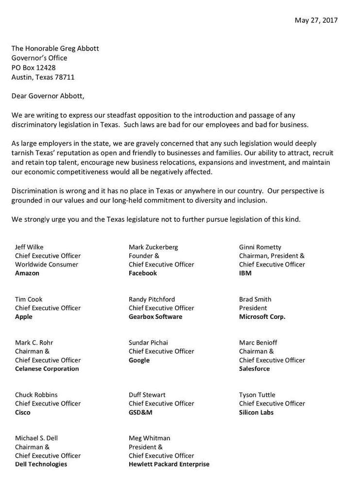

# 科技领袖要求德州州长停止歧视性立法

> 原文：<https://thenewstack.io/tech-leaders-ask-texas-governor-halt-discriminatory-legislation/>

14 名科技界重量级人物向德克萨斯州州长格雷格·阿博特(Greg Abbott)发送了一封信，宣布“坚决反对”他们认为的德克萨斯州的歧视性立法。

“这样的法律对我们的员工和企业都不利，”信中写道。他们可能会阻止[的科技会议在该州](https://thenewstack.io/cncf-keep-texas-open-business/)召开——这是奥斯汀一个日益增长的收入来源。他们还可能迫使德州科技产业——像所有科技公司一样，该产业正在拼命寻找顶尖人才——搬迁到其他地方

来自亚马逊、脸书、苹果、微软、IBM、谷歌、惠普企业、Salesforce、戴尔、Gearbox Software、GSD&M 广告公司、硅实验室、特种材料公司 Celanese Corporation 和思科的首席执行官们都在请愿书上签了名。

这封信似乎是对[参议院第 6 号](http://www.legis.state.tx.us/tlodocs/85R/billtext/html/HB00006I.htm)法案及其同伴 HB 2899，“[浴室法案](https://thenewstack.io/new-texas-bathroom-bill-tech-promising-exit/)”的回应，该法案类似于去年在北卡罗莱纳州通过的一项法案。简而言之，该立法要求一个人根据其出生证明上注明的性别使用公共厕所、更衣室或类似设施，这使得变性人使用他们认同并最常向世界展示的性别的设施成为一种犯罪。它还明确禁止市政当局和学区颁布或执行跨性别浴室政策。

对于 IT 界的许多人来说，这项法案的后果似乎非常严重。参加该州科技会议的跨性别者不仅会因使用卫生间而被逮捕和监禁，还会被认为是恋童癖者，并被列入德克萨斯州性掠夺者观察名单。因此，不仅有可能在会议期间被抓进监狱，被捕还会毁了你的余生。只是因为你需要通过一些水。

该法案类似于北卡罗莱纳州的 SB11 浴室法案，为了阻止 NCAA 离开该州，该法案于 3 月被部分废除。[据美联社](https://apnews.com/fa4528580f3e4a01bb68bcb272f1f0f8/ap-exclusive-bathroom-bill-cost-north-carolina-376b)报道，由于反对该法律，北卡罗莱纳州预计在未来几年将损失 37.6 亿美元。

德克萨斯州的法案遭到了来自[数百家企业和几个德克萨斯州商会](http://www.keeptxopen.org/)、[名人和演员](https://www.txtogether.org/)、[旅游团体](http://www.texaswelcomesall.com/)和体育组织的谴责，包括 NBA、 [NFL](http://www.espn.com/nfl/story/_/id/18660658/nfl-more-forceful-state-texas-proposed-bathroom-bill-super-bowl-li) 和 [NCAA](http://assets.hrc.org//files/documents/HRC-AthleteAlly-Emmert.pdf?_ga=1.33709601.188520738.1468888894) 。植根于奥斯汀的科技界已经注意到了这一点。它也受到了云本地计算基金会(CNCF)的谴责，几个科技会议组织者已经表示，如果该法案签署成为法律，他们就不会回到奥斯汀。仅奥斯汀今年就举办了 70 场科技会议。

阿博特表示，如果该法案获得通过，他将签署该法案。

帕特里克承诺，如果浴室法案不能通过，他将推动召开一次特别会议。由于商界对该法案通过后业务损失的担忧不断涌现，众议院对该法案进行了修改，之后该法案在州参议院搁置。修订后的法案只解决了跨性别儿童在公立学校使用洗手间的问题；共和党众议院议长乔·斯特劳斯(Joe Straus)认为，此举将使我们避免参议院 6 号法案的严重负面影响。

该法案被送回参议院批准，但被否决。

保守派共和党人、副州长丹·帕特里克已经优先考虑让这些法案成为法律。根据人权委员会的说法，帕特里克已经将“他的反 LGBTQ 的敌意作为职业。”根据德克萨斯自由网的报道，SB6 只是当前立法会议中 25 个反对同性恋、双性恋和变性者的议案中的一个，这些议案都是关于仇恨和歧视的。这包括 [17 项法案，允许政府、私人和企业利用他们的个人宗教信仰作为歧视同性恋者的借口。](http://tfn.org/avalanche-proposed-bills-allow-use-religion-discriminate-texas/)

帕特里克今年支持的法案包括:

*   [HB 3859](http://www.legis.state.tx.us/tlodocs/85R/billtext/pdf/HB03859I.pdf) 被称为宗教拒绝寄养法案赋予了基于信仰的寄养和收养机构以宗教反对为由拒绝将儿童安置在家庭中的权利。该法案是针对 LGBT 父母的，但其措辞也可能包括对穆斯林和犹太人的法律歧视。这发生在德克萨斯州将儿童福利的责任从州政府转移到地方组织的时候，这些地方组织中有许多是基督教组织。“在儿童福利系统中，一项法案将歧视置于儿童的最佳利益之上，这是不合理的，”人权运动的马蒂·劳斯说，“但德克萨斯州的立法者正是这样做的。”
*   参议院第 651 号法案允许受雇于超过 65 个特许职业的个人基于服务提供者“真诚持有的宗教信仰”拒绝向潜在客户提供服务。内科医生和治疗师也属于这一类，因此医生拒绝向任何人提供紧急医疗服务是合法的。Lambda Legal 的法律和政策主任詹妮弗·皮泽称该法案在几乎无限的范围内是“惊人的”。
*   [参议院法案 4](http://www.legis.state.tx.us/BillLookup/Text.aspx?LegSess=85R&Bill=SB4) **，**旨在消灭避难所城市。刚刚签署的这项法案已经提交法院。美国公民自由联盟加入了诉讼，并发表了一份全国性的“旅游咨询”警告说，到德克萨斯州的游客可能会侵犯他们的宪法权利。

“作为德克萨斯州的大雇主，”信中写道，“我们非常担心任何这样的立法会严重损害德克萨斯州对企业和家庭开放和友好的声誉。我们吸引、招募和留住顶尖人才、鼓励新企业搬迁、扩张和投资以及保持经济竞争力的能力都将受到负面影响……我们强烈敦促您和德克萨斯州立法机构不要进一步推动此类立法。"

这封信是在 2017 年立法会议结束之际发出的。得克萨斯州立法机关被限制在 140 个日历天内，直到 2019 年才会再次开会。阿博特有三周时间签署(或不签署)他桌上的法案，目前正在决定是否召开特别立法会议。特别会议可长达 30 天，总督对要讨论的法案拥有唯一的酌处权。

“歧视是错误的，”信中写道，“在德克萨斯州或我们国家的任何地方都没有立足之地。我们的观点基于我们的价值观以及我们对多元化和包容性的长期承诺。”

通过 Pixabay 的特征图像。

<svg xmlns:xlink="http://www.w3.org/1999/xlink" viewBox="0 0 68 31" version="1.1"><title>Group</title> <desc>Created with Sketch.</desc></svg>