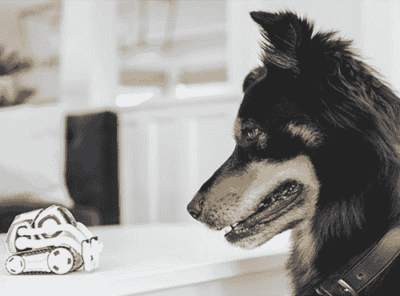
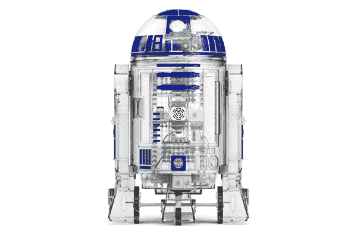
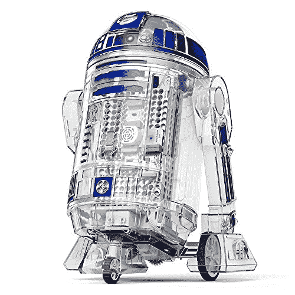
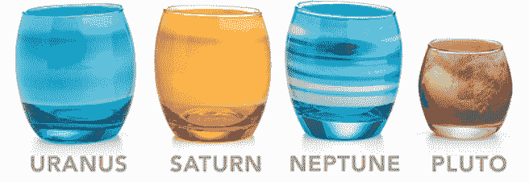
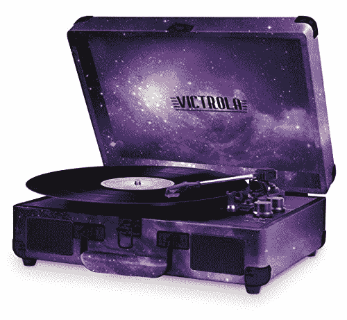
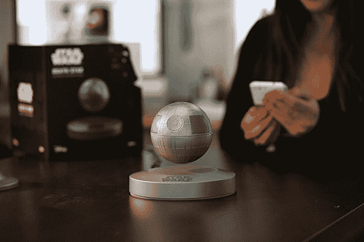
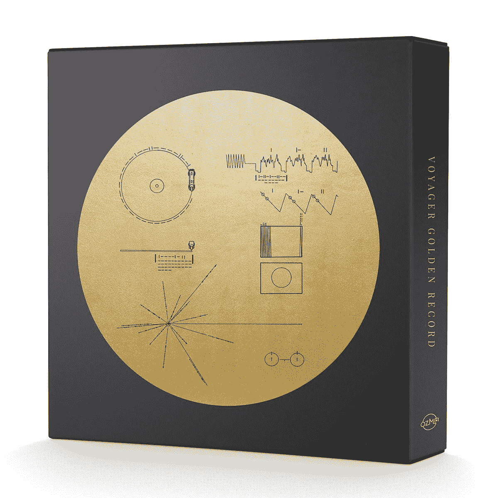
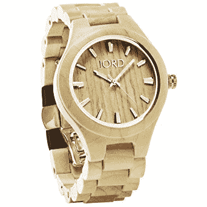

# 给极客的科技礼物:2017 年版

> 原文：<https://thenewstack.io/tech-y-gifts-geeks-2017-edition/>

科技是一个缺乏传统的行业，因为它总是在创造新的东西。但是仍然有一些东西对我们大多数人来说是珍贵的…

当我们都安顿下来，开始漫长的冬日小睡——或者至少，从疯狂的科技年中休息一下——你还在为你生命中那个特别的极客寻找礼物吗？因为对极客来说购物很难——万一你想在最后一刻创造一个节日奇迹——以下是我们真正想要的节日礼物。

## 宠物机器人

随着我们的技术变得越来越强大，新事物成为可能。所以像许多极客一样，我花了 21 世纪偷偷希望有自己的个人机器人。(或者有趣的传真。)好了，Cozmo 出现了，这是一个最先进的机器人玩具，有可爱的动画眼睛(屏幕上是它的脸)和一些可爱的预先录制的声音来模拟情绪。Cozmo 还配备了一个摄像头，“使用无处不在的配套应用程序，首先会提示你做的事情之一是使用其面部识别软件来教它你是谁，”*城市 A.M.* 的生活时尚编辑 Steve Dinneen 报道，“然后它会称呼你和其他一群人的名字。”

https://youtu.be/KJ0iSJ-9dwY

Dinneen 指出，这款相机还可以看到 Cozmo 看到的东西(当它在你的客厅地板上旋转时)，因为它可以将视频片段直接传输到你手机的应用程序中。“在‘探索’模式下，把它放在地上，它会四处跳跃，由于一系列智能传感器，它会避开墙壁和裂缝，偶尔会把它的挖掘臂举到空中，唱着小曲，因为获得了对生命的浅层模仿而感到非常高兴。”

但是有抱负的程序员——年轻人和老年人——也可以使用麻省理工学院的编程语言 [Scratch](https://scratch.mit.edu/) 指导他们顺从的新仆人。甚至还有[Cozmo SDK](https://developer.anki.com/)，在[一个宣传视频](https://www.youtube.com/watch?v=mwh-Tc95akY&feature=youtu.be)中被描述为“负担得起的、直观的和互联的机器人平台”，以及一个鼓舞人心的保证“大众机器人不再是遥远的幻想——它就在眼前。”

但它不是你唯一选择的教育玩具机器人。还有一个星球大战机器人发明家套件，它看起来就像 R2-D2，由 [littleBits](http://littlebits.cc/) 提供，他们描述为“易于使用的电子积木平台”的制造商，用于建造*自己的*发明。好吧，它不是实物大小——它有 16 英寸高——但你可以自己制作，甚至可以用贴纸定制。(因为当你可以拥有一辆橙色、红色或圣诞绿的车时，为什么仅仅满足于一辆*蓝* R2-D2？)

你的 droid inventor 工具包还附带了一个定制应用程序，因此，取代带有说明的纸质小册子的是视频教程。它还提供了一些预编程的任务，展示了机器人的能力——例如，它内置的接近传感器，也可以让你轻推机器人向前，就像你用原力命令它一样。至少有一位满意的家长已经在亚马逊上给了它一个热情洋溢的评价。“应用程序中的星球大战音乐太酷了，我们都起鸡皮疙瘩了。”

事实上，它已经在亚马逊上销售一空，这里第一个常见问题的答案是:

“是的，同是发明家。这就是你要找的机器人。”

## 外太空来的眼镜？

2017 年，极客们还梦到了什么？很可能在《星球大战》上映之前，他们已经花了一些时间思考太空。今年，美国国家航空航天局从 X 空间发射了第一枚可重复使用的火箭，卡西尼号飞船坠入土星，月球遮挡了我们的太阳 7 分 29 秒。

当你最喜欢的极客回忆起令人兴奋的太空探索年时，为什么不为行星本身举起一杯善意之杯呢——由你在 ThinkGeek.com 的朋友用行星*装饰得很漂亮。*

该网站的作者用他们通常的科学眼光来描述这些眼镜。(“如果你用这些玻璃杯喝水，很可能其中一些水分子比所描绘的太阳系还要古老……”)想象一下，在你厨房的玻璃柜里装满水银、金星、地球，还有——等等，为什么会有 *10* 玻璃杯？因为 ThinkGeek 已经慷慨地为太阳提供了一个额外的玻璃——也为以前被认为是行星的冥王星提供了一个玻璃！(“我们知道这会让你开心，”产品说明解释道。)

尽管因为科学家现在认为冥王星仅仅是一颗“矮行星”——冥王星玻璃比其他的稍微小一点*。而太阳的玻璃稍微大了一点*…**

 **

只是不要像对待真正的行星一样对待它们，让它们暴露在严酷的宇宙射线(或地球加热射线)下。因为尽管太阳的温度是 2700 万华氏度——太阳的玻璃不是微波安全的。或洗碗机安全。事实上，行星玻璃都很脆弱。

但是它们看起来确实很可爱…

## 聚氯乙烯光盘播放器

在 iTunes 和 CD 播放器出现之前，有一种被称为“留声机”的技术，可以从聚氯乙烯制成的光盘中提取录音。当社会纠结于如何处理那些剩余的黑胶唱片时，这里有一个新颖的想法——为什么不听听它们呢？

创新科技公司是仍在生产这种新型唱片播放设备的几家公司之一——现在内置了扬声器。你甚至可以将手机中的音乐(和其他音频)传输到唱机的扬声器中。它有各种各样的颜色和图案。(美国国旗！伪装！紫色闪光粉！扎染！)如果你想将你的音乐天赋与太空的宏伟结合起来，甚至有一个特别的“银河”版本——以防你想听的第一张黑胶唱片是约翰·威廉姆斯 1977 年的《星球大战》原声带。

今年，一个由音频工程师和设计专业人士组成的团队在 Kickstarter 上众筹了另一款高端留声机。即使有假日折扣，这款+电唱机也要 800 多美元，但它有一些额外的功能。例如，它有一个 USB 输入/输出驱动器，所以你可以用它来翻录你最喜欢的黑胶唱片的 MP3。

[https://www.youtube.com/embed/9PJGIhLKuqE?feature=oembed](https://www.youtube.com/embed/9PJGIhLKuqE?feature=oembed)

视频

如果你买不到整个留声机，你至少可以买一个漂亮的蓝牙音箱。事实上，为什么没有一个磁性悬浮的*蓝牙扬声器——[形状像达斯·维德的死星](https://www.amazon.com/dp/B071F9BT3G/ref=gbps_tit_m-5_86da_5f50873f?smid=ATVPDKIKX0DER&pf_rd_p=4b7fc9d7-691f-4e00-a686-3514a50786da&pf_rd_s=merchandised-search-5&pf_rd_t=101&pf_rd_i=13270237011&pf_rd_m=ATVPDKIKX0DER&pf_rd_r=6WPRX3K8JYXV6M2ANCBN)！*

 *

## 40 年前的黄金太空记录

但是有一张记录实际上是在太空中旅行的——一张 54 分钟的地球声音集，于 1977 年由旅行者号太空探测器发射到太空。有口头问候，鸟鸣，甚至地球音乐的样本，包括古典作品，摇滚，甚至一些 20 世纪的爵士乐。(想象一下当外星人听到路易斯·阿姆斯特朗和他的辣妹七人组表演“忧郁布鲁斯”时会怎么想。)

[https://www.youtube.com/embed/cnHcdqoQDcY?feature=oembed](https://www.youtube.com/embed/cnHcdqoQDcY?feature=oembed)

视频

被压制成镀金圆盘的“旅行者金唱片”(以及携带它们的两艘研究飞船)早已成为人类发射的最远的物体。(他们现在正离开我们的太阳系，进入浩瀚的星际空间。)为了纪念这张专辑发行 40 周年，一些超级粉丝推出了特别纪念版，这样我们就可以一起分享这份快乐了。

超过 10，000 名支持者承诺超过 130 万美元，以使“航海家金唱片:40 周年纪念版”成为现实——尽管不幸的是，它被[推迟到 2 月中旬](http://www.ozmarecords.com/product/voyager-golden-record-3xlp-box-set)。

## 木制的手表

在我们这个充满高科技奇迹的现代世界里，走*复古路线*总是很有趣，尤其是你每天都在用的东西。乔丹的木制手表是你能得到的最低科技产品。

这就像是《吉利根的岛》中的教授用浮木建造的东西——这真的很有意义。(比如“我的生活中有太多由塑料和金属制成的坚硬、冰冷、没有人情味的东西”或者“我不想要能和 iPhone 配对的手表…”)

当然，它也是装在木箱里运送的。

除了颜色，你还可以选择木材，特别是枫木、檀香木或檀木，所有这些都经过“手工打磨和抛光，达到光滑耐用的效果”但它们都提供了一种视觉上吸引人的方式，让你在制作腕表时回归自然。

或者，用一位亚马逊评论者的话来说:“如此简单，却非常漂亮的一款手表。”

## 运行 Vim 的打字机

如果说我对极客有什么了解的话，那就是他们喜欢想得更大，想得更复古，并且无休止地争论他们最喜欢的文本编辑器。但是有一个极客将它们组合成了一个壮观的周末项目——将一台旧打字机的真实键盘输入到他们钟爱的文本编辑软件`vim`中。

秘密成分是现成的硬件/软件包——特别是 Spectra Symbol 的“软罐”——加上一个 Raspberry Pi 板，以将输出传输到他的监视器。

[https://www.youtube.com/embed/eFBTBwdVobQ?feature=oembed](https://www.youtube.com/embed/eFBTBwdVobQ?feature=oembed)

视频

如果你真的很有野心，也许你可以在自己的生活中为极客重现这一幕。

或者干脆买下所有的零件，让他们试着自己造一个！

大家节日快乐！

* * *

# WebReduce

<svg xmlns:xlink="http://www.w3.org/1999/xlink" viewBox="0 0 68 31" version="1.1"><title>Group</title> <desc>Created with Sketch.</desc></svg>***