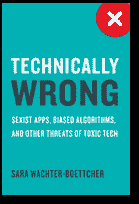
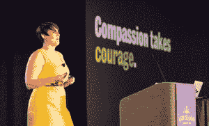

# 快速行动，打破人:“技术错误”审查有毒技术和如何处理它

> 原文：<https://thenewstack.io/technically-wrong-toxic-tech/>

萨拉·沃希特-波特彻在她的新书《技术上的错误:性别歧视的应用程序、有偏见的应用程序、有偏见的应用程序以及其他有毒技术的威胁。相反，“技术有问题。”

 “技术上的错误”解决了困扰普通人使用技术的几个问题，包括为什么社交媒体对骚扰者和机器人如此有利，以及人工智能算法在深深嵌入软件之前如何需要仔细审查偏见。

面向使用社交媒体的普通人，沃希特-博特彻的书解释了为什么多样性很重要，算法只是某人创造的一堆代码，因此容易受到创造者的偏见。她打破了脸书、Reddit 和 Twitter 等行业巨头的文化，解释了为什么它们会鼓励网上骚扰和假新闻。这是一本引人入胜的读物，写得很好，引人入胜，发人深省，即使对于像我这样的顽固的极客来说也是如此。

沃希特-博特彻说，她写这本书的部分原因是，我们需要让这些关于技术及其作用的讨论成为我们国家核心对话的一部分。她希望科技公司感觉他们不再有免费通行证。

沃希特-博特彻在她的叙述中加入了现实生活中的例子，说明为什么设计室里只有年轻男性会导致并非对所有人都适用的技术，尽管这种技术是以这种方式销售的。这种商业模式导致最终用户认为他们做错了。

例如，脸书的“[年回顾](https://www.facebook.com/help/1551882718390433/)”专题的年轻设计师们没有考虑到，并不是每个人都度过了美好的一年。把幻灯片放在一起的算法选择了你评论最多的帖子，并把它放在前面和中间。沃希特-博特彻写道，对于一个用户来说，那是他死于癌症的六岁女儿的照片。他没有办法选择退出或者关掉它。

她认为，这个案例是为什么代表权如此重要的一个例子。这是众多例子之一，说明了为什么在设计桌上没有社会的代表性会导致技术失败，几乎没有代表社会的每一部分。

> “创始人对自己的愿景深信不疑——而且长期以来一直为此获得回报——以至于他们没有意识到这个愿景有多狭隘，以及它可能会伤害多少人。”莎拉·沃希特·博特彻

但不仅仅是表象。优步的座右铭“快速行动，打破常规”和脸书对“黑客之道”的强调总结了科技的商业文化，这种文化呼吁尽快扔掉软件，而不需要考虑后果，因为你总是可以回来修复它。

她说，这就是为什么假新闻如此容易在脸书流行的原因。“将这种根深蒂固的信念与专注于快速行动而不用担心后果的文化结合起来，你不只是打破*事物*。你触犯了*人。*(强调她的。)

她认为，这些公司都放弃了责任。“对他们造成的伤害集体耸耸肩，不愿意承担未来防止伤害的责任。”

她认为，不仅仅是科技公司缺乏多样化的员工。“这是因为创始人对自己的愿景深信不疑——而且长期以来一直为此获得回报——以至于他们没有意识到这个愿景有多狭隘，以及它可能会伤害多少人。”

## 人工智能:你教什么，你就是什么

但更令沃希特-博特彻不安的是人工智能(AI)的崛起以及它如何吸收隐含的偏见。在《算法的不平等》一章中，沃希特-博特彻解释了算法的基础，然后谈到了算法中的偏见，或者说定义什么是“正常的”不仅使偏见永久化，而且如果不加以检查，还会使偏见根深蒂固。

她解释说，这些结果似乎是科学的和数据驱动的。但是当源数据持有偏见时——它们都持有偏见——它们就不是中立的。 

“这意味着技术带来的偏见和盲点不仅会进入个人的内心和思想，”她写道，“而且会真正嵌入到人类不容易看到的基础设施中，更不用说批判性地评估或修复了……偏见会一直存在——即使在我们意识到它的存在之后很久。”

她说，问题不在于技术。“这是基于技术专家经常做出的假设，即他们拥有的数据是中性的，任何处于边缘的东西都可以被忽略。一旦做出这些假设，它们就把自己包裹在一个非常精致的软件包中，让其他人更难理解表面下到底发生了什么。”

她说，后果是巨大的，并且正在以我们从未预料到的方式制造混乱。还没有准备好。

“事实是，大多数技术不会开始质疑自己。她写道:“如果没有必要，就不会这样。

## 但是 Dev 能做什么呢？

到目前为止，沃希特-博彻在一次采访中说，技术一直是在我们能做到这一点的前提下工作的？“我们需要更多的视角，”她说，“不仅仅是‘我们能在技术上做些什么吗？’以及更多类似的问题，“我们应该做点什么吗？”让我们的科技公司高层决策层参与进来。"

对于公司决策者来说，这些都是非常高级的东西。我问她，开发人员可以做些什么来推动这一趋势。

沃希特·博彻希望我们能更深入地了解我们的工作有多强大。但是，如果你只是从技术角度来看，技术也是有限的。她说，开发技术的人需要考虑他们工作的情感、社会和政治影响。

“因为，特别是在过去十年左右的时间里，技术的发展方式真的触及了我们所做的一切，”她说，并提到了美国国会目前对 [2016 年政治竞选活动的调查——脸书代表俄罗斯进行的诽谤广告](http://www.cnn.com/2017/10/11/politics/facebook-ads-russia-congress/index.html)。

她说，在开发人员层面，需要进行一些改变。你无法独自解决精英政治，但你可以做一些事情。

她建议，开始做不同种类的选择，开始问新的问题。“当你做设计决策时，我在做什么假设？如果我的这些假设是错的，会发生什么？还管用吗？”

此外，考虑所有可能的结果。“你想过人们会如何滥用你的产品吗？如果它落到最坏的人手里会发生什么？”她问。“因为这很有可能发生。”

AI 或机器学习有另一组问题:“你知道你的数据集来自哪里吗？机器从一些东西中学习，你的训练数据从哪里来？它是否代表了将使用该产品的广大人群？你在测试另一端的结果吗？另一端正在进行什么样的审计？”

这就是为什么她鼓励人们，普通人，反击。在一次采访中，她建议当产品不符合你的需求时，多抱怨。

她解释说，变化发生的方式之一是当公司感到压力时。让它可见。在网上分享，从标记公司开始。

“没有公众压力，什么都不会发生，”她说。

<svg xmlns:xlink="http://www.w3.org/1999/xlink" viewBox="0 0 68 31" version="1.1"><title>Group</title> <desc>Created with Sketch.</desc></svg>