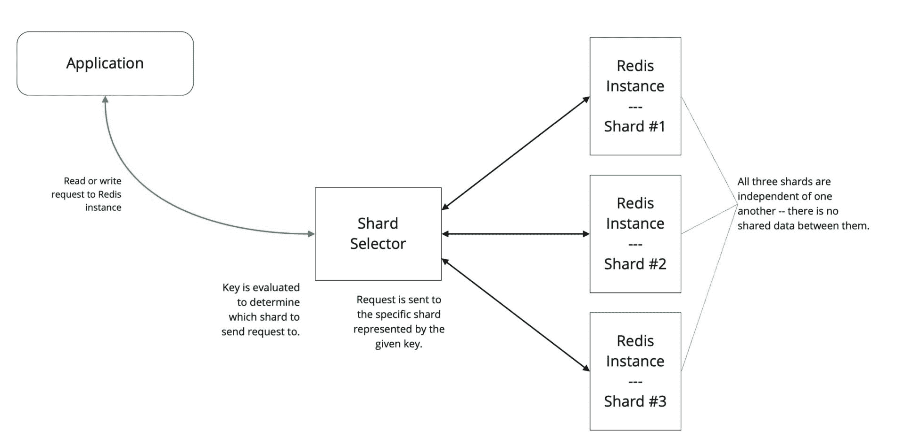
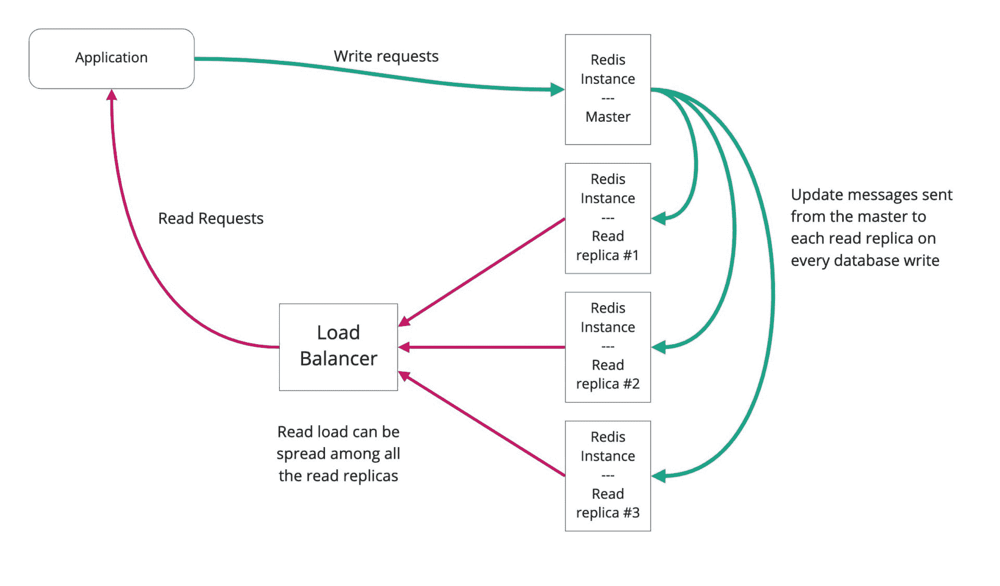
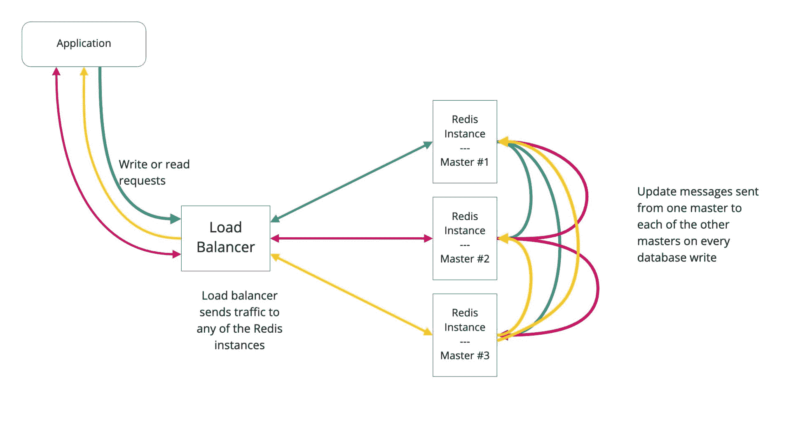
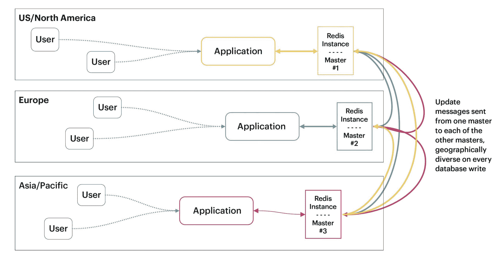

# 用数据库扩展应用程序的技术

> 原文：<https://thenewstack.io/techniques-for-scaling-applications-with-a-database/>

这是探索 Redis 功能的第二篇文章。 [*第一部分*](https://thenewstack.io/redis-data-types-the-basics/) *分享了 Redis 入门的基本数据类型和模型。*

应用程序不断增长。随着应用程序吸引更多的用户，存储所创建信息的数据库也会吸引更多的用户，无论这些信息是销售交易还是收集的科学数据。较大的数据集需要更多的资源来存储和处理这些数据。另外，随着越来越多的用户同时使用系统，数据库需要更多的资源。

当您的应用程序变得流行时，它需要扩展以满足需求。如果应用程序很慢，没有人会留下来——无论如何，不会心甘情愿。

如果需要规模化，就当是个好问题来庆祝吧！但这并没有使过程变得简单。扩展有多种可能的选择，每一种都需要不同的复杂程度。在这里，我们将伸缩性作为一个一般的挑战和专门针对 [Redis 数据库](https://thenewstack.io/redis-data-types-the-basics/)的挑战来讨论，同时关注使用 Redis Enterprise 的高级伸缩性。

## 缩放概念

缩放是一个多维问题，有几种不同的解决方案。

**垂直扩展**包括增加数据库的资源。通常，这涉及到将数据库移动到更强大的计算机或更大的实例类型。

“更多”是关键词。与任何硬件选择一样，您会考虑更强大的处理器、更多的内存和/或更多的网络带宽。您必须在它们之间找到一个平衡点，以最佳方式提高数据库的性能和它可以支持的并发用户数量，更不用说优化您的硬件预算了。

垂直伸缩的一个要素是调整数据库可用的 RAM 数量。对于 Redis，RAM 限制了数据库可以存储的数据量，因此这是一个重要的考虑因素。

垂直扩展俗称向上扩展或向下扩展*、*，这取决于您是升级到功能更强大的计算机，还是(在极少数情况下)降级到功能较弱的计算机。

**水平扩展**包括向运行数据库的实例集群添加额外的计算机节点，而不改变任何单个节点的大小或容量。水平缩放也称为向外扩展(添加节点时)或向内扩展(减少节点数量时)。

根据实现方式的不同，水平伸缩还可以提高数据库的整体可靠性。它消除了单点故障，因为您增加了可在故障转移情况下使用的节点数量。然而，水平扩展也增加了时间和精力(从而增加了成本)，因为您需要更多的节点(从而更多的故障点)来保持数据库的功能。

换句话说，垂直缩放增加了单个实例或节点的大小和计算能力，而水平缩放改变了节点或实例的数量。

垂直伸缩是提高数据库性能的一种简单方法，假设您拥有或能够获得一台更大的计算机或实例。它通常可以在云中轻松实现，对应用程序或数据库架构没有影响。

> 只要你知道自己在做什么，当复杂是正确的选择时，它并不是一件坏事。

如果操作正确，水平扩展可以为您的数据库和应用程序提供更大的增长空间。这种方案在应对性能瓶颈方面有着丰富的历史:只需投入更多的硬件！

然而，水平缩放通常比垂直缩放更难实现。添加额外的节点意味着更多的复杂性。这些节点是只读节点吗？读/写主节点？主动大师？被动大师？数据库和应用程序架构的复杂性会急剧增加。

然而，只要你知道你在做什么，当它是正确的选择时，复杂性并不是一件坏事。

有几种方法可以实现水平缩放，每种方法都有其独特的优点和缺点。选择正确的模型对于构建数据存储架构非常重要。Redis 支持许多水平缩放选项。有些在 Redis 开源(OSS)中可用，有些只在 Redis Enterprise 中可用。

## 分片的基础

分片是一种提高数据库整体性能以及增加其存储和资源限制的技术。这是一种相对简单的水平缩放技术。

使用分片，数据分布在不同的分区或节点上。每个节点只保存存储在整个数据库中的一部分数据。在 Redis 的例子中，处理一个键/值输入，并将数据存储在一个 shard 中。

当向数据库发出请求时，它被发送到一个碎片选择器，后者选择合适的碎片来发送请求。在 Redis 中，分片选择通常由一个代理来实现，该代理查看所请求数据的键，并基于该键将请求发送到适当的分片实例。

碎片选择算法是确定性的，这意味着对给定键的每个请求总是指向同一个碎片。只有该碎片具有给定数据键的信息，如图 1 所示。

图一。通过分片实现水平缩放

分片是一种相对简单的扩展数据库容量的方法。例如，通过向 Redis OSS 实现中添加三个碎片，您可以将数据库的性能提高近三倍，并将存储限制提高三倍。

但是分片并不总是简单的。选择一个分片选择器来有效地平衡所有节点之间的流量可能需要调整。分片还会降低应用程序的可用性，因为它增加了对多个实例的依赖。如果管理不当，单个实例的故障会导致整个数据库瘫痪。那会导致糟糕的一天。

Redis 集群解决了这些问题，也使得分片更容易实现。如果由于存储容量或性能的原因，需要重新存储来重新平衡数据库，则数据会以物理方式移动到新节点。

> 应用程序对碎片选择器算法的感知可以让应用程序在碎片之间执行更好的整体平衡，尽管代价是增加了复杂性。

分片的有效性取决于所使用的分片选择器算法。应用程序对碎片选择器算法的感知可以让应用程序在碎片之间执行更好的整体平衡，尽管代价是增加了复杂性。

Redis 操作系统中的集群是由集群引导的，客户端库是集群感知的。本质上，分片选择器是在客户端库中实现的。这需要客户端对集群协议的支持。

在 Redis Enterprise 中，服务器端代理用于实现碎片选择器，并为集群服务器端提供支持。代理充当水平缩放 Redis 实例之间的负载平衡器。

集群是水平扩展的一种常见解决方案，但是它有优点也有缺点。另一方面，分片是一种快速扩展应用程序的有效方法，它被用于许多大型、高度扩展的应用程序中。此外，它是现成可用的。

另一方面，集群需要额外的管理。你需要知道你在做什么。单独的大键会产生难以或不可能补偿的不平衡。

Redis 集群消除了很多分片的复杂性。它允许应用程序更有效地关注大型数据集的数据管理方面。它提高了读写性能。

最终，这一切工作得有多好取决于应用程序使用的访问模式。

## 读取副本

另一个水平扩展选项是读取副本。顾名思义，读取副本的重点是提高读取数据的性能，而不考虑将数据写入数据库所花费的时间。前提是检索数据远比更改数据或添加新数据更常见。

在简单的数据库中，数据存储在一台服务器上，对数据的读写访问都发生在该服务器上。对于读取副本，服务器数据的副本存储在辅助服务器上，称为读取副本。每当数据更新时，副本服务器都会从主服务器接收更新。

每个辅助服务器都有数据库的完整副本。因此，当应用程序发出读取请求时，该请求可以发送到任何读取副本服务器。这意味着可以同时处理大量的读取请求，从而提高可扩展性和整体性能。

> 读取副本不能提高写入性能，但可以显著提高读取性能。

但是读取副本有局限性，这取决于几个因素，例如数据库使用的一致性模型，或者您需要应对的网络延迟。

读取副本不能提高写入性能，但可以显著提高读取性能。但是，这确实需要您考虑应用程序的写密集型程度。对主数据库的数据库写入需要一些时间才能传播到读取副本。这种延迟称为时滞*、*，会导致当主服务器更新副本服务器时，旧数据被返回给应用程序。这种延迟只是很短的一段时间，但有时这些延迟是至关重要的。对于您自己的情况来说，这可能是一个问题，也可能不是，但是在设计您的系统时要注意这个问题。

考虑一下写入数据库的过程。

*   当您更新信息或添加新数据时，只对主数据库实例执行写入。那是神圣不可侵犯的；所有写入都必须到一个主数据库实例。
*   然后，该主实例向所有读取副本发送一条消息，指示数据库中的哪些数据发生了更改，并使读取副本能够更新它们的数据副本以匹配主副本。

由于所有数据库写入都要经过主实例，因此当添加额外的读取副本时，写入性能没有任何提高。事实上，当您添加新的读取复制副本时，写入性能可能会略有下降。这是因为主机现在有了一个在发生写操作时必须通知的额外节点。通常，这种影响并不显著，但肯定不是零影响。

考虑图 2 中的图示，它显示了由三台服务器组成的 Redis 实现。对 Redis 数据库的所有写入都是在单个 master 数据库中进行的。这个主服务器将已更改数据的更新发送给所有副本服务器。每个副本都包含存储的 Redis 数据库的完整副本。

然后，当应用程序想要检索数据时，对 Redis 实例的读访问可以发生在集群中的任何服务器上。负载平衡器负责路由各个读取请求，它使用多种负载平衡算法中的一种来引导流量。(有几种负载均衡算法，包括循环法、最少使用法等。，但它们超出了本讨论的范围。)

图二。读取副本的水平可扩展性

使用读取副本的另一个好处是提高了可用性。如果一个读取副本崩溃，负载平衡器只需将流量重定向到另一个读取副本。如果写入主机崩溃，您可以将其中一个读取副本提升为主主机角色，这样系统就可以继续运行。

读取副本是一种易于实现的水平可扩展性模型，该方法提高了可用性，对应用程序的影响很小或没有影响。

## 主动-主动

主动-主动复制或主动-主动集群是提高较高数据库负载性能的一种方式。

与读取副本一样，主动-主动(也称为多主控复制)依赖于具有多个节点的数据库集群，所有节点上都存储有一份数据库副本，负载平衡器负责分配负载。

但是，对于主动-主动复制，读取和写入请求都分布在多个服务器上，并在所有节点之间实现负载平衡。性能提升是有意义的，因为可以处理的请求数量显著增加，而且处理速度更快。

请注意，Redis 操作系统不直接支持主动-主动复制。如果这证明是适合您需求的扩展架构，您将需要 Redis Enterprise。但是这里的重点是解释计算机科学技术，不管你从哪里得到它(包括你自己构建它，如果你有时间的话)。

对于主动-主动复制，读取传播完全按照上一节所述进行。

当应用程序写入一个节点时，这个数据库写入会传播到系统中的每个主节点。发生这种情况的方式有很多，例如:

*   应用程序可以强制写入所有主机。
*   写代理可以分发写操作。
*   接收写调用的主节点可以将请求转发给其他未接收的主服务器。

图 3 展示了一个由三台服务器组成的集群的数据库实现。每台服务器都包含所有数据的完整副本。任何服务器都可以处理对数据库中任何数据的任何类型的数据请求——读或写。

图 3。主动-主动复制

当负载平衡器将一个写请求定向到数据库主实例时，例如在本例中，它会将更新发送到所有其他复制实例。如果向任何其他节点发送写操作，该节点会以类似的方式向所有其他复制实例发送更新。

但是当发送两个请求来更新相同的数据值时会发生什么呢？

在单节点数据库中，请求被序列化，更改按顺序发生，最后一次更改通常会覆盖之前的更改。

然而，在主动-主动模式中，这两个请求可能到达不同的主机。然后，主服务器可能会向其他主服务器发送冲突的更新消息。这称为写冲突。

在发生写入冲突的情况下，应用程序需要确定保留哪个数据库写入，拒绝哪个数据库写入。这需要某种类型的解析算法，包括应用程序逻辑或数据库规则。

此外，由于更新是异步发送到每个节点的，因此数据延迟可能会导致一个节点与另一个节点稍微不同步。即使这种不匹配只是短期的，这也是一个问题。开发人员必须注意，应用程序要考虑到这种潜在的延迟，以免影响操作。这与读取副本的问题类似，但可能更复杂。

除了提高性能之外，这种水平可伸缩性模型还提高了数据库的整体可用性。如果单个节点出现故障，其他节点可以接替。但是，由于每个节点都包含数据的完整副本，因此添加额外的服务器不会影响数据库的存储限制。

这种模式的代价是在处理冲突数据时增加了应用程序的复杂性。

### Redis 企业的主动-主动地理分布

Redis 操作系统本身不支持任何形式的多主控冗余。

但是，Redis Enterprise 提供主动-主动地理分布，从而提供主动-主动多主机冗余。

然后 Redis Enterprise 的主动-主动地理分布更进一步。它使单个集群能够位于地理上分散的位置，同时在它们之间复制数据。请看图 4。

图 4。跨地理位置的主动-主动复制

这允许 Redis 数据库在地理上分布，以支持在不同地理位置运行的软件实例。

在此模型中，多个主数据库实例位于不同的数据中心。这些可以位于不同的区域和世界各地。个人消费者通过应用程序连接到离他们地理位置最近的 Redis 数据库实例。然后，主动-主动 Redis 数据库实例在多主控模型中进行同步，以便每个 Redis 实例始终拥有完整的最新数据副本。

Redis Enterprise 的主动-主动地理分布具有复杂的算法，可有效处理写入冲突，包括实施无冲突的复制数据类型(CRDTs ),确保最终的高度一致性，并使复制同步过程更加可靠。应用程序仍然必须意识到并处理数据延迟和写冲突，所以这些问题不会成为问题。

## 什么适合你？

您需要让您的应用程序运行得更快，并支持数据库的额外负担。幸运的是，正如本文所展示的，对于缩放技术，您有很多选择。每种方式对应用程序可用的存储空间量和系统资源都有不同的影响。

您最终选择的技术取决于许多因素，包括您公司的目标、您的软件需求、您 IT 部门人员的技能、您的应用程序架构以及您愿意承担的复杂程度。

要了解更多关于 Redis Enterprise 如何扩展数据库的信息，请参考"[Redis Enterprise 的线性扩展](https://redis.com/redis-enterprise/technology/linear-scaling-redis-enterprise/)"

<svg xmlns:xlink="http://www.w3.org/1999/xlink" viewBox="0 0 68 31" version="1.1"><title>Group</title> <desc>Created with Sketch.</desc></svg>