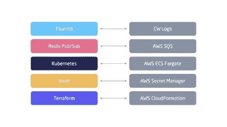

# 避免云锁定的技术

> 原文：<https://thenewstack.io/techniques-to-avoid-cloud-lock-in/>

 [山塔努·乔希

山塔努·乔希热爱使用技术来提高开发人员和企业的生产力。他目前是 Render 的一名高级软件工程师，在那里他专注于使开发人员能够访问云计算，而不需要依赖 DevOps 工程师。](https://render.com/) 

每个云提供商都有吸引公司和开发者在其平台上构建的招牌服务。这些旗舰服务与平台上的其他服务配合得很好，但通常会限制与其他公共云的互操作性，从而造成云供应商锁定。拥抱锁定是有道理的:它让公司能够提高生产率，更快地为用户提供价值。

在 [Render](https://render.com/) ，我们正在构建一个在多个公共云上引导的新云平台，并计划添加内部工作负载，避免将我们自己局限于单一提供商是至关重要的。在本帖中，我们将讨论我们做出的一些关键技术决策，以避免将自己局限于单一云提供商，并为混合云的未来做好准备。

图 1:两个样本技术栈的可视化表示。左边一个没有云锁定，右边一个包含云锁定。

## 基础设施作为代码

基础设施即代码(IaC)是当今大多数软件公司的要求。它是所有技术的基石，一旦做出选择，就很难改变。受欢迎的选项包括 AWS CloudFormation、Terraform、Pulumi、Chef 和 Ansible。

AWS CloudFormation 只对全押亚马逊网络服务的公司有效。Terraform 受到很多组织的欢迎，但是确实需要学习一门新的领域特定语言。如果你想使用你已经知道的语言，那么 Pulumi (Node.js，Go，Python，。NET core)、Chef (Ruby)或 Ansible (Python)可能更合适。最终，我们选择了 Terraform 和 Ansible，因为它们拥有成熟的生态系统和广泛的云提供商支持。Ansible 是我们配置机器映像的首选工具；Terraform 非常适合在多个公共云上供应基础架构组件和配置网络。

## 配置和秘密

每个生产应用程序都需要访问配置变量和机密，这些变量和机密最好存储在一个专门构建、加密且易于访问的位置。云提供商提供 API 驱动的产品，可以轻松安全地存储和访问这些数据:AWS Secrets Manager、AWS SSM 参数存储和 Google Cloud Secret Manager 都是让用户不必管理底层存储和加密的例子。然而，API 对这些服务的访问总是基于 IAM 凭证，这是不可能跨云移植的。

> 缺乏对控制平面的访问和可见性最终清楚地表明，我们已经超出了最初的设置，需要管理我们自己的 Kubernetes 集群。

我们的配置和机密管理解决方案必须能够完全控制我们的数据，能够跨所有主要的云提供商工作，并且能够随着公司的发展而轻松扩展。获得已经过专业审计的源代码也是至关重要的。Vault 最终满足了我们所有的约束，并且作为一个额外的好处，它相对容易设置和管理。

## 服务编排

Kubernetes 可能非常复杂，但它提供了有用的抽象，统一了跨公共云和私有数据中心的服务器/容器编排。我们的团队以前有过使用它的经验，尽管它有缺点，但由于它的社区和发展速度很快，我们还是选择了它。

早期我们的重点是尽快进入市场，所以我们决定使用托管的 Kubernetes 产品。然而，随着我们每月为数十亿个请求提供服务，我们也在跨多个云的托管解决方案中遇到了多种限制和缺陷。缺乏对控制平面的访问和可见性最终清楚地表明，我们已经超出了最初的设置，需要管理我们自己的 Kubernetes 集群。同时，对我们来说，在所有集群中使用相同的 Kubernetes 管理原语非常重要，这在使用来自不同云提供商的托管 Kubernetes 时当然是不可能的。Render 法兰克福托管区域的推出是一个重要的里程碑，它不仅将 Render 转变为一个多区域和多云平台，还帮助我们从头开始建立管理 Kubernetes 的专业知识。

似乎我们已经通过采用 Kubernetes 锁定避免了云锁定。但这正是我们在 UX 的决定有所帮助的地方:我们选择避免成为另一个托管的 Kubernetes 平台，而是完全专注于使 Render 成为一个专注于 UX 的平台，而不会向我们的客户暴露 Kubernetes。在这样做的过程中，我们保留了迁移到内部或第三方流程编排工具的选项，这些工具在任何给定时间都最适合我们用户的需求。

## 消息队列

向分布式系统添加新组件会导致复杂性呈指数级增长，并很快成为管理噩梦。消息队列通过为新服务提供与所有现有和未来服务通信的单一集成点，为这个问题提供了一个优雅的解决方案。公共云通过与其专有排队服务的默认集成来创建锁定。例如，谷歌提供了 BigQuery 和 Pub/Sub 之间的原生集成，而 AWS 可以非常容易地将 SQS 与 Lambda、RDS、Redshift 和其他 AWS 组件联系起来。

我们对消息传递锁定的解决方案很简单:使用自托管的 Redis Pub/Sub 和优秀的开源 [machinery](https://github.com/RichardKnop/machinery) 项目来提供 Redis 上的 Golang 队列抽象，如果需要，可以用另一个 OSS 队列替换它，而无需更改应用程序代码。我们的消息队列方法已经扩展到每天处理超过 1 亿个事件，并且在将消息队列部署到新的云和区域时，我们无需更改一行代码。

## 结论

世界一流的开源项目和主要云平台中改进的混合云支持相结合，使 Render 等现代云平台比以往任何时候都更容易避免云锁定。避免锁定确实会增加工程投资，但根据我们的经验，安心和使用最佳工具的能力使这种权衡非常值得。

亚马逊网络服务是新堆栈的赞助商。

通过 Pixabay 的特色图片。

<svg xmlns:xlink="http://www.w3.org/1999/xlink" viewBox="0 0 68 31" version="1.1"><title>Group</title> <desc>Created with Sketch.</desc></svg>