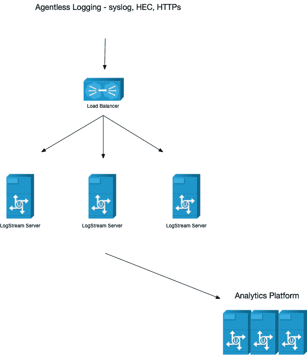
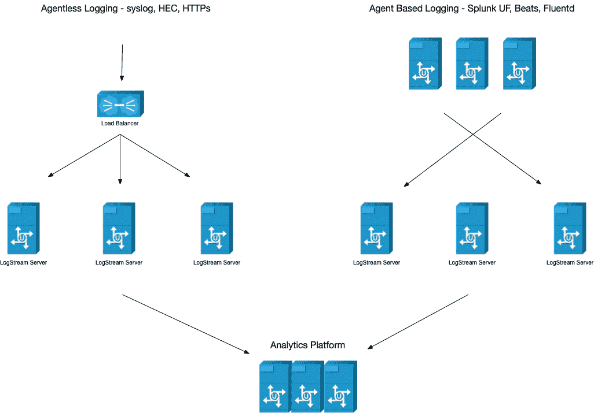

# 成功的可观测性策略的技术决策

> 原文：<https://thenewstack.io/technology-decisions-for-a-successful-observability-strategy/>

 [Ed Bailey

Ed 是一位热情的工程倡导者，在为各种应用、操作系统和硬件提供操作和安全观察方面拥有 20 多年的经验。](https://www.linkedin.com/in/baileyedward/) 

*这是关于可观察性设计和架构如何需要从基础开始的两部分系列的第 2 部分:将人和过程放在一切的中心。在第 1 部分中，我们讨论了* [*为什么人和过程*](https://thenewstack.io/observability-design-and-architecture-the-fundamentals/) *是实现任何 IT 和工程功能的重大变化和进步的关键。在第 2 部分中，我们涵盖了可观测性设计和架构的技术方面，并探讨了“构建与购买”以及如何为失败做准备。*

“构建还是购买”软件是可观测性领域中经常讨论的问题。我对任何参与讨论的人的第一个问题是，“与购买商业工具的成本相比，你有多少工程时间来支持“构建你自己的解决方案？”

毕竟时间是任何企业最大的限制因素。你必须问自己，你是把你的工程时间花在构建和维护一个内部工具上，还是花在为企业提供更多价值上？如果你在一个内部工具上花了太多时间，那么你真的需要考虑购买一个工具，让你把工程时间转移到以客户为中心的工作上。

另一个要考虑的因素是企业的复杂性。如果您的企业有标准、稳定的日志记录，您可能不需要商业工具提供的所有选项。

我从来没有享受过低复杂度的标准格式，也没有足够的时间来设计自己的解决方案。我希望我的团队花时间构建以业务为中心的工具——如 ML 驱动的服务监控和高级仪表板——并致力于培训用户充分利用我们的工具集，而不是构建自定义扩展和修补 ELK 或 Kafka。我更喜欢商业工具的组合，如 [Cribl LogStream 和 Splunk](https://cribl.io/blog/improving-splunk-performance/?utm_campaign=thewnewstackreferral&utm_medium=sponsoredarticle&utm_source=thenewstack&utm_content=hyperlinktextcribllogstreamandsplunk) 来形成我的[观察管道的基础。](https://cribl.io/blog/building-an-observability-pipeline-on-top-of-open-source-apache-nifi-logstash-or-fluentd-a-journey/?utm_campaign=thewnewstackreferral&utm_medium=sponsoredarticle&utm_source=thenewstack&utm_content=hyperlinktextobservabilitypipeline)(我寻找功能和易用性的最佳组合)。在我从事可观察性工具工作的 20 年中，LogStream 和 Splunk Enterprise 是可观察性领域的两大颠覆者。这两种工具都为这个领域带来了巨大的价值和真正的新功能。最重要的是，他们让以前困难的事情变得容易多了。

最大限度地减少日常管理时间对于工程师尽可能多地专注于解决业务挑战也至关重要。每个流程都应该是可扩展的，并使用版本控制系统来帮助大规模管理代码。如果你有额外的工程时间，那么建造你自己的[观测平台](https://thenewstack.io/monitoring-and-observability-whats-the-difference-and-why-does-it-matter/)是很棒的(我也希望我能做这件事！).但是当你做出“构建还是购买”的决定时，对自己和你的团队的能力诚实是很重要的。

## **失败计划**

我的硬件设计侧重于规模和高可用性。你必须为失败做好准备。一切失败；这是什么时候会失败的问题，而不是会不会失败的问题。为失败做好计划并了解您的系统将如何运行是非常重要的。

一些帮助计划失败的建议:

将基于代理和无代理的日志记录划分到每个数据中心的不同层中。在 Splunk 世界中，这将被称为 [Splunk Heavy Forwarder](https://docs.splunk.com/Splexicon:Heavyforwarder) 和[Elastic 的 log stash](https://www.elastic.co/guide/en/logstash/current/introduction.html)。出于本文的目的，我将称之为日志中间件。

对于每个数据中心，至少有一个服务器集群将通过 Syslog、HEC 和 HTTPS 使用您的无代理日志记录。确保使用负载平衡器来分散负载，并扩展您的硬件来处理流量高峰。我更喜欢使用 [Cribl LogStream](https://cribl.io/logstream/?utm_campaign=thewnewstackreferral&utm_medium=sponsoredarticle&utm_source=thenewstack&utm_content=hyperlinktextcribllogstream) 作为中间件。它有一个丰富的用户界面，使设置和缩放非常容易。由于自动化的工作流程和预先构建的源和目的地，较低的许可证成本和较少的工程时间远远超过了 LogStream 的成本。

使用基于代理的监控的相同方法，您可以使用 Cribl LogStream 建立一个中间件服务器集群。无论您使用 Splunk Universal Forwarder 还是 Elastics Beats，您都可以设置所有日志记录代理，以便随时记录所有中间件服务器。使用全网状架构提供了自动故障转移。更好的是，设置您的日志记录代理来记录其他数据中心或云区域中的中间件集群。由于网络限制，有些环境不允许无限制的流量通过 WAN，但这是值得考虑的。您为提供故障转移选项所做的一切意味着您的系统更有可能在您最需要它们工作的时候工作。

## **关于产能管理的说明**

就容量管理而言，不要将可观测性系统置于以平均 CPU 和内存消耗为中心的典型利用率模型中。您需要您的可观察性平台进行扩展，以处理仅在环境承受压力和出现故障时才会出现的流量峰值，例如当您的防火墙耗尽 CPU 和每秒记录千兆字节的数据时。当一切都失败的时候，你需要你的观察平台来工作。

## **底线和最终提示**

可观测性架构和设计不仅仅是软件和服务器。它们是关于与人合作和建立过程来创建一个持久的、可重复的模式。以下是迄今为止对我有效的方法:

1.与您的治理和安全团队合作，为格式和保留等问题制定明确的规则。
2。确保高层领导理解倡导这些规则适用于整个企业的所有垂直行业而不仅仅是运营垂直行业的必要性。
3。安排时间与解决方案和软件架构师一起，尽早参与新的应用程序平台和日志记录。
4。通过将工作流分解到单独的群集中来应对故障，并考虑允许数据中心之间的流量。

这些是让你开始走向成功的可观察性策略的一些基本想法。

<svg xmlns:xlink="http://www.w3.org/1999/xlink" viewBox="0 0 68 31" version="1.1"><title>Group</title> <desc>Created with Sketch.</desc></svg>