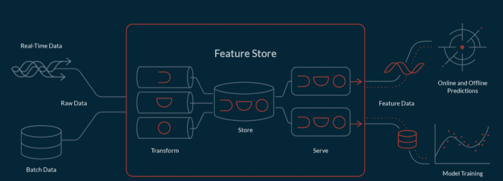
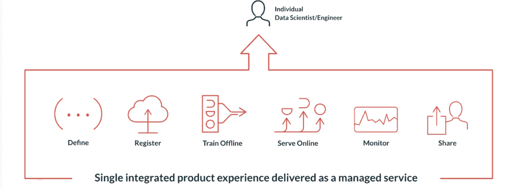

# 泰克顿帮助数据科学家拥有特征和模型生命周期

> 原文：<https://thenewstack.io/tecton-helps-data-scientists-own-features-and-the-model-lifecycle/>

今年被称为功能商店的[年，](https://medium.com/data-for-ai/2021-a-year-of-ml-feature-stores-adoption-e0f528506cad) [Databricks](https://www.zdnet.com/article/databricks-ups-ai-ante-with-new-automl-engine-and-feature-store/) 和 [Google](https://www.nextplatform.com/2021/05/20/google-cloud-mainstreams-ai-with-vertex-platform/) 是最近宣布这项技术的供应商，为在生产中利用机器学习模型铺平了道路。Twitter、脸书、康卡斯特、网飞、Pinterest 等也提供特色商店平台。

不要与用于创建 CI/CD 系统的开源框架 [Tekton](https://tekton.dev/) 混淆，商业企业特性存储 [Tecton](https://www.tecton.ai/) 旨在标准化和自动化生产机器学习(ML)应用程序中的特性管理。

Tecton.ai 创始人 [Mike Del Balso](https://www.linkedin.com/in/michaeldelbalso/) 、 [Kevin Stumpf](https://www.linkedin.com/in/kevinstumpf/) 和 [Jeremy Hermann](https://www.linkedin.com/in/jeremyhermann/) 在优步一起工作，创建了 [Michelangelo](https://eng.uber.com/michelangelo-machine-learning-platform/) 机器学习平台。

Del Balso 说，在米开朗基罗之前，优步的数据科学家会创建模型，然后将它们交给拼凑开源工具来管理它们的工程师。该公司没有标准化的系统来建立可靠的和可重复的管道来创建 ML 模型。模型不能比数据科学家的桌面大，没有用于训练实验的集中存储，也没有比较实验的方法。

“机器学习的数据管理方面确实是我们建立的独特的东西。这是真正激励我们建立泰克顿的原因，因为我们看到了它在催化机器学习的爆炸中是多么有用，使公司能够从零到数万个模型投入生产，”他说。

“我们试图通过将机器学习的同类数据层，特别是实时机器学习应用程序的同类数据层，带给其他试图解决这一问题的组织，从而为行业的其他部分带来同样的变化。”

在优步工作之前，德尔·巴尔索曾帮助谷歌广告部门建立机器学习系统，他指出，泰克顿专注于操作性机器学习——将公司已经拥有的数据应用于产品决策，而不是更多基于研究或分析的数据使用。

“数据科学家通常在本地工作，训练模型，并建立为其提供数据的管道。但是，将这种本地模型投入大规模生产是一个艰巨、耗时的过程，受到训练环境中不存在的限制。此外，离线训练的模型必须在线推送，并对相同类型的数据(称为特征)进行操作，以给出合理的结果。但是，围绕 ML 数据进行标准化、管理和合作的工具仍然非常不成熟，”风险投资公司 Andreessen Horowitz 的普通合伙人 Martin Casado 在谈到其对泰克顿的投资时写道。该公司迄今已筹集了 6000 万美元。

### **完整的 ML 生命周期**

这项技术不仅仅是一个包含[特征](https://www.tecton.ai/blog/what-is-a-feature-store/)的数据库，即机器学习模型中使用的姓名、年龄、性别等变量或属性。

“泰克顿允许数据科学家在整个机器学习生命周期中获得授权，并允许他们构建原型。但是在这个过程中，数据管道是自动生产的，”德尔·巴尔索说。“因此，工程团队的工作要轻松得多，因为一路上没有很多繁琐且容易出错的不同管道重建工作。…这有点像原型改造、生产化，在这一过程中还有监控和质量管理的元素。

泰克顿平台包括:

*   **特征管道**用于将原始数据转换成特征或标签
*   用于存储历史特征和标签数据的**特征存储器**
*   一个**特征服务器**，用于提供生产中的最新特征值
*   一个 **SDK** 用于检索训练数据和操作特征管道
*   用于管理和跟踪特征、标签和数据集的**网络用户界面**
*   一个**监控引擎**，用于检测数据质量或漂移问题并发出警报

它包括特征的转换；存储，由在线和离线存储组成，用于快速检索和慢速检索；功能服务，然后是治理层，“以帮助确保，‘嘿，这些功能只能由这些团队访问’，‘帮助我理解不同功能的血统’，所有的元数据和协作都是构建这些机器学习应用程序所需要的。然后是数据质量和监控层，以了解机器学习应用程序中数据的调试过程，”他说。

[https://www.youtube.com/embed/u_L_V2HQ_nQ?feature=oembed](https://www.youtube.com/embed/u_L_V2HQ_nQ?feature=oembed)

视频

使用 Tecton SDK 将特性定义为任何 Python 环境的代码。该平台可以从外部数据源提取现有要素，还可以使用 PySpark、Spark SQL 或 Python 对批处理和流数据进行转换来计算原始数据的要素。

离线存储包含跨时间的历史特征值，用于批量生成训练数据。离线功能商店是可配置的，但默认为[三角洲湖](https://delta.io/)。在线商店使用 AWS [DynamoDB](https://aws.amazon.com/dynamodb/) 为低延迟检索提供最新的特征值。

您可以指定配置，如回填要素的过去日期、未来作业的计划、生存时间等。

训练数据集以熊猫或 Spark 数据帧的形式交付。一旦你有了数据集，你就可以使用你的现有工具如 XGBoost，TensorFlow，PyTorch 来部署模型。

Del Balso 说，通过实时汇集数据源，Tecton 使数据科学家能够在他们的模型中使用更多的数据，并在他们的应用程序中使用实时数据。

## **加盟盛宴**

今年 4 月，这家总部位于三藩市的公司宣布将雇佣开源特色商店 [Feast](https://github.com/feast-dev/feast) 的创始人[威廉·皮纳尔](https://github.com/woop)，并成为该项目的主要贡献者。Pienaar 在中国打车初创公司 [Gojek](https://www.gojek.com/en-id/) 领导数据科学团队并与谷歌合作时创建了 Feast。盛宴最近发布了【0.10 版本。

“这就像是允许人们非常容易地开始使用功能商店一样。随着时间的推移，我们预计会有很多额外的元素，如 Feast 用户体验和 Tecton 用户体验之间的兼容性，”Del Balso 说。“今天，它们是独立的平台；明天，他们可能不会。我们的目标是让他们之间的沟通变得非常容易。”

展望未来，该公司计划与数据仓库生态系统进行更深入的集成，并在亚马逊网络服务之外添加其他云。它计划今年与雪花和红移进行一流的集成。他说，它希望帮助用户为他们的模型生成更好的功能，找到与他们的决策最相关的数据，并帮助人们找出如何将 ML 基础设施拼凑成对他们的用例有意义的架构。它希望能够为用户提供一个构建欺诈应用程序的模板，一个推荐模板，一个预测模板，“并为该组织预先构建所有数据流，所以他们只需将我们插入他们的数据，这是一件相当大的事情，我们在这上面花费了大量时间，”德尔巴尔索说。

<svg xmlns:xlink="http://www.w3.org/1999/xlink" viewBox="0 0 68 31" version="1.1"><title>Group</title> <desc>Created with Sketch.</desc></svg>