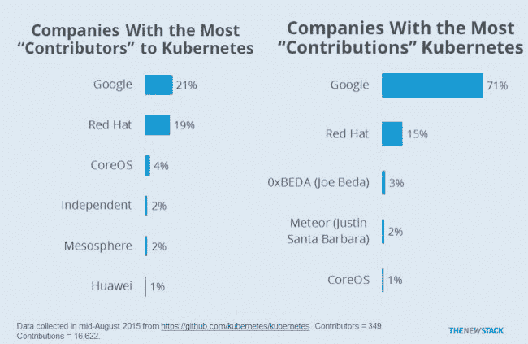

# 构造峰会:企业的 Kubernetes

> 原文：<https://thenewstack.io/tectonic-summit-kubernetes-for-the-enterprise/>

虽然迄今为止围绕谷歌 Kubernetes 软件的大部分讨论都围绕着技术本身，但围绕企业如何利用 Kubernetes 更有效地运行其 IT 运营，仍有许多未解的问题。

回答这一需求是下周在纽约州举行的“T2 构造峰会”背后的使命。CoreOS 公司本身提供名为[构造](https://thenewstack.io/coreos-debuts-tectonic-a-commercial-kubernetes-distro/)的 Kubernetes 商业分销服务。因此，不出所料，这个只有受邀者才能参加的会议将关注 Kubernetes 和 structural 如何被组织用于生产规模的运营。

“我们希望主持一场讨论，专门讨论为什么企业应该关心 Kubernetes。它是如何省钱的？它如何帮助您更快地进入市场？”CoreOS 首席执行官亚历克斯·波尔维说。“我们相信这里有巨大的商业价值，但这一领域的讨论还不够充分。”

“我们在纽约做的是离开硅谷一段时间，”他补充道。

CoreOS 首席执行官亚历克斯·波尔维

此次峰会将有许多 Kubernetes 早期采用者的充满希望的演讲，包括来自摩根士丹利、高盛、威瑞森、维亚康姆和国际证券交易所的人士。

波尔维说，对于 CoreOS 来说，谷歌的 Kubernetes 是商业化的合理选择。Google 开发了 Kubernetes 来管理大量容器，允许用户轻松扩展工作负载以满足更大的需求。对谷歌来说，它提供了一种在不增加运营团队规模的情况下轻松增加更多服务器的方式。它为基于容器的 It 架构铺平了道路。

Polvi 说，对于对这种方法感兴趣的企业，Kubernetes 可以提供一致性。例如，该软件可以提供一种方法，在不同的云提供商之间或云提供商和内部数据中心之间轻松移动基于多容器的工作负载，同时保持运营的一致性。

Polvi 说，基于容器的方法的另一个好处是安全性。如果将应用程序及其依赖项打包在容器中，安全管理员可以更容易地评估组织权限内的所有软件。

最近，CoreOS [发布了一个开源工具的测试版](https://thenewstack.io/coreos-introduces-container-scanning-for-vulnerabilities/),它可以扫描容器的内容以发现易受攻击的包，Docker[也在开发类似的功能](https://thenewstack.io/3-new-security-features-docker/)。容器[也可以被隔离](https://thenewstack.io/microsoft-secures-the-windows-docker-container/)，通过将它们包装在虚拟机中获得更高的安全性。

Kubernetes 代码库的贡献者。

企业发现他们正在成为服务提供商，就像谷歌或脸书一样。“如果你是一家零售公司，你有你的移动应用和网络服务，”波尔维说。因此，自然地，遵循网络规模的公司设定的架构路径是有意义的。

Polvi 说，独立软件供应商(ISV)和提供软件即服务的公司(SaaS)都是这种方法的早期采用者。在这两种情况下，将软件打包到容器中使得 SaaS 提供商可以轻松地管理他们自己的应用程序，并且使得 ISV 可以轻松地打包他们的产品以方便客户使用。

“2015 年，应用不仅仅是一台服务器上运行的一个二进制文件。它是一套分布式的服务，所有的服务都在一起运行，”波尔维说。

CoresOS、Docker 和 Red Hat 是新堆栈的赞助商。

专题图片:“布鲁克林夜总会 80 年代舞曲之夜[宝贝没事](http://babysallright.com/)。

<svg xmlns:xlink="http://www.w3.org/1999/xlink" viewBox="0 0 68 31" version="1.1"><title>Group</title> <desc>Created with Sketch.</desc></svg>