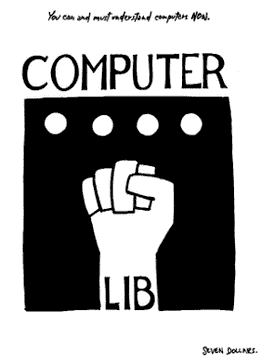
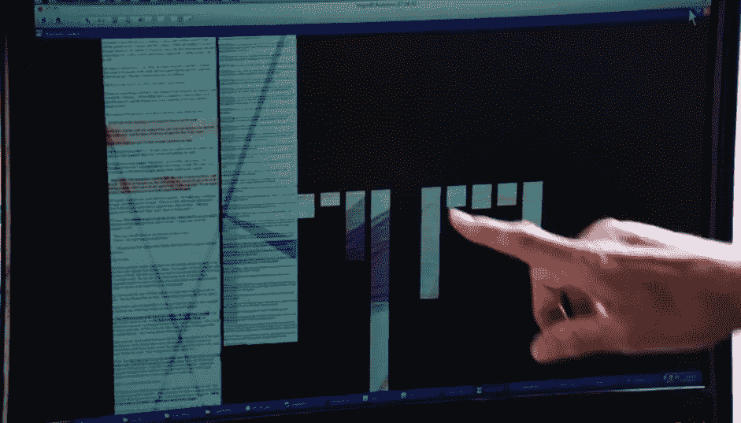

# 泰德·纳尔逊:我们还能从世外桃源学到什么

> 原文：<https://thenewstack.io/ted-nelson-can-still-learn-xanadu/>

计算机早期的经验教训还有吗？

我们生活在一个企业运行他们自己定制的微服务的世界——但是是在别人的服务器上。观看这一切的是泰德·纳尔逊，这位互联网先驱去年六月已经 80 岁了。纳尔逊被认为创造了几个永久保留在我们技术词典中的词，包括“超文本”和“超媒体”(以及“虚拟”)。在万维网最终诞生的几十年前，尼尔森就看到了对互联文档的需求。

在哈佛大学和研究生院期间，纳尔逊设想了一个基于计算机的写作系统，他称之为 Xanadu，它将作为世界知识的电子储存库，并在相关文档之间提供“跳转链接”。世外桃源的想法比蒂姆·伯纳斯·李发明万维网早几十年，在某些方面仍然领先于网络。

尼尔森一直对网络持批评态度，他认为这是对 Xanadu 想法的简化，但从未付诸实施(《连线》杂志称 Xanadu 为“计算史上持续时间最长的 vaporware 项目”。)从那以后，纳尔逊见证了网络的成长——有时这种经历是苦乐参半。

那么，泰德·纳尔逊希望我们有什么不同的做法呢？

IEEE 的 Spectrum 杂志最近发布了视频，“[现代程序员可以从过去的](https://spectrum.ieee.org/video/geek-life/profiles/ted-nelson-on-what-modern-programmers-can-learn-from-the-past)中学到什么”，这是他在 2016 年新泽西 Vintage Computing Festival East 上做主题演讲时与 Ted Nelson 的一次简短对话。

“当我们回顾计算机世界的过去时，”他开始说道，“是通过一个非常奇特的透镜。因为事情变化得如此之大，如此之快，以至于对我来说，自从我进入计算机领域以来的这 50 年，过得如此之快，过去似乎一直存在。”

纳尔逊引用了 20 世纪 60 年代的理想主义，其中包括“对新型经济的希望”

“那个时代的精神*渗入了计算机世界。开始时有一种可能性……”他停顿了一下，若有所思。“…那[是]不同的，因为我们认为计算将是手工的。”*

泰德·纳尔逊 1974 年出版的书的封面

确实如此。早在 2007 年，监督 IBM 第一台个人电脑的高管威廉·c·洛(William C. Lowe)分享了他对 1978 年纳尔逊给他们的演示的记忆，当时 IBM 正在进行早期设计。正如约翰·马科夫(John Markoff)的博客文章所描述的，“由此产生的幻灯片显示，纳尔逊先生勾画了一个世界，在这个世界中，计算机用户将能够在任何地方检索信息，洛先生说，这对身穿蓝色西装的 IBM 高管来说是一个冲击。”

九年后，尼尔森在他的开创性著作 *[计算机图书馆/梦想机器](http://www.digibarn.com/collections/books/computer-lib/)* 的更新中写道，事情已经取得了多大的进展。“1974 年，在远离空调的地方，电脑是压迫性的设备。现在[你可以在自己的客厅里被电脑压迫](http://xanadu.com.au/ted/TN/WRITINGS/TCOMPARADIGM/tedCompOneLiners.html)。”

Markoff 还写道，Nelson 坚持认为计算机行业后来精选了他的“一些”想法，但是忽略了更大的图景。

尼尔森在视频采访中说:“我们没有想象中的大垄断。”。“我们认为*(他停顿了一下，笑了笑)*公民程序员会是领导者。”然后，他几乎是在事后补充道，“当我说‘我们’的时候，我指的是‘我’，但当然我有一种感觉，我在和很多人分享这一点——我有民主化、公民参与的愿景，以及软件艺术表达的可能性的伟大前景……”

1999 年，Nelson 用一系列精辟的引言总结了他对计算范式的想法，开头是:

*“计算机的目的是人类的自由。”*

“还没有人的生活被电脑简化过。”

早在 20 世纪 60 年代，摩尔定律就已经被作为一条普遍原则向他阐明了——事物会变得更快更便宜——而且人们预见到了每个人都拥有电脑的那一天。在视频采访中，尼尔森说，那时他开始思考未来的文档，设想文档之间的“平行连接”——页面之间有一座视觉“桥梁”。"

超文本的概念是在 20 世纪 60 年代和 70 年代通过各种项目发展起来的。但成功的版本是伯纳斯-李的，这是互联网上第六或第七个超文本系统。纳尔逊将其描述为“一项干净的工作，背后有欧洲核子研究中心的影响力。”

但对尼尔森来说，互联信息是他一生都在追求的愿景。2016 年，尼尔森还出现在维尔纳·赫尔佐格的一部电影中——这部纪录片名为 *[瞧，互联世界的遐想](http://www.loandbeholdfilm.com/)*——分享了更早的记忆——1942 年的一天，他和祖父母在一艘划艇上，当时他还是一个小男孩，用手指拖着水——看着水在另一边再次汇集。在那一刻，他意识到了关于宇宙的一个巨大真理——即“世界是一个不断变化的关系和结构的系统。”

[https://www.youtube.com/embed/Bqx6li5dbEY?feature=oembed](https://www.youtube.com/embed/Bqx6li5dbEY?feature=oembed)

视频

“表达相互联系一直是我所有思考的中心，我所有的计算机工作都是在表达、表现和展示相互联系——尤其是在作品之间。”

在这部电影中，Nelson 展示了浏览文档的更大可能性——相关文档也完全可见，并且它们与主文档的关系很容易可视化。

去年，尼尔森也在互联网历史上留下了另一个印记。他向互联网档案馆移交了价值几十年的垃圾邮件——18 箱。主板开玩笑说:“这有点令人痛苦的讽刺，但是我们保存我们大部分计算历史的最好机会涉及一些有思想的灵魂，他们认为最好扔掉他们过去的物理垃圾邮件。”

但他更大的追求仍然是追求他最初的愿景。“50 年前，当我开始从事计算机工作时，我知道的比大多数人认为我现在知道的多十倍，”尼尔森在他的新书的序言中写道。“我认为自己是一名哲学家和电影制作人，我所知道的是媒体、展示和设计、写作和文学的本质、技术分析和思想操纵的过程，以及人类的心灵。我也了解项目，以及为什么一个人敢于跟随项目的内在冲动，去它自然想去的地方。”

“我在 1960 年看到了所有这些事情将如何转移到交互式计算机屏幕上。从那以后，我一直在处理后果，包括政治和技术上的问题。”

* * *

# WebReduce

来自 Spectrum 的[的特征图现代程序员可以从过去的](https://spectrum.ieee.org/video/geek-life/profiles/ted-nelson-on-what-modern-programmers-can-learn-from-the-past)中学到什么

<svg xmlns:xlink="http://www.w3.org/1999/xlink" viewBox="0 0 68 31" version="1.1"><title>Group</title> <desc>Created with Sketch.</desc></svg>