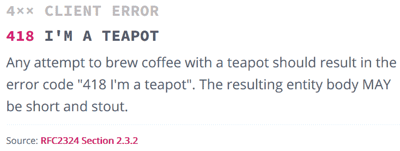
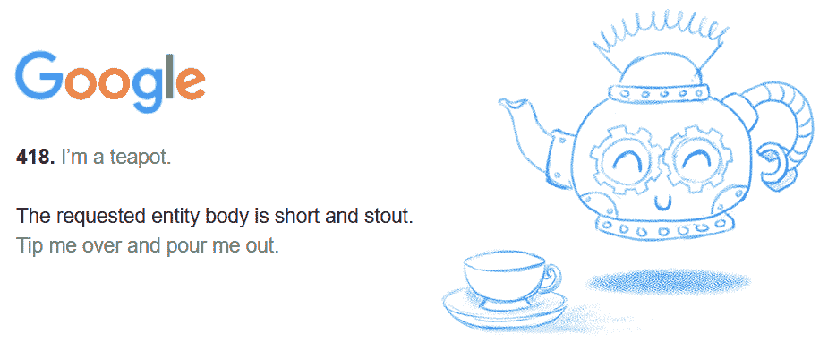

# 奇怪的酿造:网络 418 错误代码如何陷入争议

> 原文：<https://thenewstack.io/tempest-teapot-error-compleat-history-418-return-code/>

这个月，一个 1998 年的冷笑话演变成了一场小争论。这个问题很快得到了解决，但这一事件让我们有趣地一瞥了极客们的共享文化——以及保持这一切运行的经常被忽视的社区。

这也给[带来了新一轮的关注，一个很棒的愚人节玩笑](https://www.ietf.org/rfc/rfc2324.txt)。

故事开始于 1998 年，在施乐位于帕洛阿尔托的著名的 PARC 研究中心，拉里·马辛特的职责包括制定网络和互联网标准。(两年后，他加入了 Adobe，并一直在那里工作——仍然作为公司标准组的首席科学家继续他的标准工作)。4 月 1 日，Masinter 公布了——利用其他人的贡献——他后来称之为“对许多糟糕的 API 设计的讽刺”，其中包括一个模拟 HTTP 状态代码。

每次浏览器调用服务器时，都会返回一个三位数的状态代码。当客户端请求由于某种原因没有被满足时，大多数错误代码(属于 HTTP 状态代码的 4xx 区域)都是干巴巴的:“414: URI 太长”或“415:不支持的媒体类型”错误代码 418 被简单地列为“我是茶壶”

Masinter 还说协议提案“有一个严肃的目的——它指出了 HTTP 被不恰当扩展的许多方式。”

马辛特半开玩笑地写道，“对于一个专门为咖啡酿造而设计的协议，有一个强烈的、黑暗的、丰富的需求。”在官方的 RFC 2324 中，他提议我们的超文本传输协议，更好的说法是 HTTP，现在应该加入 HTCPC——超文本咖啡壶控制协议，“用于控制、监控和诊断咖啡壶。”

"该协议的未来版本可能包括对浓缩咖啡机和类似设备的扩展."

这种幽默逐渐从技术细节的迷雾中显露出来。虽然 web 服务器识别以`http:`开头的地址，但是根据 Masinter 的提议，适当的服务器现在也将开始识别“`coffee:." `”。该协议还确定了一些重要的安全考虑。(“任何挡在我和我的早晨咖啡之间的人都应该是没有安全感的。”)，并对“拒绝咖啡服务”攻击的可能性发出了可怕的警告。

## 1998 年的迷因

在第 2.3.2 节中，一个简单的笑话指定了一个很快成为著名的返回代码。

“IETF 每年 4 月 1 日也会定期发布幽默的规范(作为‘信息’文档)，也许是为了表明‘并非所有的 RFC 都是标准’，但也是为了给技术辩论提供幽默素材，”Masinter 写道，解释了[消息](https://masinter.blogspot.com/2011/12/http-status-cat-418-i-teapot.html)的完整背景故事。“HTCPC 的目标是我们在 HTTP 工作组(我曾担任主席)中看到的对 HTTP 进行扩展的建议浪潮，以支持在我看来不恰当的应用程序。

"我在 RFC2324 中尽可能多地误用了 HTTP 可扩展性点."

然而，马辛特也承认，这种代码可能会带来问题。“代码、值和标识符注册管理机构面临的问题之一是如何处理不‘严重’的提交。418 应该在 HTTP 状态码的 IANA 注册表中吗？it(coffee:12 种语言)中的众多(并非实际有效的)URI 计划是否应该列为注册 URI 计划？”

随着时间的推移，这个精致的模仿作品悄悄地吸引了一批地下追随者，对错误消息的赞美开始出现在现实世界的编程语言和平台中。

文档承认这是一个笑话代码，不应该在服务器软件中实现，尽管它已经作为一种隐藏的“复活节彩蛋”得到了多种语言和平台的支持。418“我是茶壶”代码在 Node.js 平台的代码中实现，也(以各种形式)出现在 Python requests、Google 的 Go 编程语言和 ASP.NET 中。维基百科[指出](https://en.wikipedia.org/wiki/Hyper_Text_Coffee_Pot_Control_Protocol)Emacs 文本编辑器也实现了该协议——并且在 Mozilla.org，“存在大量[错误报告](https://bugzilla.mozilla.org/show_bug.cgi?id=46647)抱怨 Mozilla 缺乏对该协议的支持。”

谷歌甚至在 Google.com/teapot.有自己版本的错误

点击它使它倾倒！

随着时间的推移，愚蠢的“我是茶壶”错误的新化身偶尔会起到一些有用的作用——至少，如果你相信 Reddit 上的[报道](https://www.reddit.com/r/webdev/comments/6t4lrm/we_did_it_reddit_http_error_code_418_im_a_teapot/dli3109/)的话。“我见过 DreamHost [抛出 418 个错误](http://duncanlock.net/blog/2016/03/22/finally-figured-out-my-mysterious-418unused-http-status-code-dreamhost/)来回应暴力登录尝试，可能是为了迷惑黑客什么的……”类似的回应显然出现在至少一个 [WordPress 插件](https://wordpress.stackexchange.com/questions/103089/why-better-wp-security-plugin-returns-418-im-a-teapot-error)中。

2015 年，现在是 IETF 首席科学家的 Masinter 出现在 Twitter 上的一个帖子中，提醒大家，是的，这是讽刺。

## 以后就没这么好笑了

本月早些时候，这个错误信息引起了负责监管超文本传输协议的 IETF 工作组主席 Mark Nottingham 的高度关注。他为极客社区提供的服务包括为 web feeds 共同创建了 Atom XML 语言，他还在雅虎担任首席技术专家，在 Rackspace 担任系统架构师，在 Akamai 担任研究科学家，然后在 8 月份接受了内容交付平台 Fastly 的职位。

8 月 5 日，他提出从 Node.js 中移除对错误消息的支持。

“HTCPCP 是拉里在 4 月 1 日开的一个玩笑，用来说明人们是如何以各种方式滥用 HTTP 的。具有讽刺意味的是，它[现在]正被用来滥用 HTTP 本身——人们正在他们的 HTTP 栈中实现 HTCPCP 的一部分…

虽然我们现在有许多未注册的 4xx HTTP 状态代码，但 HTTP 的语义(希望)将会持续很长时间，所以有一天我们可能会需要这个代码点…

我知道这很有趣，我知道有些人只是为了好玩才实现的，但是这不应该污染核心协议；如果人们想使用非标准语义，他们可以很容易地扩展 Node。"

他向处理 [Go](https://github.com/golang/go/issues/21326#issue-248234750) 、 [Python](https://github.com/requests/requests/issues/4238#issue-249497185) 和[ASP.Net](https://github.com/aspnet/HttpAbstractions/issues/915)的社区提出了类似的要求。

问题的另一面是一位名叫谢恩·布伦瑞克的 15 岁程序员。他已经完成了高中一年级的学习，并且正在创建一个网站来为代码的保存而集会。“有些人想从世界上抹去 418 的所有痕迹，”布伦瑞克在 GitHub 上写道[。“我希望能阻止这一切。”](https://github.com/WhataShane/save418)

他告诉*商业内幕*这个错误[让你笑逐颜开](http://www.businessinsider.com/save-418-saving-the-http-teapot-error-2017-8)

Brunswick 坚持不懈地相信心爱的错误代码可以通过一些在线活动来挽救，并且[在 save418.com](http://save418.com/)推出了一个网站。(它的口号？“我们是茶壶。”)但是，严肃地说，他提出了保留错误消息的理由。“这提醒我们，计算机的底层流程仍然是由人类制造的。看着 418 消失真是太遗憾了。”

Shane 的帖子在 Reddit 的编程论坛吸引了数千人的支持，当它出现在黑客新闻上[时，又有一百多人支持。](https://news.ycombinator.com/item?id=14987460)

诺丁汉勇敢地在推特上承认了争议。

https://twitter.com/mnot/status/895757119160320002

诺丁汉甚至在布伦瑞克自己的 Save418 网站的代码上留下了和解的评论。“我在这一切中的目标是澄清代码的状态(之前有人断言没有人会关心 418，这显然不是真的)。我们做得非常好……”

社区发表了意见，几天后诺丁汉在 w3 官方邮件列表上分享了一个更新。
 *所以，我戳了几个实现，看看他们是否会移除 418 的“茶壶”语义，有了反应(说得委婉点)。*

一份新文档的草稿很快出现在 IETF 网站上——由诺丁汉本人撰写。

“在中间的几年里，这种身份码被广泛地当作‘复活节彩蛋’来使用，因此实际上被这种使用所消耗。该文档在 IANA HTTP 状态代码注册表中将状态改变 418 为‘保留’以反映这一点。”

很快，他和马辛特就开始讨论合作应对的最佳方式。

https://twitter.com/mnot/status/896030835257729024

https://twitter.com/mnot/status/896447440500412416

https://twitter.com/mnot/status/896032238755659776

与此同时，谢恩·布伦瑞克的网站更新为“我们拯救了 418”，感谢那些对“从互联网上删除如此精彩的错误代码的后果”表示担忧的人。

在接下来的日子里，诺丁汉保持了他的好心情——特别是在他自己的项目之一 REDbot 上，该项目检查 HTTP 资源中的常见问题。当亚美尼亚的一名开发人员提交了一个 [pull 请求](https://github.com/mnot/redbot/pull/198)以便 REDbot 的代码现在也支持“HTTP 错误代码 418 我是茶壶”时，诺丁汉[很快批准了这一更改](https://github.com/mnot/redbot/pull/198)，并在第二天部署了它。

他还在 Brunswick 网页的 GitHub 知识库上的评论[中留下了这一变化，并补充道:“顺便说一句，谢谢你关心 HTTP:)](https://github.com/WhataShane/save418/issues/8)

“很抱歉在那些 Github 线程中引起了所有混乱，”Brunswick 回应道，并补充道“希望我没有让你的工作变得更加困难。”

“另外，我要感谢您为 HTTP 协议付出的所有时间。我生命中的大部分时间可能都以某种方式、形状或形式与互联网联系在一起，受益于你在职业生涯中所做的工作。也谢谢大家关心 HTTP:)”

* * *

# WebReduce

特写图片由[朋美井村](http://www.girliemac.com/blog/)通过 [Flickr](https://www.flickr.com/photos/girliemac/6508102407/in/album-72157628409467125/) ，CC BY 2.0。

<svg xmlns:xlink="http://www.w3.org/1999/xlink" viewBox="0 0 68 31" version="1.1"><title>Group</title> <desc>Created with Sketch.</desc></svg>