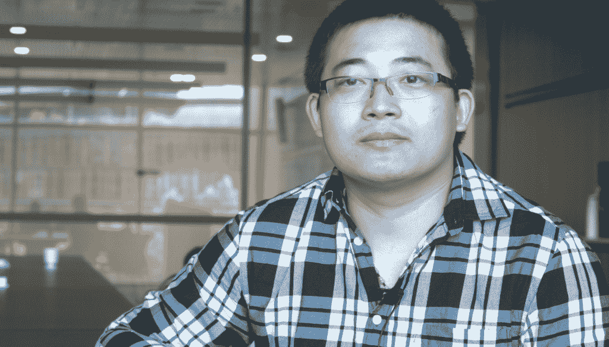

# 腾讯:用 OpenStack 服务十亿用户

> 原文：<https://thenewstack.io/tencent-serving-billion-users-openstack/>

[悉尼 OpenStack 峰会](https://www.openstack.org/summit/sydney-2017/)为我们带来了许多独特的用例，这些用例继续证明 [OpenStack](https://www.openstack.org/) 是成熟、稳定且持续增长的。

例如，与百度和阿里巴巴(合称为 BAT)并列的中国三大领先科技公司之一的腾讯，通过其私有的 OpenStack 云为超过 10 亿活跃用户提供服务。这是一个令人难以置信的用例，使腾讯成为今年 OpenStack 超级用户奖的获得者。该公司最近还被接纳为 OpenStack 基金会的黄金会员。

[腾讯控股有限公司](https://www.tencent.com/en-us/)是 [QQ](https://im.qq.com/index.shtml) 和[微信](http://weixin.qq.com/)的母公司。除了这两款旗舰产品，腾讯还为政府提供电子政务系统，管理各种公共服务，包括公共交通、税收、社会保险、医疗保健等。腾讯还提供最大的在线游戏平台之一。他们有音乐、电影、网络浏览器、电子商务等等。

我们会见并采访了腾讯首席架构师鲍耶·刘，以了解他们是如何使用 OpenStack 的。

Bowyer Liu, chief architect at Tencent.

## 腾讯简史

1998 年，由马、张志东、许、陈一丹和曾创办腾讯。他们的第一个产品是 1999 年推出的 QQ 即时通讯服务。随着时间的推移，QQ 增加了更多服务，包括在线游戏、音乐、购物、微博、电影和语音聊天平台微信。

2011 年，腾讯公布了 Weixin，又称微信。随着该公司扩展其基于互联网的服务，它需要一个云战略。随着微信的推出，腾讯也宣布了开放平台战略。为了赶上主要竞争对手阿里巴巴和百度，腾讯建立了云计算中心和电子商务基金会。在内部进行了两年的云工作后，腾讯于 2013 年宣布了腾讯云的公共可用性。

## 过渡到 OpenStack

腾讯云由他们自己的基础设施 TStack 提供支持，仍在传统基础设施上运行，拥有超过 6000 台服务器、80000 台桌面终端、110000 台移动终端和 1000 个内部应用程序。该公司在全球拥有六个以上的数据中心和 70 多个工作场所。

腾讯面临着与传统云基础设施相同的扩展、优化和管理挑战。TStack 不是一个可以支持异构虚拟化的云管理平台。“许多资源无法得到管理和充分利用，包括异构虚拟机、成千上万的物理服务器和许多第三方存储设备，”TStack 团队在接受超级用户[采访时说。](http://superuser.openstack.org/articles/tencent-openstack/)

腾讯在 2011 年推出云平台的时候，OpenStack 还是一个比较新的项目；它只有几个月大。但 OpenStack 的飞速增长和采用引起了腾讯的注意，就像业内其他人一样。为了克服 TStack 的挑战，腾讯在 2014 年押注 OpenStack 作为 TStack 的基础设施层。

刘说:“我们选择 OpenStack 来构建我们自己的公共云，因为它是一个非常强大的平台，而且它足够开放，可以帮助我们构建我们需要的私有云。”

TStack 拥有超过 80，000 个内核和超过 360 TB 的内存，由超过 6，000 个节点管理。其中，有 2000 个裸机节点由 Ironic 管理。他们运行着 12，000 多台虚拟机(VM)，覆盖 17 个集群，分布在四个地区的七个数据中心。TStack 管理着包括 QQ 和微信在内的 300 多项服务。

据 TStack 团队介绍，TStack 已经部署到上海、成都、天津和汕尾四个地区的七个数据中心的 14 个集群中。它管理 10，000 多个操作系统，托管内部 It 系统、职能部门业务系统以及腾讯内部的大部分开发和测试系统。TStack 已经在生产环境中运行了四年，可用性超过 99.99%。

## TStack 堆栈

TStack 目前基于 OpenStack 的 Kilo 版本。腾讯正在评估最新版本的升级。除了使用核心 OpenStack 组件，如 Keystone、Nova、Neutron、Cinder、Glance、Ironic、Heat、Swift、Manila 和 Horizon，TStack 还使用其他开源项目，如 CoreOS、Docker、Kubernetes、KVM、HAProxy、Keepalived、Clear Container、Rabbitmq、MariaDB、Nginx、Ansible、Jenkins、Git、ELK、Zabbix、Grafana、InfluxDB、Tempest 和 Rally。

借助 OpenStack，TStack 转变为一个可扩展且高度可用的云计算管理平台。它能够提供用于管理计算资源、存储、网络、图像、认证和测量的服务接口，并且与异构虚拟化、服务器、存储设备和网络设备兼容。它也适用于分布式计算和存储。

通过迁移到 OpenStack，腾讯不仅可以更好地管理资源，还节省了 30%的服务器成本和超过 55%的运营和管理成本。

## 听候吩咐

虽然微信和 QQ 是 OpenStack 支持的旗舰服务，但 TStack 也为超过 40，000 名员工提供电子邮件服务。它使用 TStack 为其 20，000 多名开发人员提供一个 CI/CD 环境。

OpenStack 支持的 TStack 运行 300 多项内部 IT 服务，包括 OA 认证、微信网关、RTX、邮件系统、视频监控、内部安全、功能管理和 ERP。TStack 还管理腾讯各种产品的开发和测试服务，例如微信、QQ、浏览器、游戏等。

接下来还有更多。

2015 年，有远见的腾讯联合创始人兼首席执行官马宣布了[互联网+](http://english.gov.cn/2016special/internetplus/)战略，该战略也被中国总理列入政府工作报告。

互联网+背后的想法是在更传统的中国行业中增加互联网和其他现代 IT 技术的使用，如云计算、大数据/机器学习和物联网。

OpenStack 是互联网+战略的核心。

腾讯还向外部组织提供基于 OpenStack 的服务。它现在被中国的许多省市使用。最近的金砖国家峰会由 TStack 提供支持。腾讯现在正在使用 TStack 向开发者提供英伟达的人工智能开发深度学习平台。

只有一个词可以形容腾讯用 OpenStack 做的事情:不可思议。

[OpenStack](https://www.openstack.org/) 是新堆栈的赞助商。

<svg xmlns:xlink="http://www.w3.org/1999/xlink" viewBox="0 0 68 31" version="1.1"><title>Group</title> <desc>Created with Sketch.</desc></svg>